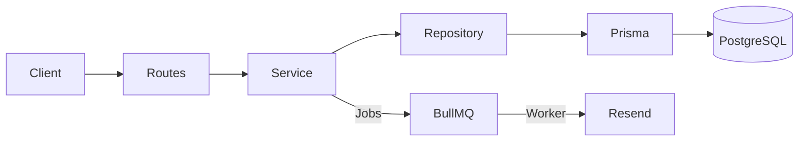

# Architecture — Agenda XPTO

## System Overview
Agenda XPTO is a SaaS for scheduling management. It uses a monorepo structure to share types and validations between the API and the (future) Web frontend.

## Monorepo Structure
- `apps/api`: Fastify backend
- `apps/web`: React frontend
- `packages/types`: Shared TypeScript definitions
- `packages/validations`: Shared Zod schemas

## Backend Architecture
Modular layered architecture per domain.

### Layers
1. **Routes (`*.routes.ts`)**: HTTP entry point, input validation (Zod), calls Service.
2. **Service (`*.service.ts`)**: Pure business logic, calls Repository.
3. **Repository (`*.repository.ts`)**: Database access (Prisma), no business logic.
4. **Schema (`*.schema.ts`)**: Zod definitions and inferred types.

### Principles
- **Multi-tenancy**: Every request is scoped to an `establishmentId`. Validation occurs at the middleware/service level.
- **Stateless**: Auth handled via Better Auth sessions/tokens.
- **Asynchronous**: Long-running tasks (notifications) handled via BullMQ workers.

## Data Flow

