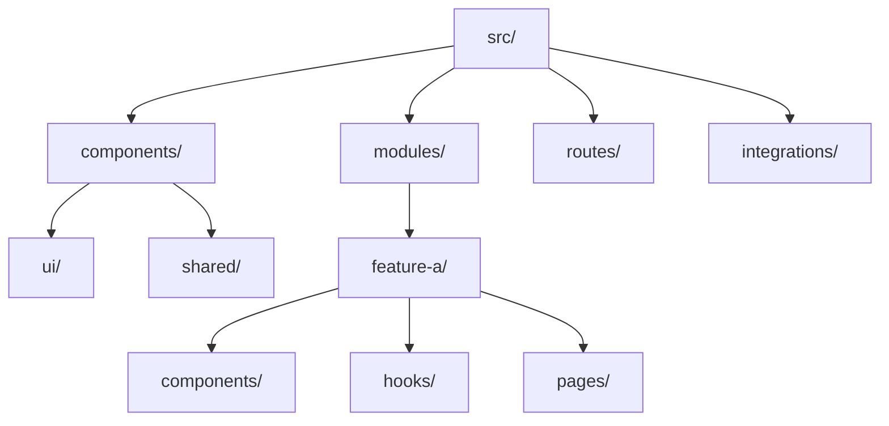

# Architecture

**Pattern:** Modular Frontend (Feature-based)

## High-Level Structure

## Identified Patterns

### Feature-based Modules

**Location:** `src/modules/<module-name>/`
**Purpose:** Encapsulate business logic, components, and state per domain.
**Implementation:** Subfolders for components, hooks, pages, stores, schemas.
**Example:** (Future modules like auth, dashboard)

### UI Component Library

**Location:** `src/components/ui/`
**Purpose:** Generic, reusable UI atoms.
**Implementation:** Tailwind-based components with props.
**Example:** `src/components/storybook/button.tsx` (temporarily in storybook folder)

### SSR Query Integration

**Location:** `src/router.tsx`, `src/integrations/tanstack-query/`
**Purpose:** Unified server-side and client-side data fetching.
**Implementation:** `setupRouterSsrQueryIntegration` links TanStack Router context with QueryClient.

## Data Flow

### Authentication Flow

**Status:** Documented in `USER_STORIES.md`, uses Better Auth.
**Flow:** Handled via Axios singleton with auth interceptors.

## Code Organization

**Approach:** Layered within features.

**Structure:**

- `src/components/`: Reusable UI components.
- `src/modules/`: Domain-specific logic and UI.
- `src/routes/`: Route definitions (TanStack Router).
- `src/integrations/`: Third-party configurations.
- `src/lib/`: Global singletons (Axios, etc).
- `src/hooks/`: Global shared hooks.
