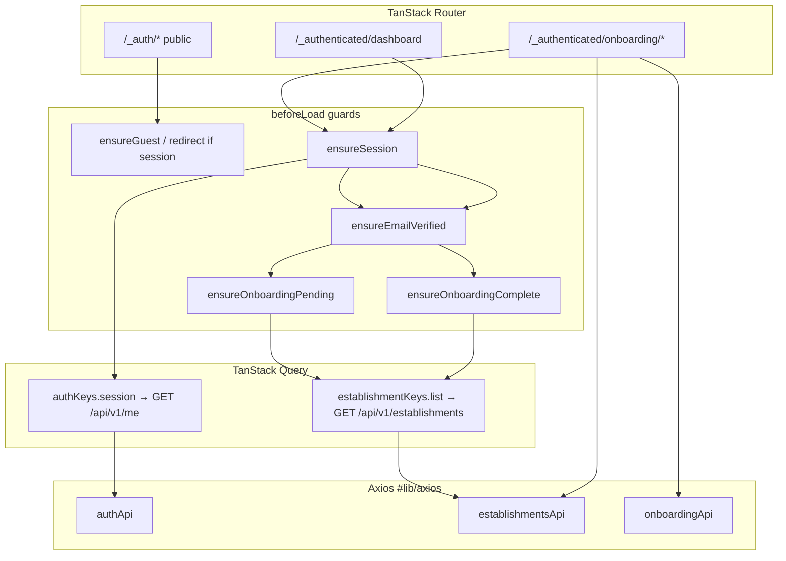
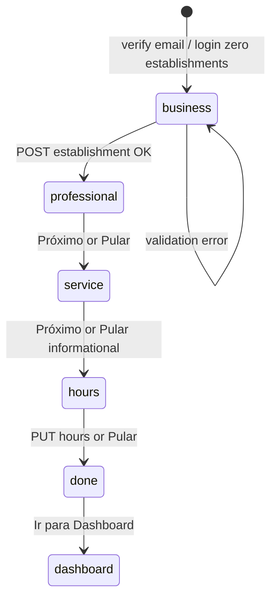

# Auth Design

**Spec:** `.specs/features/auth/spec.md`  
**Context:** `.specs/features/auth/context.md`  
**Status:** Draft (2026-05-20)

---

## Architecture Overview

Cookie-based Better Auth session on the API; the web app uses a single **Axios** client (`withCredentials: true`) and **TanStack Query** for session and establishments. **TanStack Router** `beforeLoad` hooks enforce access (authenticated → verified → onboarding complete). No `better-auth` package on the frontend.



### Session & onboarding state (derived)

| State | Condition | Redirect target |
| ----- | ----------- | ----------------- |
| Guest | `GET /me` → 401 | Protected → `/login` |
| Unverified | `user.emailVerified === false` | Protected → `/verify-email` |
| Onboarding pending | Verified + `establishments.length === 0` | Non-onboarding protected → `/onboarding/business` |
| Ready | Verified + `establishments.length >= 1` | `/dashboard`; `/onboarding/*` → `/dashboard` |

No `localStorage` session tokens. No `onboardingCompletedAt` in DB for MVP.

---

## Code Reuse Analysis

### Existing components to leverage

| Asset | Location | Use |
| ----- | -------- | --- |
| `Button`, `Input`, `Card`, `Toast` | `#/components/ui/` | All auth/onboarding forms |
| `cn` | `#/lib/utils.ts` | Class composition |
| `QueryClient` + SSR integration | `#/router.tsx`, `#/integrations/tanstack-query/` | `ensureQueryData` in guards |
| Design tokens | `#/styles.css`, `#/lib/tokens.ts` | Layouts and forms |

### New shared UI (auth feature)

| Component | Location |
| --------- | -------- |
| `PasswordField` | `#/components/ui/password-field.tsx` + stories |
| `FormError` (optional) | `#/components/ui/form-error.tsx` or inline in `AuthFormCard` |

### Integration points

| System | Method |
| ------ | ------ |
| Better Auth | `authApi` → `/api/auth/*` (proxied Fastify) |
| Session user | `GET /api/v1/me` |
| Establishments | `POST/GET /api/v1/establishments` |
| Professionals | `POST .../professionals` |
| Business hours | `PUT .../availability/business-hours/:weekday` |

### Concerns mitigated (from `CONCERNS.md`)

| Concern | Mitigation |
| ------- | ---------- |
| `QueryClient` defaults | Set `staleTime: 60_000` for `session` and `establishments.list` in `getContext()` |
| SSR + cookies | Document below; validate in first guard implementation |
| Missing tests | Each hook/API module gets `__tests__`; MSW in route/hook tests |

---

## Environment & Axios

### Env vars

| Variable | Purpose |
| -------- | ------- |
| `VITE_API_URL` | Axios `baseURL` (e.g. `http://localhost:3001`) |
| `VITE_WEB_URL` | Absolute `callbackURL` / `redirectTo` in auth emails (e.g. `http://localhost:3000`) |

Use `import.meta.env.VITE_*` only in `#/lib/axios.ts` and `#/lib/urls.ts` (helper for absolute web URLs).

### `#/lib/axios.ts`

```typescript
import axios from 'axios'

export const api = axios.create({
  baseURL: import.meta.env.VITE_API_URL,
  withCredentials: true,
  headers: { 'Content-Type': 'application/json' },
})

// Optional: map Better Auth error body without logging credentials
export type BetterAuthErrorBody = { message: string; code?: string }
```

**SSR note:** On the server, `beforeLoad` calls must forward the incoming request `Cookie` header to Axios if session is needed during SSR. If not configured in the first task, treat auth routes as **client-safe** (forms work; guards may re-run after hydration). Flag as **verify during AUTH-06 implementation** — do not assume SSR session works without testing.

---

## Query keys

**File:** `#/modules/auth/query-keys.ts` (session) and `#/modules/establishments/query-keys.ts` (establishments), or a single `#/lib/query-keys.ts` if preferred.

```typescript
export const authKeys = {
  all: ['auth'] as const,
  session: () => [...authKeys.all, 'session'] as const,
}

export const establishmentKeys = {
  all: ['establishments'] as const,
  list: () => [...establishmentKeys.all, 'list'] as const,
  detail: (id: string) => [...establishmentKeys.all, 'detail', id] as const,
}
```

### Query options factories

**File:** `#/modules/auth/queries/session-queries.ts`

```typescript
export const sessionQueryOptions = () => ({
  queryKey: authKeys.session(),
  queryFn: () => authApi.getMe(),
  retry: false,
  staleTime: 60_000,
})

export const establishmentsQueryOptions = () => ({
  queryKey: establishmentKeys.list(),
  queryFn: () => establishmentsApi.list(),
  staleTime: 60_000,
})
```

### Invalidation matrix

| Mutation | Invalidate |
| -------- | ---------- |
| `signUp`, `signIn`, `signOut` | `authKeys.session()` |
| `signOut` | Also `establishmentKeys.all` (clear tenant cache) |
| `createEstablishment` (onboarding step 1) | `establishmentKeys.list()` |
| `createProfessional` | Optional: `establishmentKeys.detail(id)` if used later |

---

## API layer

### `#/modules/auth/api/auth-api.ts`

Thin wrappers — no business logic.

| Function | HTTP | Body / notes |
| -------- | ---- | ------------- |
| `signUpEmail` | `POST /api/auth/sign-up/email` | `{ name, email, password, callbackURL }` |
| `signInEmail` | `POST /api/auth/sign-in/email` | `{ email, password, rememberMe?, callbackURL? }` |
| `signOut` | `POST /api/auth/sign-out` | `{}` |
| `sendVerificationEmail` | `POST /api/auth/send-verification-email` | `{ email, callbackURL }` |
| `requestPasswordReset` | `POST /api/auth/request-password-reset` | `{ email, redirectTo }` |
| `resetPassword` | `POST /api/auth/reset-password` | `{ newPassword, token }` |
| `getMe` | `GET /api/v1/me` | Returns `{ user: AuthUser }` |

**Callback URLs (absolute):**

```typescript
// #/lib/urls.ts
export const webUrls = {
  verifyEmail: () => `${webOrigin}/verify-email`,
  onboardingBusiness: () => `${webOrigin}/onboarding/business`,
  resetPassword: () => `${webOrigin}/reset-password`,
}
```

Signup / resend verification use `callbackURL: webUrls.onboardingBusiness()` so post-verify lands on step 1 (Better Auth `autoSignInAfterVerification`).

### `#/modules/establishments/api/establishments-api.ts`

| Function | HTTP |
| -------- | ---- |
| `list` | `GET /api/v1/establishments` |
| `create` | `POST /api/v1/establishments` |

### `#/modules/onboarding/api/onboarding-api.ts`

Composes domain APIs (no `/onboarding/*` backend):

| Function | Delegates to |
| -------- | ------------- |
| `createProfessional` | `POST .../professionals` |
| `upsertBusinessHour` | `PUT .../business-hours/:weekday` |
| `upsertBusinessHoursBatch` | `Promise.all(weekdays.map(...))` |

---

## Route guards

**File:** `#/modules/auth/lib/route-guards.ts`

All guards receive `{ context: { queryClient }, location }` from TanStack Router and use `redirect()` from `@tanstack/react-router`.

```typescript
type AuthUser = {
  id: string
  email: string
  emailVerified: boolean
  name: string | null
}

export async function fetchSession(queryClient: QueryClient): Promise<AuthUser | null>
export async function fetchEstablishments(queryClient: QueryClient): Promise<EstablishmentPublic[]>

export async function ensureGuest({ context, location }): Promise<void>
export async function ensureSession({ context, location }): Promise<AuthUser>
export async function ensureEmailVerified(user: AuthUser, location: Location): Promise<void>
export async function ensureOnboardingPending({ context, location }): Promise<void>
export async function ensureOnboardingComplete({ context, location }): Promise<void>
export function resolvePostLoginPath(establishmentsCount: number): '/onboarding/business' | '/dashboard'
```

### Guard behavior

| Guard | Used on | Logic |
| ----- | ------- | ----- |
| `ensureGuest` | `/_auth/*` | If session exists → `resolvePostLoginPath` |
| `ensureSession` | `/_authenticated/*` | No session → `/login?redirect=...` |
| `ensureEmailVerified` | After session | `!emailVerified` → `/verify-email?email=...` |
| `ensureOnboardingPending` | `/onboarding/*` | If `establishments.length >= 1` → `/dashboard` |
| `ensureOnboardingComplete` | `/dashboard` | If `establishments.length === 0` → `/onboarding/business` |

**Index `/`:** `beforeLoad` → same as guest or authenticated redirect chain.

### Route tree (file-based)

```
src/routes/
├── __root.tsx
├── index.tsx                          # redirect hub
├── _auth/
│   ├── route.tsx                      # AuthLayout + ensureGuest
│   ├── login.tsx
│   ├── signup.tsx
│   ├── forgot-password.tsx
│   ├── reset-password.tsx             # search: { token?: string }
│   └── verify-email.tsx               # search: { email?: string }
└── _authenticated/
    ├── route.tsx                      # ensureSession + ensureEmailVerified
    ├── dashboard/
    │   └── index.tsx                  # DashboardLayout stub + ensureOnboardingComplete
    └── onboarding/
        ├── route.tsx                  # OnboardingLayout + ensureOnboardingPending
        ├── business.tsx               # step 1 — no skip
        ├── professional.tsx
        ├── service.tsx                # informational only
        ├── hours.tsx
        └── done.tsx
```

`routeTree.gen.ts` is generated by the router plugin — do not edit manually.

---

## Hooks (mutations & UX)

| Hook | File | Responsibility |
| ---- | ---- | -------------- |
| `useSession` | `#/modules/auth/hooks/use-session.ts` | `useQuery(sessionQueryOptions)` |
| `useSignUp` | `#/modules/auth/hooks/use-sign-up.ts` | Mutation + navigate `/verify-email?email=` |
| `useSignIn` | `#/modules/auth/hooks/use-sign-in.ts` | Mutation + invalidate session + post-login redirect |
| `useSignOut` | `#/modules/auth/hooks/use-sign-out.ts` | Mutation + clear cache + `/login` |
| `useRequestPasswordReset` | `#/modules/auth/hooks/use-request-password-reset.ts` | Neutral success UI state |
| `useResetPassword` | `#/modules/auth/hooks/use-reset-password.ts` | Token from route search |
| `useResendVerification` | `#/modules/auth/hooks/use-resend-verification.ts` | Mutation + **60s cooldown** state |
| `useOnboardingEstablishment` | `#/modules/onboarding/hooks/use-onboarding-establishment.ts` | `establishments[0]` from list query |
| `useCreateEstablishment` | onboarding mutations | Step 1 |
| `useCreateProfessional` | onboarding mutations | Step 2 |
| `useUpsertBusinessHours` | onboarding mutations | Step 4 batch |

Forms: **TanStack Form** + Zod schemas in `#/modules/auth/schemas/` and `#/modules/onboarding/schemas/`.

---

## Onboarding wizard flow



| Step | `canSkip` | Primary action | Next route |
| ---- | --------- | -------------- | ---------- |
| `business` | **false** | `POST` establishment | `/onboarding/professional` |
| `professional` | true | `POST` professional or skip | `/onboarding/service` |
| `service` | true | Info only | `/onboarding/hours` |
| `hours` | true | Batch `PUT` weekdays or skip | `/onboarding/done` |
| `done` | — | Link to dashboard | `/dashboard` |

**Active establishment:** `const establishment = establishments[0]` after step 1 invalidates list. Mid-wizard refresh: re-fetch list; if `length >= 1`, use first item’s `id` for steps 2–4.

**Step 1 form fields (MVP):**

| Field | Maps to API |
| ----- | ------------- |
| `name` | `name` |
| `timezone` | `timezone` (select: `America/Sao_Paulo`, etc.) |
| `email` | pre-filled from `user.email`, `email` |
| `slug` | omitted → API auto-generates |

Category field: **hidden/disabled** with helper text (deferred).

**Step 4 hours UI:** Multi-select weekdays (MON–SUN); for each open day, `opensAt`, `closesAt`, optional lunch → `breakStartsAt` / `breakEndsAt`. Closed days: `PUT` with `{ closed: true }` or skip PUT (Design: skip PUT for unchecked days — establishment has no row = closed).

**Step 5 summary:** Read-only list from cached query data (establishment name, optional professional name if created, hours count). No extra API call.

### Onboarding UI store (optional, TanStack Store)

**File:** `#/modules/onboarding/stores/onboarding-ui-store.ts`

- Draft form values per step (survive back navigation within wizard)
- **Not** used for completion flag (establishments query is source of truth)

---

## Components

### Layouts

| Component | Location | Props / behavior |
| --------- | -------- | ---------------- |
| `AuthLayout` | `#/components/layouts/auth-layout.tsx` | Centered `Card`, logo, `children`, footer slot |
| `OnboardingLayout` | `#/components/layouts/onboarding-layout.tsx` | `StepProgress`, `OnboardingShell` slot |
| `DashboardLayout` | `#/components/layouts/dashboard-layout.tsx` | Stub shell for MVP (header + logout placeholder) |

### Auth module

| Component | Purpose |
| --------- | ------- |
| `AuthFormCard` | Title, subtitle, children, footer links |
| `LoginForm` | Email, password, remember me |
| `SignUpForm` | Name, email, password, confirm password |
| `ForgotPasswordForm` | Email + neutral success panel |
| `ResetPasswordForm` | New + confirm password; invalid token state |
| `VerifyEmailPanel` | Email display, resend button + cooldown, back to login |

### Onboarding module

| Component | Purpose |
| --------- | ------- |
| `OnboardingShell` | Step label, `onSkip?`, `onNext`, loading |
| `StepProgress` | 5-step indicator (current highlighted) |
| `BusinessStepForm` | Step 1 |
| `ProfessionalStepForm` | Step 2 |
| `ServiceInfoStep` | Step 3 static copy + CTAs |
| `HoursStepForm` | Step 4 |
| `OnboardingDoneSummary` | Step 5 |

---

## Data models (frontend types)

Mirror API shapes; prefer Zod inference in module schemas.

```typescript
type AuthUser = {
  id: string
  email: string
  emailVerified: boolean
  name: string | null
}

type MeResponse = { user: AuthUser }

type EstablishmentPublic = {
  id: string
  name: string
  slug: string
  email: string
  timezone: string
  // ...nullable fields per API
}

type BetterAuthErrorBody = { message: string; code?: string }
```

Shared package `@agenda-xpto/validations` has no auth schemas yet — **define locally** in `#/modules/auth/schemas/` and align with `apps/api/.../auth.schema.ts` when `@agenda-xpto/validations` is extended (future).

---

## Error handling

| Scenario | Detection | User-facing (pt-BR) |
| -------- | ----------- | --------------------- |
| Invalid login | 401 / Better Auth body | “E-mail ou senha inválidos.” (generic) |
| Duplicate signup | `code` or message match* | “Este e-mail já está cadastrado.” |
| CSRF / 403 on auth | 403 | “Não foi possível entrar. Tente novamente.” |
| Unverified login | Redirect / API signal | `/verify-email` |
| Reset token invalid | 400 | “Link inválido ou expirado.” + CTA forgot |
| Network error | Axios no response | Toast + retry |
| Establishment slug conflict | 422 `SLUG_ALREADY_TAKEN` | Show API message or retry without custom slug |

\* **Duplicate email mapping** (`context.md` agent discretion):

```typescript
// #/modules/auth/lib/map-auth-error.ts
const DUPLICATE_EMAIL_CODES = new Set([
  'USER_ALREADY_EXISTS',
  'EMAIL_ALREADY_EXISTS',
  // extend after probing Better Auth in dev
])

export function mapSignUpError(error: BetterAuthErrorBody): string
```

Probe real responses during AUTH-01 implementation; log unknown codes in dev only.

**Resend cooldown:** UI-only 60s; ignore API errors with toast “Não foi possível reenviar. Tente mais tarde.”

---

## Auth forms & validation (Zod)

| Schema | Rules |
| ------ | ----- |
| `signUpSchema` | `name` min 1; `email`; `password` 8–128; `confirmPassword` refines match |
| `signInSchema` | `email`; `password` min 8 |
| `forgotPasswordSchema` | `email` |
| `resetPasswordSchema` | `newPassword` 8–128; confirm match |
| `businessStepSchema` | `name`; `timezone` |
| `professionalStepSchema` | `name`; optional `email`, `phone` |
| `hoursStepSchema` | At least one weekday open with valid times |

---

## MSW (tests & Storybook)

**File:** `#/test/msw/handlers/auth-handlers.ts`, `establishments-handlers.ts`, `onboarding-handlers.ts`

| Handler | Method | Notes |
| ------- | ------ | ----- |
| `me` | GET | Cookie optional in tests via `document.cookie` or bypass |
| `sign-in` | POST | Set mock session cookie header |
| `sign-up` | POST | Return `emailVerified: false` |
| `send-verification-email` | POST | 200 |
| `establishments list/create` | GET/POST | Drive onboarding guards |
| `professionals create` | POST | |
| `business-hours put` | PUT | |

Register in `#/test/setup.ts` for Vitest; Storybook `preview.ts` imports subset.

---

## Tech decisions

| Decision | Choice | Rationale |
| -------- | ------ | ----------- |
| Auth HTTP client | Axios + `authApi` | Locked in `context.md` (5B); no extra dependency |
| Session source | `GET /api/v1/me` | Typed, matches dashboard auth |
| Onboarding complete | `establishments.length >= 1` | Locked (2C); single query drives guards |
| Step 3 | Informational | Locked (1A); no Services API |
| Step 1 | Mandatory | Locked (4B); no skip UI |
| Route protection | `beforeLoad` + Query `ensureQueryData` | TanStack Router + SSR Query integration already in `router.tsx` |
| Post-verify URL | `/onboarding/business` | Locked in context |
| Duplicate signup error | Explicit message via `mapSignUpError` | context agent discretion — safe on signup only |
| Already onboarded hits `/onboarding` | Redirect to `/dashboard` | Simplest reading of spec AC #9 |
| Wizard draft state | TanStack Store optional | Not required for completion; improves UX on back nav |

---

## Requirement mapping (design coverage)

| ID | Design section |
| -- | -------------- |
| AUTH-01–05 | API layer, hooks, auth routes, schemas, errors |
| AUTH-06, AUTH-18 | Route guards, query keys, index redirect |
| AUTH-07 | AuthLayout, `_auth` routes |
| AUTH-08 | `#/lib/axios.ts`, `authApi` |
| AUTH-09 | `PasswordField` |
| AUTH-12–17 | Onboarding routes, shell, step forms, flow diagram |
| AUTH-20 | `useResendVerification` + cooldown |
| AUTH-10 | `useSignOut` + dashboard layout stub |
| AUTH-21 | Deferred (informational step 3) |

---

## Implementation order (for Tasks phase)

1. `axios` + `urls` + `authApi` + query keys + `sessionQueryOptions` (AUTH-08, AUTH-06 base)
2. Route guards + `_auth` / `_authenticated` tree (AUTH-07, AUTH-18)
3. Login / signup / verify / forgot / reset pages (AUTH-01–05, AUTH-09, AUTH-20)
4. Establishments API + list query (AUTH-13 dependency)
5. Onboarding shell + steps 1–5 (AUTH-12–17)
6. Dashboard stub + sign out (AUTH-10)
7. MSW + tests per `TESTING.md` gates

---

## Open items (verify in implementation)

| Item | Action |
| ---- | ------ |
| Better Auth duplicate-email `code` | Probe in dev; extend `DUPLICATE_EMAIL_CODES` |
| SSR cookie forwarding | Test `beforeLoad` with TanStack Start; add `Cookie` header pass-through if 401 on server |
| `GET /api/auth/verify-email` from email link | May be full-page navigation to API host — ensure `callbackURL` is web URL; if API redirects to web, no extra route needed |

---

*Next phase: **Tasks** (`tasks.md`) — atomic tasks with dependencies aligned to implementation order above.*
