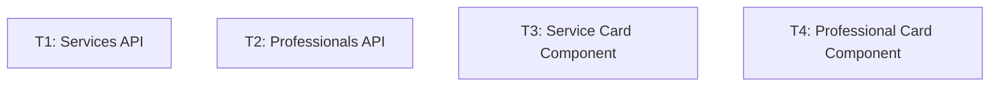
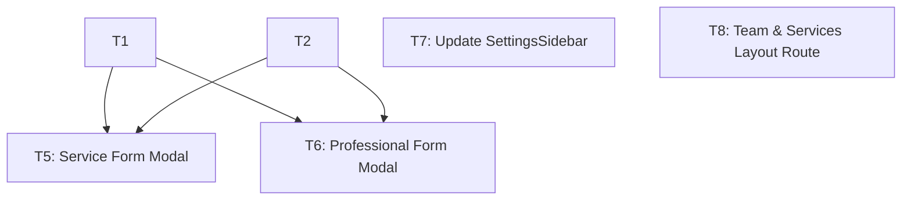
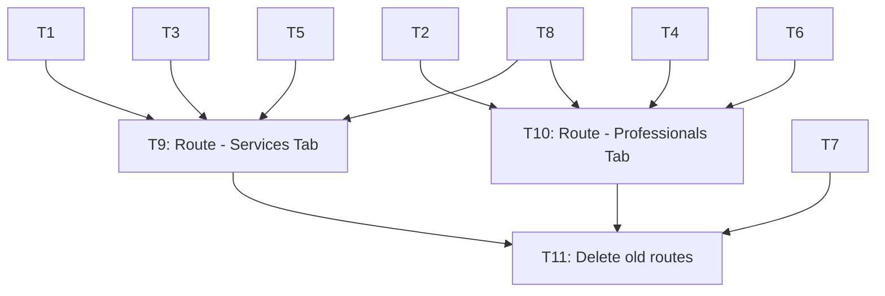

# Professionals and Services Tasks

**Design**: `.specs/features/professionals-and-services/design.md`
**Status**: Draft

---

## Execution Plan

### Phase 1: Foundation (Parallel OK)
Independent components and API layers.

### Phase 2: Modals & Layout (Parallel OK)
Forms that depend on the APIs to fetch linkage data, plus the layout shell.

### Phase 3: Integration & Assembly (Sequential)
Wiring the routes together and cleaning up old files.

---

## Task Breakdown

### T1: Services API Service & Hooks [P]
**Status**: ✅ Complete
**What**: Create Axios service and TanStack Query hooks for Services CRUD.
**Where**: `src/modules/services/api/services-api.ts` and `src/modules/services/queries/service-queries.ts`
**Depends on**: None
**Reuses**: `src/lib/axios.ts`
**Requirement**: TEAM-01
**Tools**:
- MCP: `filesystem`
- Skill: NONE
**Done when**:
- [ ] API functions (get, create, update, delete) are implemented.
- [ ] Query hooks (useServices, useCreateService, etc.) are implemented.
- [ ] Unit tests pass for the API hooks.
- [ ] Gate check passes: `pnpm test`
- [ ] Test count: >3 tests pass.
**Tests**: unit
**Gate**: quick

---

### T2: Professionals API Service & Hooks [P]
**Status**: ✅ Complete
**What**: Create Axios service and TanStack Query hooks for Professionals CRUD.
**Where**: `src/modules/professionals/api/professionals-api.ts` and `src/modules/professionals/queries/professional-queries.ts`
**Depends on**: None
**Reuses**: `src/lib/axios.ts`
**Requirement**: TEAM-02
**Tools**:
- MCP: `filesystem`
- Skill: NONE
**Done when**:
- [ ] API functions (get, create, update, delete) are implemented.
- [ ] Query hooks (useProfessionals, etc.) are implemented.
- [ ] Unit tests pass for the API hooks.
- [ ] Gate check passes: `pnpm test`
- [ ] Test count: >3 tests pass.
**Tests**: unit
**Gate**: quick

---

### T3: Service Card Component [P]
**Status**: ✅ Complete
**What**: Create a presentational card component for displaying a service.
**Where**: `src/modules/services/components/service-card.tsx`
**Depends on**: None
**Reuses**: `src/components/ui/card.tsx`, `src/components/ui/button.tsx`
**Requirement**: TEAM-01
**Tools**:
- MCP: `filesystem`
- Skill: `storybook`
**Done when**:
- [ ] Renders name, duration, price, and catalogCombo badge.
- [ ] Includes Edit and Delete actions (Trash icon triggers generic confirmation).
- [ ] Storybook story created.
- [ ] Integration tests verify rendering and callbacks.
- [ ] Gate check passes: `pnpm test`
- [ ] Test count: >2 tests pass.
**Tests**: integration
**Gate**: quick

---

### T4: Professional Card Component [P]
**Status**: ✅ Complete
**What**: Create a presentational card component for displaying a professional.
**Where**: `src/modules/professionals/components/professional-card.tsx`
**Depends on**: None
**Reuses**: `src/components/ui/card.tsx`, `src/components/ui/button.tsx`
**Requirement**: TEAM-02
**Tools**:
- MCP: `filesystem`
- Skill: `storybook`
**Done when**:
- [ ] Renders name, email, phone avatar.
- [ ] Includes Edit and Delete actions (Trash icon triggers generic confirmation).
- [ ] Storybook story created.
- [ ] Integration tests verify rendering and callbacks.
- [ ] Gate check passes: `pnpm test`
- [ ] Test count: >2 tests pass.
**Tests**: integration
**Gate**: quick

---

### T5: Service Form Modal [P]
**Status**: ✅ Complete
**What**: Dialog component with react-hook-form to create/edit services and link professionals.
**Where**: `src/modules/services/components/service-form-modal.tsx`
**Depends on**: T1, T2
**Reuses**: `src/components/ui/dialog.tsx`, `src/components/ui/input.tsx`
**Requirement**: TEAM-01, TEAM-03
**Tools**:
- MCP: `filesystem`
- Skill: `storybook`
**Done when**:
- [ ] Form with Zod validation.
- [ ] Section to toggle catalogCombo.
- [ ] Section to link professionals and set priceOverrides.
- [ ] Storybook story with MSW mocks.
- [ ] Integration tests verify form submission.
- [ ] Gate check passes: `pnpm test`
- [ ] Test count: >2 tests pass.
**Tests**: integration
**Gate**: quick

---

### T6: Professional Form Modal [P]
**Status**: ✅ Complete
**What**: Dialog component with react-hook-form to create/edit professionals and link services.
**Where**: `src/modules/professionals/components/professional-form-modal.tsx`
**Depends on**: T1, T2
**Reuses**: `src/components/ui/dialog.tsx`, `src/components/ui/input.tsx`
**Requirement**: TEAM-02, TEAM-03
**Tools**:
- MCP: `filesystem`
- Skill: `storybook`
**Done when**:
- [ ] Form with Zod validation.
- [ ] Section to link services and set priceOverrides.
- [ ] Storybook story with MSW mocks.
- [ ] Integration tests verify form submission.
- [ ] Gate check passes: `pnpm test`
- [ ] Test count: >2 tests pass.
**Tests**: integration
**Gate**: quick

---

### T7: Update SettingsSidebar [P]
**What**: Update the sidebar links to use `/settings/team-and-services/professionals` instead of the separate ones.
**Status**: ✅ Complete
**What**: Replace "Profissionais" and "Serviços" links with a single "Equipe e Serviços" link (or points to the default tab).
**Where**: `src/modules/establishments/components/settings-sidebar.tsx`
**Depends on**: None
**Reuses**: Existing `SettingsSidebar`
**Requirement**: TEAM-01, TEAM-02
**Tools**:
- MCP: `filesystem`
- Skill: NONE
**Done when**:
- [ ] Replaces "Profissionais" and "Serviços" links with a single "Equipe e Serviços" link (or points to the default tab).
- [ ] Tests updated to reflect the new navigation items.
- [ ] Gate check passes: `pnpm test`
- [ ] Test count: >1 test pass.
**Tests**: integration
**Gate**: quick

---

### T8: Team & Services Layout Route [P]
**Status**: ✅ Complete
**What**: Create layout with Tabs (Profissionais / Serviços) using TanStack Router nested routes.
**Where**: `src/routes/_authenticated/settings/team-and-services/route.tsx`
**Depends on**: None
**Reuses**: `@tanstack/react-router` Link
**Requirement**: TEAM-01, TEAM-02
**Tools**:
- MCP: `filesystem`
- Skill: NONE
**Done when**:
- [ ] Renders visual tabs for navigation.
- [ ] Outlet renders the child routes.
- [ ] Tests verify tab rendering.
- [ ] Gate check passes: `pnpm test`
- [ ] Test count: >1 test pass.
**Tests**: integration
**Gate**: quick

---

### T9: Route - Services Tab [P]
**Status**: ✅ Complete
**What**: Mount `ServiceCard` list and `ServiceFormModal` connecting to API hooks.
**Where**: `src/routes/_authenticated/settings/team-and-services/services.tsx`
**Depends on**: T1, T3, T5, T8
**Reuses**: None
**Requirement**: TEAM-01
**Tools**:
- MCP: `filesystem`
- Skill: NONE
**Done when**:
- [ ] Fetches services using `useServices`.
- [ ] Renders list of `ServiceCard`.
- [ ] Modals wired to state.
- [ ] Component integration tests (MSW mocked) pass.
- [ ] Gate check passes: `pnpm test`
- [ ] Test count: >1 test pass.
**Tests**: integration
**Gate**: quick

---

### T10: Route - Professionals Tab [P]
**Status**: ✅ Complete
**What**: Mount `ProfessionalCard` list and `ProfessionalFormModal` connecting to API hooks.
**Where**: `src/routes/_authenticated/settings/team-and-services/professionals.tsx`
**Depends on**: T2, T4, T6, T8
**Reuses**: None
**Requirement**: TEAM-02
**Tools**:
- MCP: `filesystem`
- Skill: NONE
**Done when**:
- [ ] Fetches professionals using `useProfessionals`.
- [ ] Renders list of `ProfessionalCard`.
- [ ] Modals wired to state.
- [ ] Component integration tests (MSW mocked) pass.
- [ ] Gate check passes: `pnpm test`
- [ ] Test count: >1 test pass.
**Tests**: integration
**Gate**: quick

---

### T11: Delete old routes [P]
**Status**: ✅ Complete
**What**: Remove `src/routes/_authenticated/settings/professionals.tsx` and `src/routes/_authenticated/settings/services.tsx`.
**Where**: `src/routes/_authenticated/settings/professionals.tsx` and `src/routes/_authenticated/settings/services.tsx`
**Depends on**: T7, T9, T10
**Reuses**: None
**Requirement**: TEAM-01, TEAM-02
**Tools**:
- MCP: `filesystem`
- Skill: NONE
**Done when**:
- [ ] Files are deleted.
- [ ] Route tree generator runs without errors.
- [ ] Application builds without missing route errors.
- [ ] Gate check passes: `pnpm build`
- [ ] Test count: N/A
**Tests**: none
**Gate**: build
