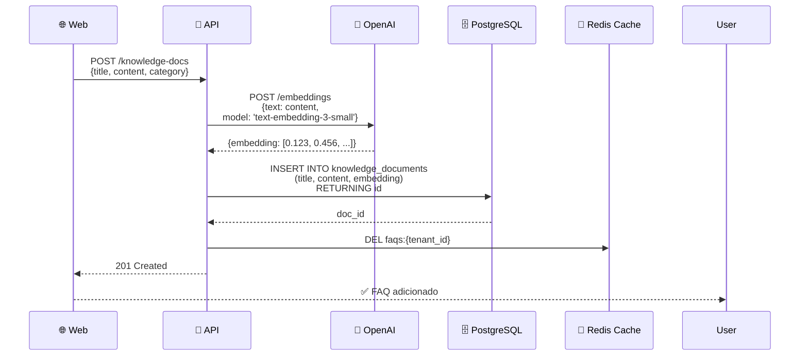

# 08-FAQ — Wireframes, Sequence, Estado

[Wireframes já em user-flow]

## Sequence: Adicionar FAQ com Embedding

```mermaid
sequenceDiagram
    participant Web as 🌐 Web
    participant API as 🚀 API
    participant OpenAI as 🧠 OpenAI
    participant DB as 🗄️ PostgreSQL
    participant Cache as 💾 Redis Cache
    
    Web->>API: POST /knowledge-docs<br/>{title, content, category}
    
    API->>OpenAI: POST /embeddings<br/>{text: content,<br/>model: 'text-embedding-3-small'}
    OpenAI-->>API: {embedding: [0.123, 0.456, ...]}
    
    API->>DB: INSERT INTO knowledge_documents<br/>(title, content, embedding)<br/>RETURNING id
    DB-->>API: doc_id
    
    API->>Cache: DEL faqs:{tenant_id}
    API-->>Web: 201 Created
    Web-->>User: ✅ FAQ adicionado
```

## State

[Veja user-flow]
