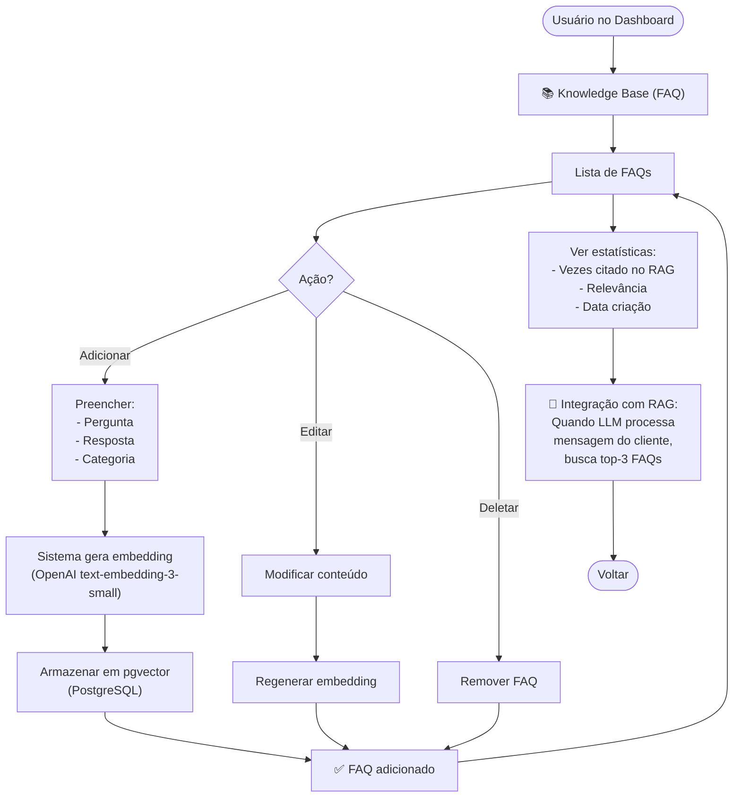
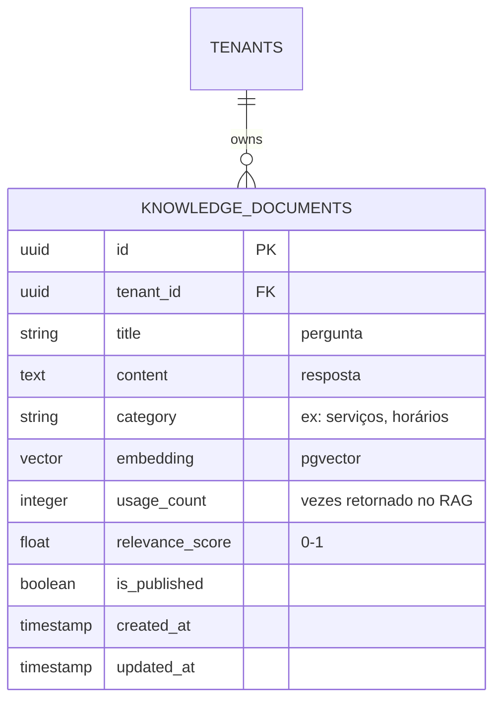
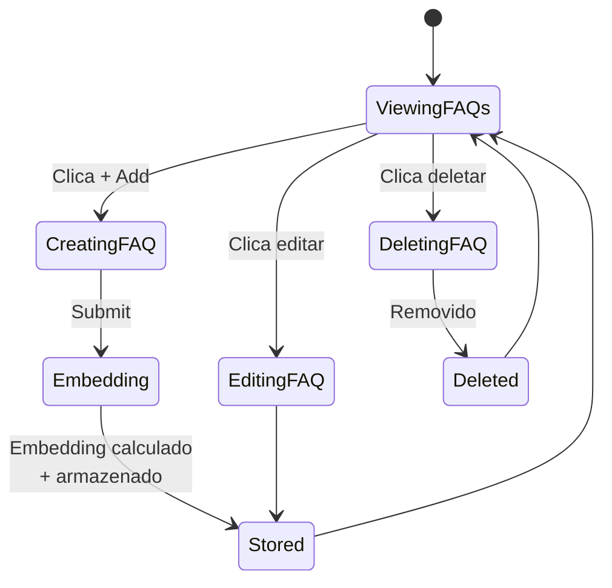

# 08-FAQ — Fluxo / Estados / Wireframes / ERD

## User Flow



## ERD



## Wireframes

```
┌─────────────────────────────────────────────────────────┐
│  Knowledge Base                            [← Voltar]   │
├─────────────────────────────────────────────────────────┤
│                                                         │
│             [ + Adicionar FAQ ]                        │
│                                                         │
│  FAQs Cadastradas:                                      │
│                                                         │
│  ┌─────────────────────────────────────────────────┐  │
│  │ ❓ Qual é o valor do corte masculino?           │  │
│  │ Resposta: O corte masculino custa R$ 35...      │  │
│  │ Categoria: Serviços                              │  │
│  │ Usado: 23 vezes | Score: 0.92                   │  │
│  │ [Editar] [Deletar]                               │  │
│  └─────────────────────────────────────────────────┘  │
│                                                         │
│  ┌─────────────────────────────────────────────────┐  │
│  │ ❓ Qual é o horário de funcionamento?           │  │
│  │ Resposta: Abrimos de seg-sex 9h-18h...          │  │
│  │ Categoria: Horários                              │  │
│  │ Usado: 45 vezes | Score: 0.98                   │  │
│  │ [Editar] [Deletar]                               │  │
│  └─────────────────────────────────────────────────┘  │
│                                                         │
└─────────────────────────────────────────────────────────┘
```

## State Diagram


