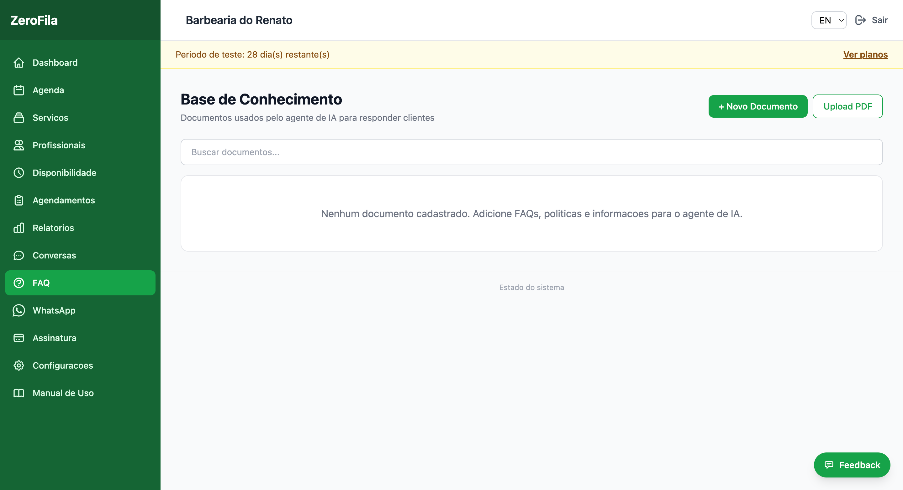
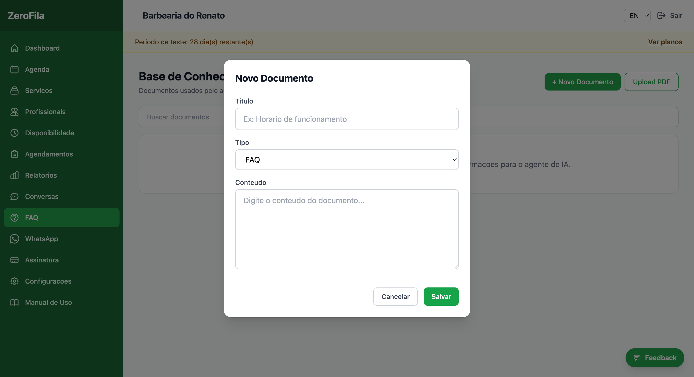

## Criar base de conhecimento (FAQ)

**Menu:**  Painel Admin →  **FAQ**

A base de conhecimento permite que o assistente IA responda a perguntas frequentes com informações específicas do seu estabelecimento.

### Como adicionar:

1.  Clique em  **"Novo Documento"**.
2.  Preencha:  **Título**,  **Tipo**  (FAQ, Política ou Informação) e  **Conteúdo**.
3.  Clique em  **"Salvar"**.

O sistema processa automaticamente o conteúdo com inteligência artificial para que o assistente consiga encontrar a informação relevante durante as conversas.

### Exemplos de documentos úteis:

#### Política de Cancelamento

O cliente pode cancelar até 2 horas antes do horário marcado, sem qualquer custo. Cancelamentos fora deste prazo poderão ser sujeitos a uma taxa de 50% do valor do serviço.

#### Formas de Pagamento

Aceitamos: Dinheiro, Cartão de débito e crédito (Visa, Mastercard, Elo), PIX. Pagamento realizado após a conclusão do serviço.

#### Serviços para Crianças

Realizamos cortes infantis para crianças a partir de 3 anos. Preço: R$ 25,00. Duração: 20 minutos. Criança deve estar acompanhada por um responsável.

**Dica:**  Quanto mais informação relevante cadastrar, melhor o assistente IA responderá. Pense nas perguntas mais frequentes que recebe por telefone.