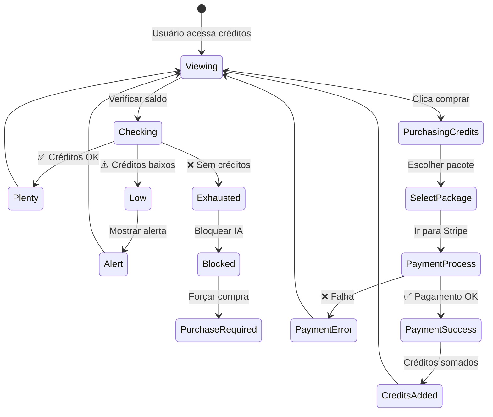
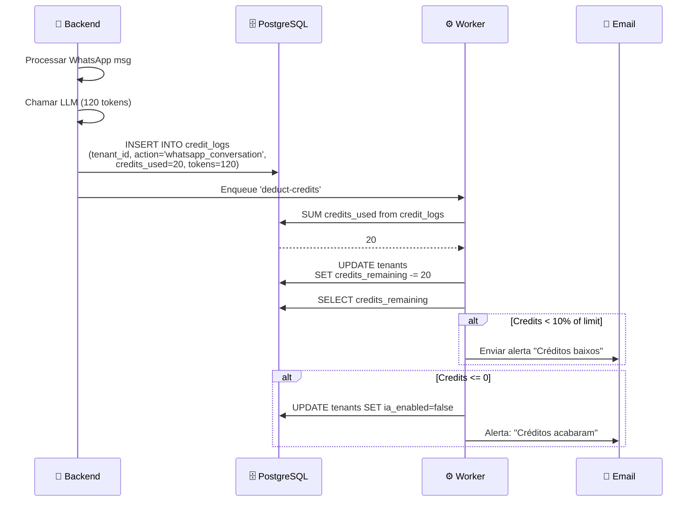

# 07-IA-Credits — Estados e Sequência

## State Diagram

```mermaid
stateDiagram-v2
    [*] --> Viewing: Usuário acessa créditos
    Viewing --> Checking: Verificar saldo
    
    Checking --> Plenty: ✅ Créditos OK
    Plenty --> Viewing
    
    Checking --> Low: ⚠️ Créditos baixos
    Low --> Alert: Mostrar alerta
    Alert --> Viewing
    
    Checking --> Exhausted: ❌ Sem créditos
    Exhausted --> Blocked: Bloquear IA
    Blocked --> PurchaseRequired: Forçar compra
    
    Viewing --> PurchasingCredits: Clica comprar
    PurchasingCredits --> SelectPackage: Escolher pacote
    SelectPackage --> PaymentProcess: Ir para Stripe
    PaymentProcess --> PaymentError: ❌ Falha
    PaymentError --> Viewing
    
    PaymentProcess --> PaymentSuccess: ✅ Pagamento OK
    PaymentSuccess --> CreditsAdded: Créditos somados
    CreditsAdded --> Viewing
```

## Sequence: Debitagem de Créditos

```mermaid
sequenceDiagram
    participant App as 🚀 Backend
    participant DB as 🗄️ PostgreSQL
    participant Worker as ⚙️ Worker
    participant Email as 📧 Email
    
    App->>App: Processar WhatsApp msg
    App->>App: Chamar LLM (120 tokens)
    App->>DB: INSERT INTO credit_logs<br/>(tenant_id, action='whatsapp_conversation',<br/>credits_used=20, tokens=120)
    
    App->>Worker: Enqueue 'deduct-credits'
    Worker->>DB: SUM credits_used from credit_logs
    DB-->>Worker: 20
    Worker->>DB: UPDATE tenants<br/>SET credits_remaining -= 20
    
    Worker->>DB: SELECT credits_remaining
    alt Credits < 10% of limit
        Worker->>Email: Enviar alerta "Créditos baixos"
    end
    
    alt Credits <= 0
        Worker->>DB: UPDATE tenants SET ia_enabled=false
        Worker->>Email: Alerta: "Créditos acabaram"
    end
```
