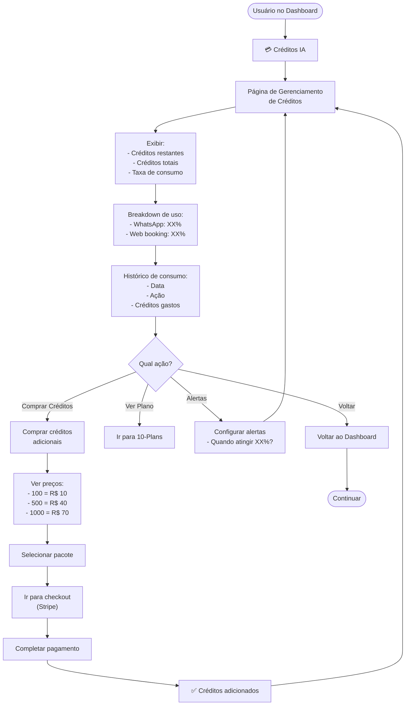
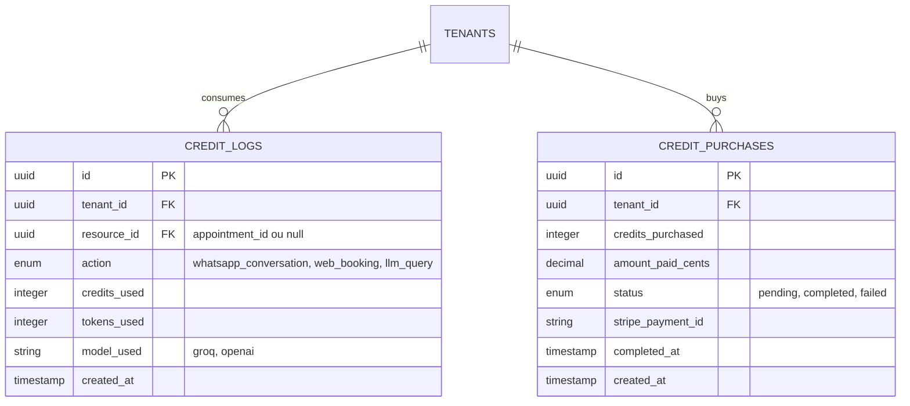

# 07-IA-Credits — Fluxo / Diagrama

## User Flow



## Wireframes

```
┌─────────────────────────────────────────────────────────┐
│  Créditos IA                               [← Voltar]   │
├─────────────────────────────────────────────────────────┤
│                                                         │
│  💳 Créditos Restantes                                  │
│                                                         │
│  ╔═════════════════════════════════════════════════╗   │
│  ║        450 de 500 créditos                      ║   │
│  ║        ████████████░░░ 90%                      ║   │
│  ║        R$ 44,50 / R$ 49,50                      ║   │
│  ║                                                 ║   │
│  ║  ⚠️ Aviso: Créditos acabando!                   ║   │
│  ║  Seu plano Starter reseta em 12 dias.          ║   │
│  ║                                                 ║   │
│  ║        [ Comprar mais créditos ]                ║   │
│  ╚═════════════════════════════════════════════════╝   │
│                                                         │
│  📊 Consumo deste Mês                                   │
│                                                         │
│  WhatsApp:      320 créditos (85%)  ██████████░        │
│  Web Booking:   30 créditos (15%)   ██░░░░░░░░          │
│                                                         │
│  ─────────────────────────────────────────────────────  │
│                                                         │
│  📝 Histórico de Consumo                                │
│                                                         │
│  18/05 14:32  WhatsApp conversation     20 créditos    │
│  18/05 12:00  WhatsApp conversation     15 créditos    │
│  18/05 09:30  Web booking page          5 créditos     │
│                                                         │
│  [ Ver mais ]                                           │
│                                                         │
│  ─────────────────────────────────────────────────────  │
│                                                         │
│  [ 🔔 Configurar Alertas ]  [ 📊 Ver Plano ]          │
│                                                         │
└─────────────────────────────────────────────────────────┘
```

## ERD


