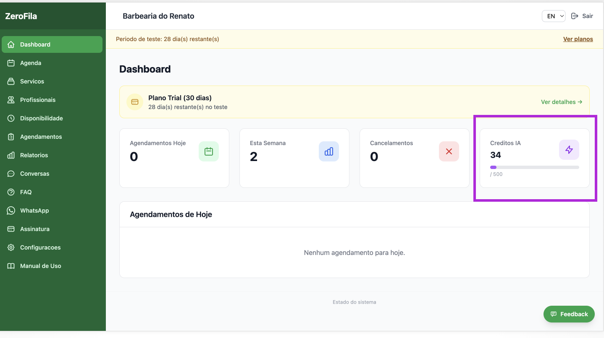

# 18. Créditos IA do Assistente Virtual

## O que são

Cada interação com o assistente IA consome créditos. Os créditos medem o uso do assistente virtual.

---

## Limites por plano

| Plano    | Créditos/mês |
| -------- | ------------ |
| Trial    | 500          |
| Starter  | 1.500        |
| Pro      | 8.000        |
| Business | 30.000       |

> 💡 **Obs:** Valores ilustrativos, preciso pesquisar valores e alternativas..

---

## Onde ver o consumo

No Dashboard (card **"Créditos IA"**) e na página de Assinatura (barra de progresso).

---

## O que acontece quando esgotam

O assistente para de responder e envia mensagem ao cliente pedindo contacto directo.  
Os créditos renovam automaticamente no início de cada mês.

---

> 💡 **Dica:** Se os créditos estão a esgotar rapidamente, pode fazer upgrade do plano para ter mais créditos.