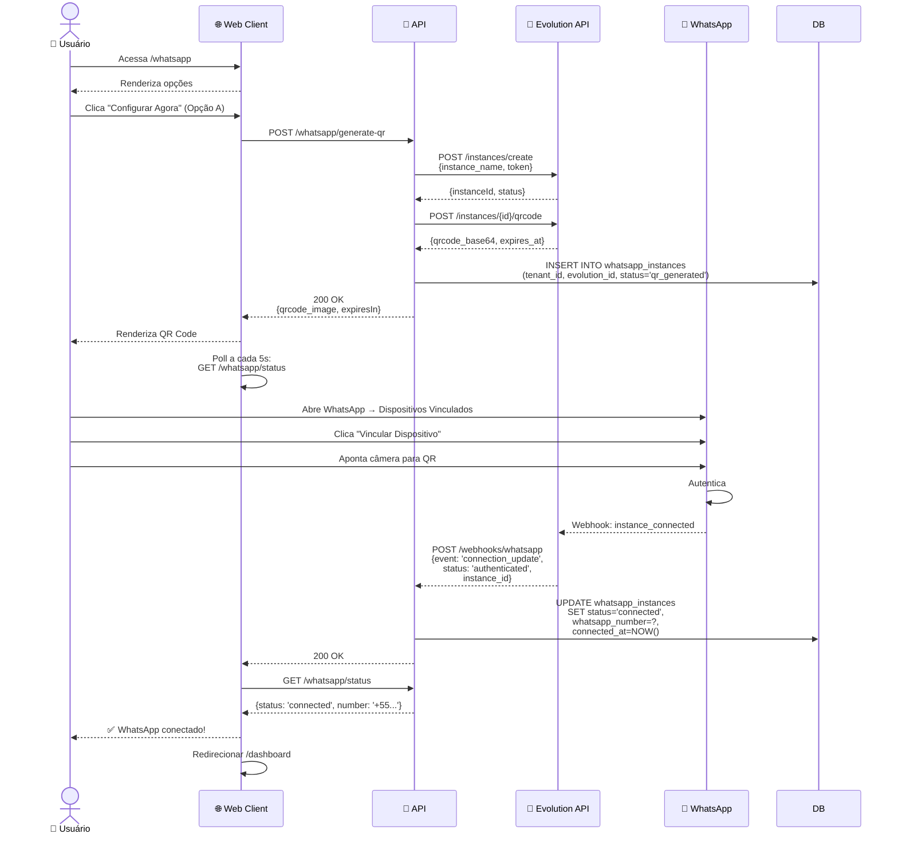
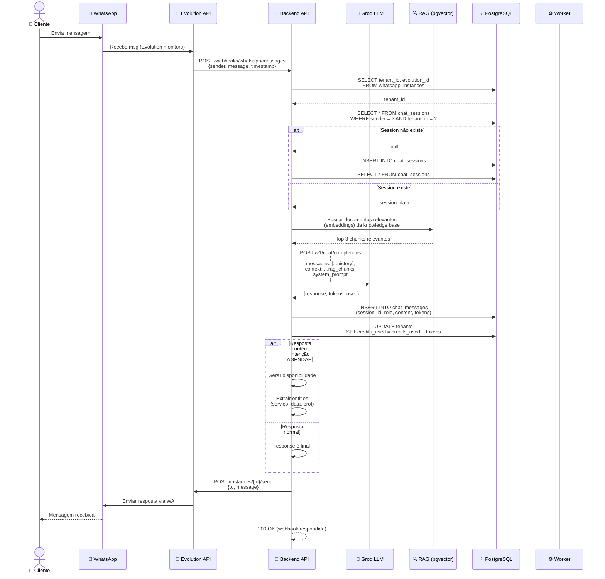
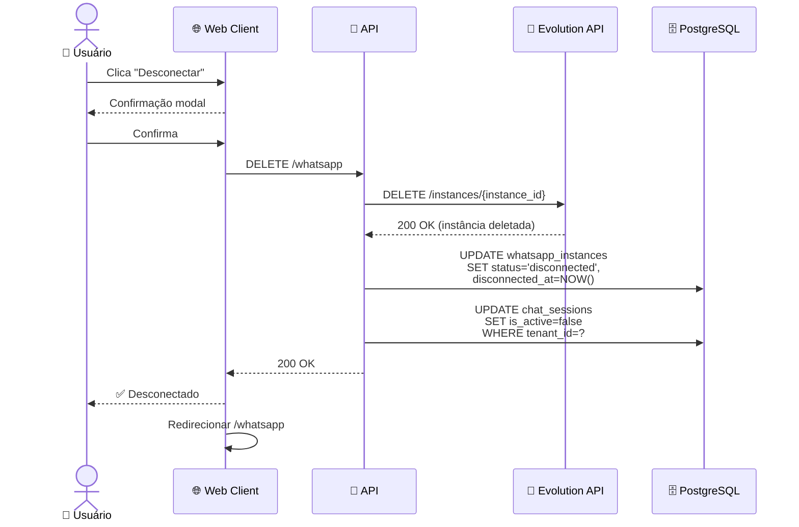
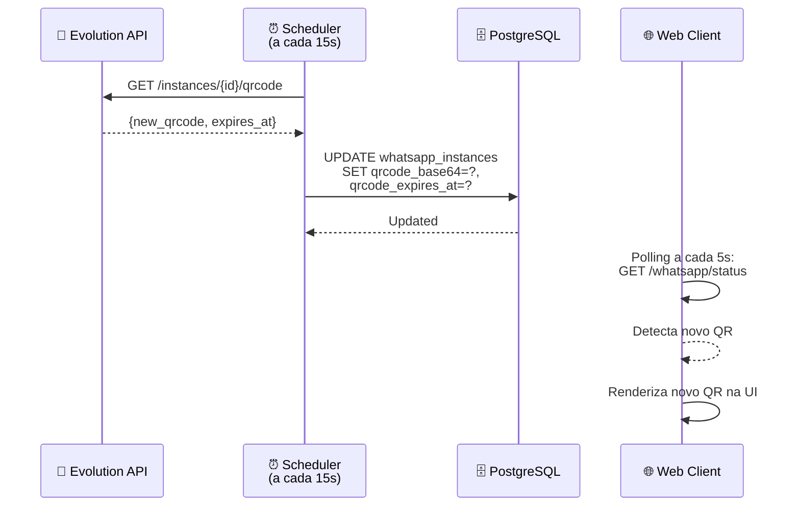

# 06-WhatsApp Integration — Diagrama de Sequência

## Fluxo: Conectar WhatsApp (QR Code)

## Fluxo: Receber Mensagem e Processar

## Fluxo: Desconectar WhatsApp

## Fluxo: Gerar QR Code Automático (Renovação)

