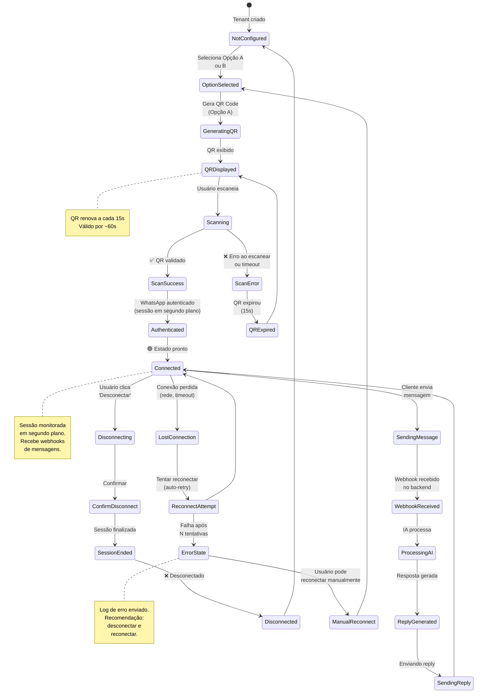
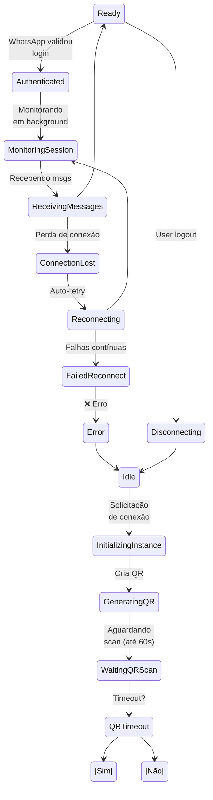

# 06-WhatsApp Integration — Diagrama de Estados

```mermaid
stateDiagram-v2
    [*] --> NotConfigured: Tenant criado
    
    NotConfigured --> OptionSelected: Seleciona Opção A<br/>ou B
    
    OptionSelected --> GeneratingQR: Gera QR Code<br/>(Opção A)
    GeneratingQR --> QRDisplayed: QR exibido
    QRDisplayed --> Scanning: Usuário escaneia
    
    Scanning --> ScanSuccess: ✅ QR validado
    ScanSuccess --> Authenticated: WhatsApp autenticado<br/>(sessão em segundo plano)
    
    Scanning --> ScanError: ❌ Erro ao escanear<br/>ou timeout
    ScanError --> QRExpired: QR expirou<br/>(15s)
    QRExpired --> QRDisplayed
    
    Authenticated --> Connected: 🟢 Estado pronto
    
    Connected --> SendingMessage: Cliente envia<br/>mensagem
    SendingMessage --> WebhookReceived: Webhook recebido<br/>no backend
    WebhookReceived --> ProcessingAI: IA processa
    ProcessingAI --> ReplyGenerated: Resposta gerada
    ReplyGenerated --> SendingReply: Enviando reply
    SendingReply --> Connected
    
    Connected --> Disconnecting: Usuário clica<br/>'Desconectar'
    Disconnecting --> ConfirmDisconnect: Confirmar
    ConfirmDisconnect --> SessionEnded: Sessão finalizada
    SessionEnded --> Disconnected: ❌ Desconectado
    
    Disconnected --> NotConfigured
    
    Connected --> LostConnection: Conexão perdida<br/>(rede, timeout)
    LostConnection --> ReconnectAttempt: Tentar reconectar<br/>(auto-retry)
    ReconnectAttempt --> Connected
    ReconnectAttempt --> ErrorState: Falha após<br/>N tentativas
    ErrorState --> ManualReconnect: Usuário pode<br/>reconectar manualmente
    ManualReconnect --> OptionSelected
    
    note right of QRDisplayed
      QR renova a cada 15s
      Válido por ~60s
    end note
    
    note right of Connected
      Sessão monitorada
      em segundo plano.
      Recebe webhooks
      de mensagens.
    end note
    
    note right of ErrorState
      Log de erro enviado.
      Recomendação:
      desconectar e
      reconectar.
    end note
```

## Estado de Conexão com Evolution API

```mermaid
stateDiagram-v2
    Idle --> InitializingInstance: Solicitação<br/>de conexão
    InitializingInstance --> GeneratingQR: Cria QR
    
    GeneratingQR --> WaitingQRScan: Aguardando<br/>scan (até 60s)
    
    WaitingQRScan --> QRTimeout: Timeout?
    QRTimeout -->|Sim| GeneratingQR
    QRTimeout -->|Não| Ready
    
    Ready --> Authenticated: WhatsApp validou<br/>login
    
    Authenticated --> MonitoringSession: Monitorando<br/>em background
    MonitoringSession --> ReceivingMessages: Recebendo msgs
    
    ReceivingMessages --> Ready
    ReceivingMessages --> ConnectionLost: Perda de conexão
    
    ConnectionLost --> Reconnecting: Auto-retry
    Reconnecting --> MonitoringSession
    Reconnecting --> FailedReconnect: Falhas contínuas
    
    FailedReconnect --> Error: ❌ Erro
    Error --> Idle
    
    Ready --> Disconnecting: User logout
    Disconnecting --> Idle
```
