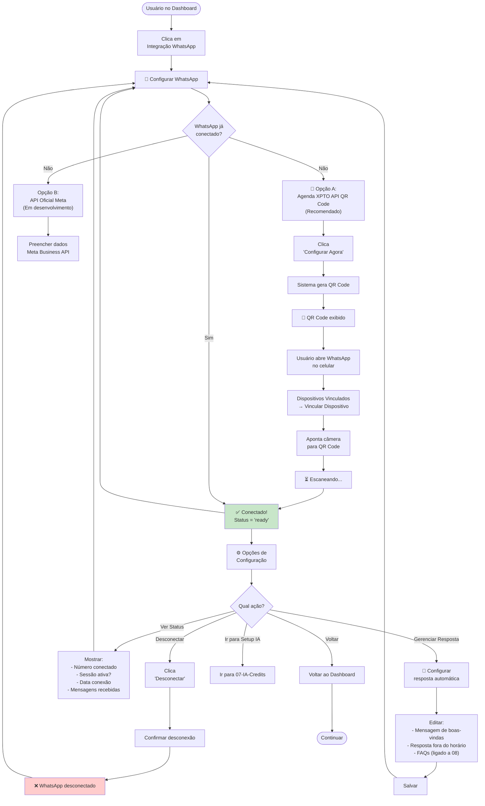

# 06-WhatsApp Integration — Fluxo de Usuário

**Decisões Principais:**
- Agenda XPTO API (Evolution API) = padrão (sem conta Meta)
- API Oficial Meta = para empresas com negócios verificados
- QR Code renova a cada 15 segundos
- Session monitoring contínuo
- Desconexão é reversível

**Fluxo de Mensagens:**
- WhatsApp → Evolution API → Webhook do Backend
- Backend processa com IA
- IA gera resposta
- Backend → Evolution API → WhatsApp
