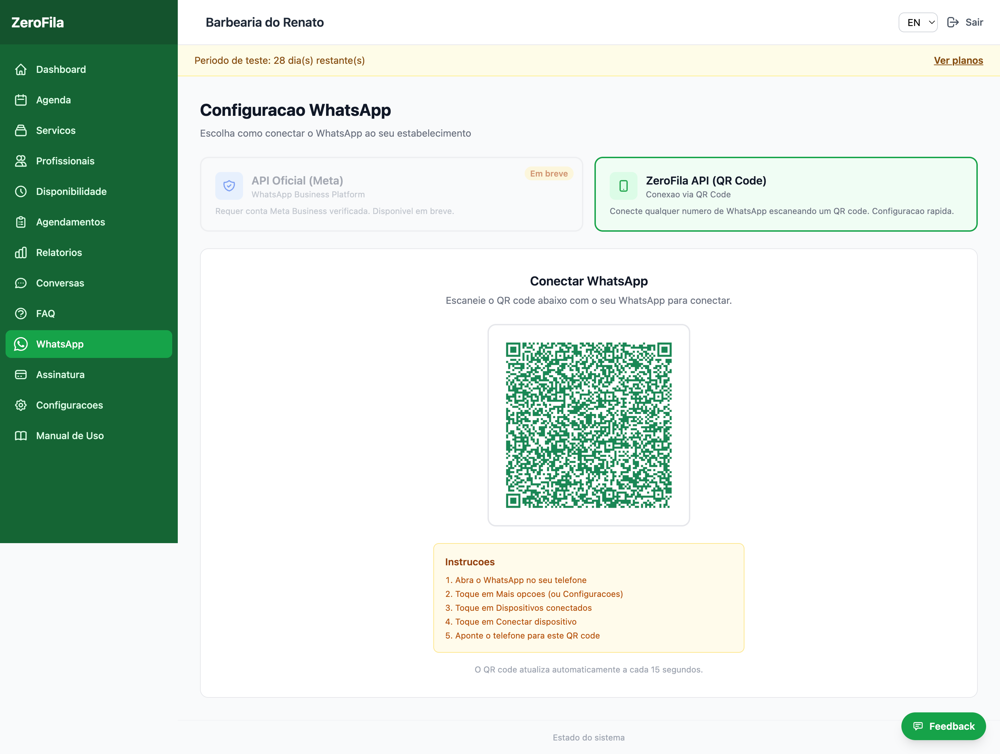

# 7. Configurar a Integração com WhatsApp

**Menu:** Painel Admin → WhatsApp  

O ZeroFila oferece duas formas de ligar o WhatsApp ao seu negócio. Escolha a que melhor se adapta às suas necessidades:

---

## 🟢 Opção A — ZeroFila API (QR Code) *(Recomendado)*

A forma mais rápida e simples. Conecte qualquer número WhatsApp (pessoal ou Business) em menos de 2 minutos, sem necessidade de conta Meta Business.

### Como configurar:

1. No painel, vá a **WhatsApp** e selecione **"ZeroFila API (QR Code)"**.  
2. Clique em **"Configurar Agora"** — o sistema cria automaticamente a sua instância.  
3. Um **QR Code** aparecerá no ecrã.  
4. No seu telemóvel, abra o WhatsApp → **Dispositivos vinculados** → **Vincular dispositivo**.  
5. Aponte a câmara para o QR Code.  
6. Quando o estado mudar para **"WhatsApp Conectado"**, está pronto!

> ⚠️ **Nota:** O QR Code renova automaticamente a cada 15 segundos. Se expirar, basta aguardar o novo.

---

## ⚙️ Opção B — API Oficial (Meta) *(Em breve)*

Para empresas que necessitam da API oficial do WhatsApp Business Platform. Requer conta verificada no Meta Business Suite.

### Pré-requisitos:

- Conta no **Meta Business Suite (Facebook Business)**  
- Aplicativo criado no **Meta for Developers**  
- Número de telefone verificado no **WhatsApp Business API**

---

### Campos

| Campo           | O que é                 | Onde encontrar                         |
| --------------- | ----------------------- | -------------------------------------- |
| Access Token    | Token de acesso da API  | Meta Business → Configurações do App   |
| Phone Number ID | Identificador do número | Meta Business → WhatsApp → Config. API |
| Verify Token    | Token de verificação    | Você define (frase secreta)            |
| Número WhatsApp | Número para os clientes | Número registrado no WA Business       |

---

### Passos:

1. Preencha os campos acima no painel do ZeroFila e clique em **"Salvar"**.  
2. No **Meta for Developers**, configure o webhook com a URL do seu domínio.  
3. Use o mesmo **Verify Token** que definiu no passo 1.  
4. Subscreva o campo **"messages"**.  
5. Teste enviando uma mensagem para o número configurado.

---

## 💬 Precisa de ajuda?

A configuração pode ser técnica. Contacte a equipa de suporte do ZeroFila para assistência.