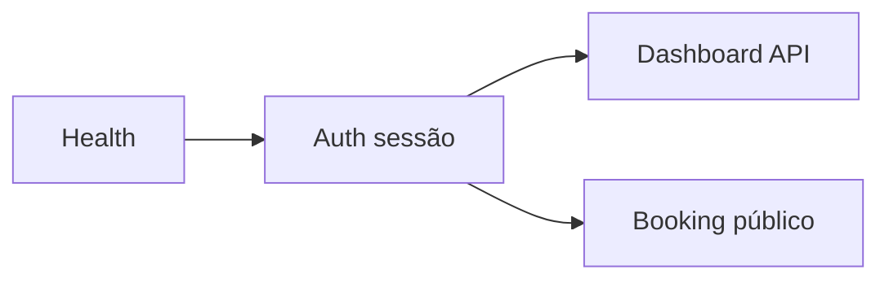

# Validação manual end-to-end — API Agenda XPTO

Guia para exercitar **fluxos principais** contra a API real (Fastify), de ponta a ponta, após `pnpm --filter api db:seed`. Útil para smoke test antes de release, regressão manual ou homologação.

**Escopo:** HTTP + cookies de sessão (Better Auth) + rotas públicas de booking. Não substitui testes automatizados (`pnpm --filter api test`).

---

## 1. Pré-requisitos

| Item | Comando / valor |
|------|------------------|
| PostgreSQL + Redis | `docker compose up -d` (na raiz do monorepo) |
| Variáveis | `DATABASE_URL` apontando para o DB local |
| Migrações | `pnpm --filter api db:migrate` (se o schema mudou) |
| Seed | `pnpm --filter api db:seed` |
| API | `pnpm --filter api dev` (padrão **http://localhost:3001**) |
| SPA / Swagger | O Better Auth aceita `Origin` da SPA (`WEB_URL`) **e** da própria API (`http://localhost:PORT`, etc.) para `trustedOrigins`. O Swagger em `/docs` usa o mesmo host da API — não é preciso abrir a SPA só para o login. |

Após o seed, o log Pino imprime credenciais e IDs de referência (veja o terminal). Valores fixos documentados:

| Campo | Valor |
|--------|--------|
| E-mail do dono | `owner@example.com` |
| Senha | `DevSeedPassword123` |
| Slug público do estabelecimento | `demo-salon` |
| Timezone do estabelecimento | `America/Sao_Paulo` |
| Plano (seed) | `PRO` em trial (`TRIALING`) |

**Importante:** IDs (`establishmentId`, `professionalId`, `serviceId`) são **CUID2** e mudam a cada `db:seed`. Sempre use o log do seed ou `GET /api/v1/public/booking/establishments/demo-salon` para copiar IDs atuais.

**Datas a evitar no booking (fixtures de bloqueio no seed):**

- `2026-06-01` — bloco do estabelecimento  
- `2026-06-02` — bloco do profissional A  

**Feriado fixture:** `2030-12-25` (lista de slots deve ficar vazia nesse dia).

---

## 2. Ordem sugerida dos fluxos (visão geral)



1. Saúde da API  
2. Autenticação (login + cookie)  
3. Estabelecimento e sessão “me”  
4. Disponibilidade (admin)  
5. Agendamentos (admin)  
6. Booking público (slug → slots → criar → cancelar com token)  
7. Notificações (leitura)  
8. Relatórios  
9. Planos / quota  

---

## 3. Fluxo — Health

| Passo | Ação | Resultado esperado |
|-------|------|---------------------|
| 3.1 | `GET /health` | `200`, corpo com status ok (schema em OpenAPI) |

---

## 4. Fluxo — Autenticação (Better Auth)

Sessão via **cookie** (`Set-Cookie` na resposta). Em `curl`, use `-c` / `-b` para gravar e reenviar cookies.

**Headers recomendados (chamadas autenticadas fora do Swagger):**

- `Origin: http://localhost:5173` (ou o valor de `WEB_URL`) — necessário para `curl`/SPA quando o pedido não vem do mesmo host da API  
- `Content-Type: application/json`

No **Swagger** em `http://localhost:3001/docs`, o browser envia `Origin: http://localhost:3001`; essa origem passa a estar em `trustedOrigins` (ver `src/lib/auth.ts`).

| Passo | Ação | Resultado esperado |
|-------|------|---------------------|
| 4.1 | `POST /api/auth/sign-in/email` com `{"email":"owner@example.com","password":"DevSeedPassword123"}` | `200` + `Set-Cookie` de sessão |
| 4.2 | `GET /api/v1/me` com os mesmos cookies | `200`, dados do utilizador autenticado |
| 4.3 | `POST /api/auth/sign-out` com cookies | `200`, sessão terminada |
| 4.4 | `GET /api/v1/me` sem cookie (ou após sign-out) | `401` |

**Exemplo mínimo (login + me):**

```bash
API=http://localhost:3001
ORIGIN=http://localhost:5173
COOKIEJAR=/tmp/agenda-xpto-cookies.txt

curl -sS -c "$COOKIEJAR" -H "Origin: $ORIGIN" -H "Content-Type: application/json" \
  -d '{"email":"owner@example.com","password":"DevSeedPassword123"}' \
  "$API/api/auth/sign-in/email"

curl -sS -b "$COOKIEJAR" -H "Origin: $ORIGIN" "$API/api/v1/me"
```

Também pode usar **Swagger UI** em `http://localhost:3001/docs` (apenas fora de produção): autenticar no browser, depois “Try it out” nos endpoints que usam cookie (alguns browsers exigem mesma origem; se falhar, prefira `curl` ou extensão que envie `Cookie`).

---

## 5. Fluxo — Estabelecimentos (autenticado)

| Passo | Método e rota | Resultado esperado |
|-------|----------------|-------------------|
| 5.1 | `GET /api/v1/establishments` | `200`, lista contém **Demo Salon** / slug `demo-salon` |
| 5.2 | `POST /api/v1/establishments` (corpo válido, novo slug único) | `201` ou `422` se limite de plano / slug duplicado |
| 5.3 | `GET /api/v1/establishments/:id` com `id` do seed (log ou lista) | `200` |
| 5.4 | `PATCH /api/v1/establishments/:id` (campos permitidos) | `200` |

Validar **403/404** com ID de estabelecimento que não pertence ao utilizador (opcional).

---

## 6. Fluxo — Disponibilidade (autenticado)

Prefixo típico: `/api/v1/establishments/:establishmentId/...` (confirmar em `/docs/json`).

| Passo | Ação | Resultado esperado |
|-------|------|---------------------|
| 6.1 | Listar horários de funcionamento | `200`, dias úteis coerentes com o seed |
| 6.2 | Listar feriados | Contém fixture `2030-12-25` (se o módulo expuser listagem) |
| 6.3 | Listar blocos | Reflete blocos de `2026-06-01` / `2026-06-02` |
| 6.4 | CRUD de blocos / disponibilidades de profissional (conforme rotas registadas) | Criação `201`, leitura `200`, atualização `200`, remoção `204` onde aplicável |

---

## 7. Fluxo — Agendamentos — painel (autenticado)

| Passo | Ação | Resultado esperado |
|-------|------|---------------------|
| 7.1 | `GET .../appointments` com query de datas | `200`, inclui agendamentos **CONFIRMED** do seed (maio/2026) |
| 7.2 | Cancelamento pelo dono / bulk (conforme rotas) | Estado atualizado, notificações enfileiradas se aplicável |
| 7.3 | Reagendamento (se existir rota) | `200`/`201` e conflitos `409`/`422` quando slot inválido |

---

## 8. Fluxo — Booking público (sem sessão)

Base: **`/api/v1/public/booking`**

| Passo | Método | Rota | Resultado esperado |
|-------|--------|------|---------------------|
| 8.1 | `GET` | `/establishments/demo-salon` | `200`, `services`, `professionals`, timezone |
| 8.2 | `GET` | `/establishments/demo-salon/slots?date=YYYY-MM-DD&serviceIds=<id1>&serviceIds=<id2>` | `200`, lista de `slots` (horário em ISO UTC). Usar **dia útil futuro** em `America/Sao_Paulo`, fora dos blocos seed |
| 8.3 | `POST` | `/establishments/demo-salon/appointments` | `201`, corpo inclui `cancelToken` **uma vez** — guardar para o passo 8.4 |
| 8.4 | `POST` | `/appointments/cancel/:cancelToken` | `200` para token válido e ainda não usado; `422`/`404` quando já cancelado ou inválido |

**Corpo do POST (exemplo — substituir IDs e `startAt` por valores do passo 8.1–8.2):**

```json
{
  "professionalId": "<professionalId>",
  "serviceIds": ["<serviceId>"],
  "startAt": "2026-05-20T14:00:00.000Z",
  "clientName": "Manual E2E Client",
  "clientEmail": "manual-e2e@example.com",
  "clientPhone": "+5511988887777"
}
```

Respeitar `minAdvanceMinutes` do estabelecimento (seed: **30** minutos) e duração dos serviços; slot deve coincidir com um retornado em 8.2.

---

## 9. Fluxo — Notificações (autenticado)

| Passo | Ação | Resultado esperado |
|-------|------|---------------------|
| 9.1 | Listar logs / fila (rotas do módulo `notifications`) | `200`, entradas ligadas a `APPOINTMENT_CONFIRMATION`, `REMINDER_24H`, etc., do seed |

---

## 10. Fluxo — Relatórios (autenticado)

Plano seed: **PRO** (trial) — relatórios “Pro” devem estar acessíveis onde o produto assim o definir.

| Passo | Ação | Resultado esperado |
|-------|------|---------------------|
| 10.1 | Pedir relatório “starter-only” com plano atual | `403` com código tipo `REPORT_REQUIRES_UPGRADE` onde aplicável |
| 10.2 | Pedir relatório permitido para PRO | `200`, estrutura conforme schema |

---

## 11. Fluxo — Planos e quota (autenticado)

| Passo | Método | Rota | Resultado esperado |
|-------|--------|------|---------------------|
| 11.1 | `GET` | `/api/v1/plans/current` | `200`, `planType` / `status` coerentes com subscription do utilizador |
| 11.2 | `GET` | `/api/v1/plans/quota?establishmentId=<id>` | `200`; com plano PRO espera-se quota “ilimitada” / não Starter |
| 11.3 | Fluxos `convert` / `upgrade` / `downgrade` (se aplicável ao teu ambiente) | Seguir exemplos no Swagger; validar `422` para transições inválidas |

---

## 12. Checklist rápido (copiar para PR / release)

- [ ] `/health` OK  
- [ ] Login + `GET /api/v1/me` OK  
- [ ] Lista de estabelecimentos contém `demo-salon`  
- [ ] Booking público: estabelecimento + slots + criar + cancelar  
- [ ] Pelo menos um endpoint de appointments (autenticado) OK  
- [ ] `GET /plans/current` OK  
- [ ] (Opcional) Relatório e notificações  

---

## 13. OpenAPI e troubleshooting

| Problema | Causa provável |
|----------|----------------|
| **Swagger: "Failed to fetch"** no `POST /api/auth/sign-in/email` | Antes: `trustedOrigins` do Better Auth só incluía `WEB_URL` (5173); o browser envia `Origin: http://localhost:3001` quando usas `/docs`. **Correção:** `apps/api/src/lib/auth.ts` inclui também `AUTH_URL` / `API_URL` / `localhost`+`PORT` e `127.0.0.1`+`PORT`. Reinicia a API após atualizar. |
| `403` no sign-in (curl / outra origem) | Header `Origin` não está em `trustedOrigins` — alinha `WEB_URL` / `AUTH_URL` com a origem real do cliente |
| Slots vazios | Feriado, bloco, `minAdvanceMinutes`, profissional sem disponibilidade para o weekday, ou serviço não associado ao profissional |
| `401` nas rotas `/api/v1/*` | Cookie de sessão ausente ou expirado |
| CORS no browser | Origem não permitida em `@fastify/cors` — ajustar `WEB_URL` / `API_URL` / `PORT` como em `server.ts` |

Especificação em tempo real: `GET http://localhost:3001/docs/json` (dev).

**Nota:** Em `curl` não existe `Origin` a menos que o envies; o Better Auth pode aceitar pedidos sem `Origin` de ferramentas CLI. No browser (Swagger), o `Origin` é sempre enviado em `POST` e tem de constar em `trustedOrigins`.

---

## 14. Referências no repositório

- [AGENTS.md](../AGENTS.md) — visão geral e comandos  
- [docs/flow/06-public-booking-page/USER_STORIES.md](flow/06-public-booking-page/USER_STORIES.md) — regras do booking  
- [docs/flow/00-sustain/DATABASE.md](flow/00-sustain/DATABASE.md) — algoritmo de slots e modelo de dados  

---

*Última revisão: alinhado ao seed com disponibilidade Mon–Sex para ambos os profissionais, `minAdvanceMinutes: 30`, e log estruturado com IDs após `db:seed`.*
