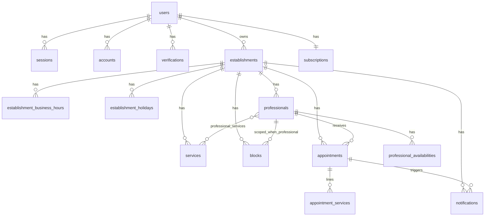

# DATABASE.md — AgendaIA

**Versão:** 1.0 | **Data:** Abril 2026 | **Estado:** Canónico para modelo de dados do MVP

Este documento descreve o modelo relacional, convenções Prisma, ERD e regras que cruzam com o [PRD](../../PRD.md), [ARCHITECTURE](./ARCHITECTURE.md) e user stories dos fluxos 03–09.

> **Nota de alinhamento com [ARCHITECTURE.md §6.2](./ARCHITECTURE.md):** esse parágrafo ainda referencia `ServiceCombo` e `Subscription` ao nível do estabelecimento. Está **desactualizado**. O modelo canónico é: **combo = `Service` normal** (sem entidade separada) e **assinatura por conta de utilizador** (`Subscription` ligada ao `User`, não ao `Establishment`). Actualizar `ARCHITECTURE.md` §6.2 quando conveniente; este ficheiro prevalece para dados.

---

## 1. Decisões de modelagem

| Decisão | Escolha | Motivo |
|--------|---------|--------|
| Chaves primárias | `String` com **cuid2** (`@default(cuid(2))`) | IDs opacos, seguros em URLs, sem sequência previsível |
| Auditoria | `created_at`, `updated_at` em todas as tabelas | Rastreio, ordenação, relatórios (ex.: antecedência média) |
| Soft delete | `deleted_at` em `users`, `establishments`, `professionals`, `services` | Histórico e downgrade sem apagar dados ([US-118](../09-plans/USER_STORIES.md)) |
| Data/hora | Todos os `DateTime` em **UTC** no PostgreSQL | Consistência entre fusos; regras de negócio usam `establishments.timezone` |
| Combo | Linha em `services` (nome, duração, preço definidos pelo dono) | Sem tabela `service_combo`; catálogo unificado ([módulo 06](../06-public-booking-page/USER_STORIES.md)) |
| Disponibilidade semanal | Vários registos por **dia da semana** por profissional | Ex.: 09:00–11:00 e 14:00–18:00 = 2 linhas ([US-411](../04-availability/USER_STORIES.md)) |
| Assinatura | Uma `Subscription` por **utilizador** (dono) | Um plano, N estabelecimentos; limites por plano ([PRD §10](../../PRD.md), [módulo 09](../09-plans/USER_STORIES.md)) |
| Profissional × Serviço | Tabela `professional_services` (N:N) | Especialização e override de preço ([US-204](../03-establishment-setup/USER_STORIES.md), [US-205](../03-establishment-setup/USER_STORIES.md)) |
| Itens do agendamento | `appointment_services` com **snapshot** | Preço/nome/duração imutáveis no histórico; serviço pode mudar ou ser soft-deleted |
| Bloqueios | `blocks.scope` = `ESTABLISHMENT` ou `PROFESSIONAL` | Folga global vs folga individual ([US-413](../04-availability/USER_STORIES.md)) |
| Cancelamento público | `cancel_token` (UUID) na criação do agendamento | Link opaco nos e-mails ([US-502](../05-appointments/USER_STORIES.md), [US-608](../06-public-booking-page/USER_STORIES.md)) |
| Quota Starter | Campo denormalizado na `Subscription` + job BullMQ | Contagem mensal; reset no dia 1 ([módulo 09](../09-plans/USER_STORIES.md), [ARCHITECTURE §7](./ARCHITECTURE.md)) |
| Preços monetários | **Centavos** (`Int`, sufixo `*_cents`) | Evitar erros de ponto flutuante |
| Feriados | Tabela `establishment_holidays` | Datas em que o estabelecimento não recebe agendamentos ([US-412](../04-availability/USER_STORIES.md)) |
| Estado inicial do agendamento | Persistir **só** `CONFIRMED` na mesma transacção | `PENDING` não existe na BD; “pendente” é apenas lógica transitória na app ([states](../05-appointments/diagrams/state-diagram/states.md)) |
| Ocupação de slot | Só `AppointmentStatus.CONFIRMED` bloqueia slot | `COMPLETED`, `NO_SHOW`, `CANCELLED` não entram no motor de interseção |

---

## 2. ERD (Mermaid)



---

## 3. Schema Prisma (referência)

O fragmento abaixo é a **fonte de verdade** do modelo; ajustar nomes de provider (`postgresql`) e extensões do Better Auth conforme a versão exacta no `package.json`.

```prisma
// schema.prisma (referência — colocar em apps/api/prisma/schema.prisma no monorepo)

generator client {
  provider = "prisma-client-js"
}

datasource db {
  provider = "postgresql"
  url      = env("DATABASE_URL")
}

// --- Enums ---

// PENDING não existe na BD: só estado lógico durante a transação de criação (ver secção 1 e 5).
enum AppointmentStatus {
  CONFIRMED
  COMPLETED
  CANCELLED
  NO_SHOW
}

enum NotificationType {
  APPOINTMENT_CONFIRMATION
  REMINDER_24H
  REMINDER_2H
  CANCELLATION_CLIENT
  CANCELLATION_OWNER
  NO_SHOW_CLIENT
  TRIAL_EXPIRY_ALERT
  PLAN_CHANGED
}

enum NotificationStatus {
  PENDING
  SENDING
  SENT
  FAILED_RETRYING
  FAILED_PERMANENT
}

enum PlanType {
  STARTER
  PRO
  BUSINESS
}

enum SubscriptionStatus {
  TRIALING
  ACTIVE
  PAST_DUE
  CANCELED
}

enum BlockScope {
  ESTABLISHMENT
  PROFESSIONAL
}

enum Weekday {
  MON
  TUE
  WED
  THU
  FRI
  SAT
  SUN
}

enum CancelledBy {
  CLIENT
  OWNER
  SYSTEM
}

// --- Better Auth (campos mínimos; completar com adapter oficial) ---

model User {
  id            String    @id @default(cuid(2))
  email         String    @unique
  emailVerified Boolean   @default(false) @map("email_verified")
  name          String?
  image         String?
  createdAt     DateTime  @default(now()) @map("created_at")
  updatedAt     DateTime  @updatedAt @map("updated_at")
  deletedAt     DateTime? @map("deleted_at")

  sessions              Session[]
  accounts              Account[]
  verifications         Verification[]
  establishments        Establishment[]
  subscription          Subscription?
  appointmentsCreated   Appointment[] @relation("AppointmentCreatedBy")

  @@map("users")
}

model Session {
  id        String   @id @default(cuid(2))
  expiresAt DateTime @map("expires_at")
  token     String   @unique
  createdAt DateTime @default(now()) @map("created_at")
  updatedAt DateTime @updatedAt @map("updated_at")
  ipAddress String?  @map("ip_address")
  userAgent String?  @map("user_agent")
  userId    String   @map("user_id")
  user      User     @relation(fields: [userId], references: [id], onDelete: Cascade)

  @@index([userId])
  @@map("sessions")
}

model Account {
  id                    String    @id @default(cuid(2))
  accountId             String    @map("account_id")
  providerId            String    @map("provider_id")
  userId                String    @map("user_id")
  user                  User      @relation(fields: [userId], references: [id], onDelete: Cascade)
  accessToken           String?   @map("access_token")
  refreshToken          String?   @map("refresh_token")
  idToken               String?   @map("id_token")
  accessTokenExpiresAt  DateTime? @map("access_token_expires_at")
  refreshTokenExpiresAt DateTime? @map("refresh_token_expires_at")
  scope                 String?
  password              String?
  createdAt             DateTime  @default(now()) @map("created_at")
  updatedAt             DateTime  @updatedAt @map("updated_at")

  @@index([userId])
  @@map("accounts")
}

model Verification {
  id         String   @id @default(cuid(2))
  identifier String
  value      String
  expiresAt  DateTime @map("expires_at")
  createdAt  DateTime @default(now()) @map("created_at")
  updatedAt  DateTime @updatedAt @map("updated_at")

  @@index([identifier])
  @@map("verifications")
}

// --- Negócio ---

model Subscription {
  id                              String             @id @default(cuid(2))
  userId                          String             @unique @map("user_id")
  user                            User               @relation(fields: [userId], references: [id], onDelete: Cascade)
  planType                        PlanType           @map("plan_type")
  status                          SubscriptionStatus
  trialEndsAt                     DateTime?          @map("trial_ends_at")
  currentPeriodStart              DateTime?          @map("current_period_start")
  currentPeriodEnd                DateTime?          @map("current_period_end")
  /// Contador denormalizado para plano Starter: agendamentos criados no mês civil (ver secção 5).
  starterMonthlyAppointmentsCount Int                @default(0) @map("starter_monthly_appointments_count")
  /// Início UTC do período mensal usado para o contador (ajustado pelo job do dia 1).
  starterQuotaPeriodStart         DateTime?          @map("starter_quota_period_start")
  createdAt                       DateTime           @default(now()) @map("created_at")
  updatedAt                       DateTime           @updatedAt @map("updated_at")

  @@index([status, planType])
  @@map("subscriptions")
}

model Establishment {
  id                   String    @id @default(cuid(2))
  userId               String    @map("user_id")
  user                 User      @relation(fields: [userId], references: [id], onDelete: Cascade)
  name                 String
  slug                 String    @unique
  email                String
  phone                String?
  address              String?
  /// IANA TZ, ex.: America/Sao_Paulo — usado em relatórios e mês civil Starter.
  timezone             String
  minAdvanceMinutes    Int       @default(60) @map("min_advance_minutes")
  isActive             Boolean   @default(true) @map("is_active")
  archivedAt           DateTime? @map("archived_at")
  /// Destino de alertas operacionais (ex.: cancelamento pelo cliente — US-705).
  operationalEmail     String?   @map("operational_email")
  createdAt            DateTime  @default(now()) @map("created_at")
  updatedAt            DateTime  @updatedAt @map("updated_at")
  deletedAt            DateTime? @map("deleted_at")

  businessHours   EstablishmentBusinessHour[]
  holidays        EstablishmentHoliday[]
  professionals   Professional[]
  services        Service[]
  blocks          Block[]
  appointments    Appointment[]
  notifications   Notification[]

  @@index([userId])
  @@index([userId, deletedAt])
  @@map("establishments")
}

model EstablishmentBusinessHour {
  id              String        @id @default(cuid(2))
  establishmentId String        @map("establishment_id")
  establishment   Establishment @relation(fields: [establishmentId], references: [id], onDelete: Cascade)
  weekday         Weekday
  opensAt         DateTime      @map("opens_at") @db.Time(6)
  closesAt        DateTime      @map("closes_at") @db.Time(6)
  breakStartsAt   DateTime?     @map("break_starts_at") @db.Time(6)
  breakEndsAt     DateTime?     @map("break_ends_at") @db.Time(6)
  createdAt       DateTime      @default(now()) @map("created_at")
  updatedAt       DateTime      @updatedAt @map("updated_at")

  @@unique([establishmentId, weekday])
  @@map("establishment_business_hours")
}

model EstablishmentHoliday {
  id              String        @id @default(cuid(2))
  establishmentId String        @map("establishment_id")
  establishment   Establishment @relation(fields: [establishmentId], references: [id], onDelete: Cascade)
  date            DateTime      @db.Date
  reason          String
  createdAt       DateTime      @default(now()) @map("created_at")
  updatedAt       DateTime      @updatedAt @map("updated_at")

  @@unique([establishmentId, date])
  @@index([establishmentId, date])
  @@map("establishment_holidays")
}

model Professional {
  id              String        @id @default(cuid(2))
  establishmentId String        @map("establishment_id")
  establishment   Establishment @relation(fields: [establishmentId], references: [id], onDelete: Cascade)
  name            String
  email           String?
  phone           String?
  createdAt       DateTime      @default(now()) @map("created_at")
  updatedAt       DateTime      @updatedAt @map("updated_at")
  deletedAt       DateTime?     @map("deleted_at")

  professionalServices ProfessionalService[]
  availabilities       ProfessionalAvailability[]
  appointments         Appointment[]
  blocks               Block[]

  @@unique([establishmentId, email])
  @@index([establishmentId, deletedAt])
  @@map("professionals")
}

model Service {
  id              String        @id @default(cuid(2))
  establishmentId String        @map("establishment_id")
  establishment   Establishment @relation(fields: [establishmentId], references: [id], onDelete: Cascade)
  name            String
  description     String?
  durationMinutes Int           @map("duration_minutes")
  priceCents      Int           @map("price_cents")
  /// Opcional: true para destacar na UI como “combo”; mesmo modelo de dados que serviço avulso.
  catalogCombo    Boolean       @default(false) @map("catalog_combo")
  createdAt       DateTime      @default(now()) @map("created_at")
  updatedAt       DateTime      @updatedAt @map("updated_at")
  deletedAt       DateTime?     @map("deleted_at")

  professionalServices ProfessionalService[]
  appointmentServices  AppointmentService[]

  @@index([establishmentId, deletedAt])
  @@map("services")
}

model ProfessionalService {
  professionalId     String       @map("professional_id")
  professional       Professional @relation(fields: [professionalId], references: [id], onDelete: Cascade)
  serviceId          String       @map("service_id")
  service            Service      @relation(fields: [serviceId], references: [id], onDelete: Cascade)
  priceOverrideCents Int?         @map("price_override_cents")
  createdAt          DateTime     @default(now()) @map("created_at")
  updatedAt          DateTime     @updatedAt @map("updated_at")

  @@id([professionalId, serviceId])
  @@map("professional_services")
}

model ProfessionalAvailability {
  id               String       @id @default(cuid(2))
  professionalId String       @map("professional_id")
  professional   Professional @relation(fields: [professionalId], references: [id], onDelete: Cascade)
  weekday          Weekday
  startsAt         DateTime     @map("starts_at") @db.Time(6)
  endsAt           DateTime     @map("ends_at") @db.Time(6)
  createdAt        DateTime     @default(now()) @map("created_at")
  updatedAt        DateTime     @updatedAt @map("updated_at")

  @@index([professionalId, weekday])
  @@map("professional_availabilities")
}

model Block {
  id              String        @id @default(cuid(2))
  establishmentId String        @map("establishment_id")
  establishment   Establishment @relation(fields: [establishmentId], references: [id], onDelete: Cascade)
  scope           BlockScope
  professionalId  String?       @map("professional_id")
  professional    Professional? @relation(fields: [professionalId], references: [id], onDelete: Cascade)
  startsAt        DateTime      @map("starts_at")
  endsAt          DateTime      @map("ends_at")
  reason          String
  createdAt       DateTime      @default(now()) @map("created_at")
  updatedAt       DateTime      @updatedAt @map("updated_at")

  @@index([establishmentId, startsAt, endsAt])
  @@index([professionalId, startsAt, endsAt])
  @@map("blocks")
}

model Appointment {
  id                 String             @id @default(cuid(2))
  establishmentId    String             @map("establishment_id")
  establishment      Establishment      @relation(fields: [establishmentId], references: [id], onDelete: Cascade)
  professionalId     String             @map("professional_id")
  professional       Professional       @relation(fields: [professionalId], references: [id], onDelete: Restrict)
  status             AppointmentStatus
  startAt            DateTime           @map("start_at")
  /// Fim exclusivo ou inclusivo documentado na secção 5; calcular como startAt + soma das durações snapshot.
  endAt              DateTime           @map("end_at")
  clientName         String             @map("client_name")
  clientPhone        String             @map("client_phone")
  clientEmail        String             @map("client_email")
  cancelToken        String             @unique @map("cancel_token")
  cancelTokenUsedAt  DateTime?          @map("cancel_token_used_at")
  cancelledAt        DateTime?          @map("cancelled_at")
  cancelledBy        CancelledBy?       @map("cancelled_by")
  createdByUserId    String?            @map("created_by_user_id")
  createdByUser      User?              @relation("AppointmentCreatedBy", fields: [createdByUserId], references: [id], onDelete: SetNull)
  createdAt          DateTime           @default(now()) @map("created_at")
  updatedAt          DateTime           @updatedAt @map("updated_at")

  appointmentServices AppointmentService[]
  notifications       Notification[]

  @@index([establishmentId, startAt])
  @@index([establishmentId, professionalId, startAt])
  @@index([establishmentId, status, startAt])
  @@index([clientEmail, establishmentId])
  @@index([createdByUserId])
  @@map("appointments")
}

model AppointmentService {
  id                        String      @id @default(cuid(2))
  appointmentId             String      @map("appointment_id")
  appointment               Appointment @relation(fields: [appointmentId], references: [id], onDelete: Cascade)
  serviceId                 String?     @map("service_id")
  service                   Service?    @relation(fields: [serviceId], references: [id], onDelete: SetNull)
  snapshotName              String      @map("snapshot_name")
  snapshotDurationMinutes   Int         @map("snapshot_duration_minutes")
  snapshotPriceCents        Int         @map("snapshot_price_cents")
  sortOrder                 Int         @default(0) @map("sort_order")
  createdAt                 DateTime    @default(now()) @map("created_at")
  updatedAt                 DateTime    @updatedAt @map("updated_at")

  @@index([appointmentId])
  @@map("appointment_services")
}

model Notification {
  id               String             @id @default(cuid(2))
  establishmentId  String             @map("establishment_id")
  establishment    Establishment      @relation(fields: [establishmentId], references: [id], onDelete: Cascade)
  appointmentId    String?            @map("appointment_id")
  appointment      Appointment?       @relation(fields: [appointmentId], references: [id], onDelete: SetNull)
  type             NotificationType
  status           NotificationStatus
  recipientEmail   String             @map("recipient_email")
  attemptCount     Int                @default(0) @map("attempt_count")
  lastError        String?            @map("last_error")
  scheduledFor     DateTime?          @map("scheduled_for")
  sentAt           DateTime?          @map("sent_at")
  idempotencyKey   String?            @unique @map("idempotency_key")
  createdAt        DateTime           @default(now()) @map("created_at")
  updatedAt        DateTime           @updatedAt @map("updated_at")

  @@index([status, scheduledFor])
  @@index([appointmentId, type])
  @@map("notifications")
}
```

**Notas de implementação Prisma:**

- Campos `@db.Time(6)` em `EstablishmentBusinessHour` e `ProfessionalAvailability`: armazenam só hora no PostgreSQL; em Prisma mapeiam-se como `DateTime` (usar só componente de hora na aplicação). A combinação com data civil faz-se na camada de domínio ao expandir slots.
- `Professional.email` com `@@unique([establishmentId, email])`: permite vários `NULL` em PostgreSQL; validar duplicados não-nulos na aplicação se necessário.
- Completar modelos **Session / Account / Verification** com quaisquer campos extra exigidos pela versão do Better Auth em uso.

---

## 4. Resumo das tabelas

| Tabela | Descrição | Soft delete (`deleted_at`) |
|--------|-----------|----------------------------|
| `users` | Dono da conta; autenticação Better Auth | Sim |
| `sessions` | Sessões Better Auth | Não |
| `accounts` | Contas / credenciais Better Auth | Não |
| `verifications` | Verificação de e-mail / reset | Não |
| `subscriptions` | Plano e quota Starter por utilizador | Não (usa `status`) |
| `establishments` | Unidade de negócio, slug público, timezone | Sim |
| `establishment_business_hours` | Expediente semanal (1 linha por dia útil) | Não |
| `establishment_holidays` | Feriados / suspensões por data | Não |
| `professionals` | Profissionais do estabelecimento | Sim |
| `services` | Serviços e “combos” (catálogo único) | Sim |
| `professional_services` | N:N com override de preço em centavos | Não |
| `professional_availabilities` | Blocos semanais por profissional | Não |
| `blocks` | Bloqueios pontuais (âmbito estabelecimento ou profissional) | Não |
| `appointments` | Agendamento; cliente guest inline; `created_by_user_id` opcional (painel) | Não |
| `appointment_services` | Linhas com snapshot de preço/nome/duração | Não |
| `notifications` | Fila / registo de envios de e-mail | Não |

---

## 5. Decisões importantes (prosa)

### 5.1 Snapshot em `appointment_services`

Preço, nome e duração são copiados para `snapshot_*` no momento do agendamento. Alterações futuras ao `Service` ou a `price_override_cents` em `professional_services` **não** alteram histórico. O FK `service_id` pode ficar `NULL` após soft delete do serviço; as linhas de agendamento mantêm o snapshot.

### 5.2 Cálculo de `end_at`

`end_at` (UTC) = `start_at` + **soma** de `snapshot_duration_minutes` de todas as linhas de `appointment_services` (ordenadas por `sort_order`). Convém persistir `end_at` na criação e recalcular na edição pelo dono para índices e queries de colisão simples (`start_at`, `end_at` em `[start, end)`).

### 5.3 Token de cancelamento

Na criação (`CONFIRMED` na mesma transacção), gera-se `cancel_token` (UUID). O link público valida o token; após sucesso, preenche-se `cancel_token_used_at` e o estado passa a `CANCELLED` com `cancelled_at` e `cancelled_by = CLIENT`. Regras de prazo mínimo antes do horário e “não reutilizar” estão nas user stories ([US-502](../05-appointments/USER_STORIES.md), [US-608](../06-public-booking-page/USER_STORIES.md)); não logar o token completo ([US-702](../07-notifications/USER_STORIES.md)).

### 5.4 Contador mensal Starter e job

- **Fonte de verdade para “criado no mês civil”:** `appointments.created_at` convertido para `establishments.timezone` ao avaliar limites ([US-110](../09-plans/USER_STORIES.md), [US-116](../09-plans/USER_STORIES.md)).
- **Campo `starter_monthly_appointments_count`:** actualizado na criação de cada agendamento quando o plano efectivo for Starter (ou após trial → Starter); usado para UI rápida e bloqueio público.
- **Job BullMQ** (`reset-monthly-quota`, cron dia 1): zera o contador e actualiza `starter_quota_period_start` para o novo período; em caso de deriva, o job pode **reconciliar** com um `COUNT(*)` no intervalo do mês civil do estabelecimento âncora (ex.: estabelecimento activo ou único não arquivado no Starter).

### 5.5 Múltiplos blocos de disponibilidade

Cada linha em `professional_availabilities` é um intervalo `[starts_at, ends_at)` num `weekday`. Vários registos no mesmo dia representam vários turnos. Validação: blocos contidos na união do expediente do estabelecimento naquele dia ([US-411](../04-availability/USER_STORIES.md)).

### 5.6 Algoritmo de interseção (slots públicos)

Dados: `establishment_id`, `professional_id` (ou conjunto), `total_duration_minutes` (soma dos itens seleccionados), janela de datas, `now` UTC.

1. **Expediente:** para cada dia civil no `timezone` do estabelecimento, construir intervalos abertos a partir de `establishment_business_hours` (menos intervalo de almoço se existir).
2. **Disponibilidade do profissional:** intersectar com a união dos blocos `professional_availabilities` desse dia da semana.
3. **Feriados:** se existir `establishment_holidays` para essa data, **não** há slots.
4. **Bloqueios:** subtrair intervalos de `blocks` onde `scope = ESTABLISHMENT` ou (`scope = PROFESSIONAL` e `professional_id` coincide).
5. **Ocupação:** subtrair intervalos `[start_at, end_at)` de `appointments` com `status = CONFIRMED` apenas (`COMPLETED`, `NO_SHOW`, `CANCELLED` **não** ocupam).
6. **Antecedência mínima:** descartar inícios com `start_candidate < now + min_advance_minutes` (em UTC coerente com `now`).
7. **Granularidade:** gerar candidatos de início (ex.: cada 15 min) dentro dos intervalos resultantes e verificar que `[candidate, candidate + total_duration)` cabe inteiramente no intervalo livre.

A mesma lógica deve correr na **criação** do agendamento (transacção com bloqueio pessimista ou `SELECT … FOR UPDATE` no profissional/dia) para anti-concorrência ([US-416](../04-availability/USER_STORIES.md), [US-607](../06-public-booking-page/USER_STORIES.md)).

---

## 6. Índices relevantes

| Índice (campos) | Tabela | Motivo |
|-----------------|--------|--------|
| `email` UNIQUE | `users` | Login e unicidade |
| `slug` UNIQUE | `establishments` | URL pública `/b/:slug` |
| `(user_id)` | `establishments` | Listar negócios do dono |
| `(establishment_id, weekday)` UNIQUE | `establishment_business_hours` | Um expediente por dia |
| `(establishment_id, date)` UNIQUE | `establishment_holidays` | Sem duplicar feriado |
| `(professional_id, weekday)` | `professional_availabilities` | Listar blocos por dia |
| `(establishment_id, starts_at, ends_at)` | `blocks` | Consulta de bloqueios na janela |
| `(establishment_id, start_at)` | `appointments` | Calendário e relatórios por período |
| `(establishment_id, professional_id, start_at)` | `appointments` | Colisão por profissional |
| `(establishment_id, status, start_at)` | `appointments` | Relatórios por estado |
| `(created_by_user_id)` | `appointments` | Listar criações manuais do dono (opcional) |
| `cancel_token` UNIQUE | `appointments` | Lookup do link de cancelamento |
| `(status, scheduled_for)` | `notifications` | Worker de fila |
| `(appointment_id, type)` | `notifications` | Idempotência de lembrete |
| `idempotency_key` UNIQUE | `notifications` | Evitar alertas duplicados ao dono ([US-703](../07-notifications/USER_STORIES.md)) |

---

## 7. Seed inicial (desenvolvimento local)

Descrição do seed (script Prisma ou `prisma/seed.ts`):

1. **Utilizador** com e-mail e password de teste; `emailVerified: true`.
2. **Subscription** em `TRIALING` com `planType: PRO` e `trialEndsAt` +15 dias.
3. **Establishment** activo: timezone `America/Sao_Paulo`, `min_advance_minutes` 120, slug único `demo-salon`, `operational_email` igual ao do utilizador.
4. **Business hours:** seg–sex 09:00–18:00 com almoço 12:00–13:00; sábado opcional meio período.
5. **Holidays:** uma data fixa futura com motivo “Teste feriado”.
6. **Services:** “Corte” (45 min, preço em centavos), “Barba” (30 min), “Combo Corte+Barba” (`catalog_combo: true`, duração = soma, preço próprio).
7. **Professionals:** dois profissionais; ambos ligados aos três serviços em `professional_services`; num deles, `price_override_cents` num serviço para testar snapshot vs catálogo.
8. **Availabilities:** vários blocos num mesmo dia para um profissional.
9. **Appointments:** 1–2 `CONFIRMED` com `appointment_services` e `cancel_token`; opcional um `CANCELLED` para testar relatórios.
10. **Notifications:** algumas linhas `SENT` / `PENDING` para desenvolver a UI de logs.

Não incluir dados PII reais; usar domínio `@example.com` para clientes fictícios.

---

## Referências cruzadas

- [ARCHITECTURE.md](./ARCHITECTURE.md) — stack, filas, convenções gerais  
- [PRD](../../PRD.md) — planos e limites de produto  
- Fluxos: [03](../03-establishment-setup/USER_STORIES.md), [04](../04-availability/USER_STORIES.md), [05](../05-appointments/USER_STORIES.md), [06](../06-public-booking-page/USER_STORIES.md), [07](../07-notifications/USER_STORIES.md), [08](../08-reports/USER_STORIES.md), [09](../09-plans/USER_STORIES.md)

---

*Documento vivo — actualizar quando o modelo ou o Better Auth evoluírem.*
