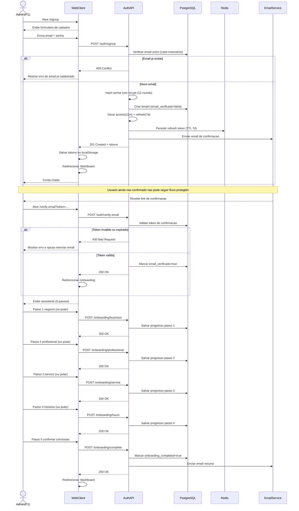
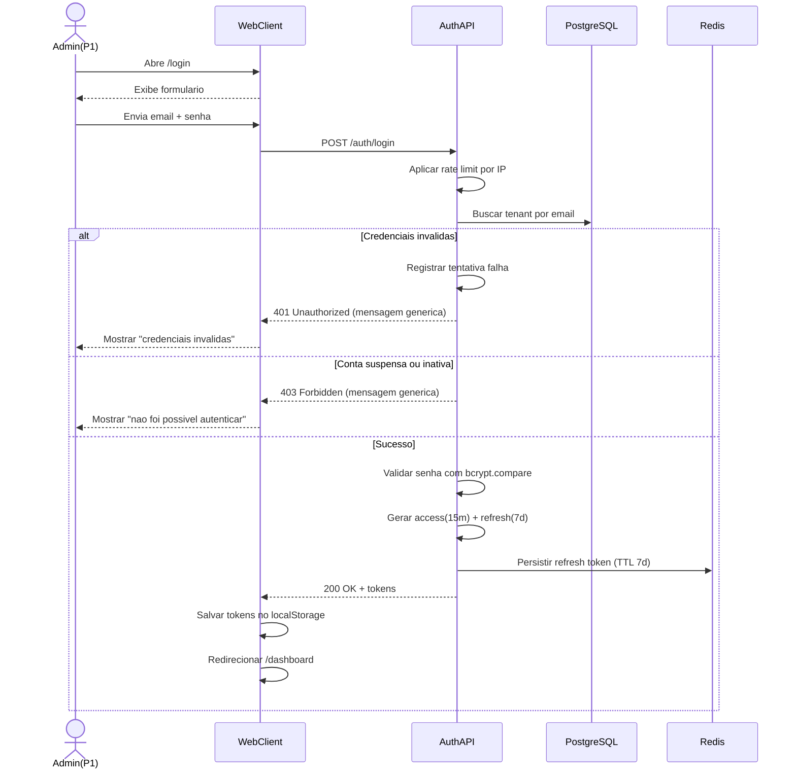
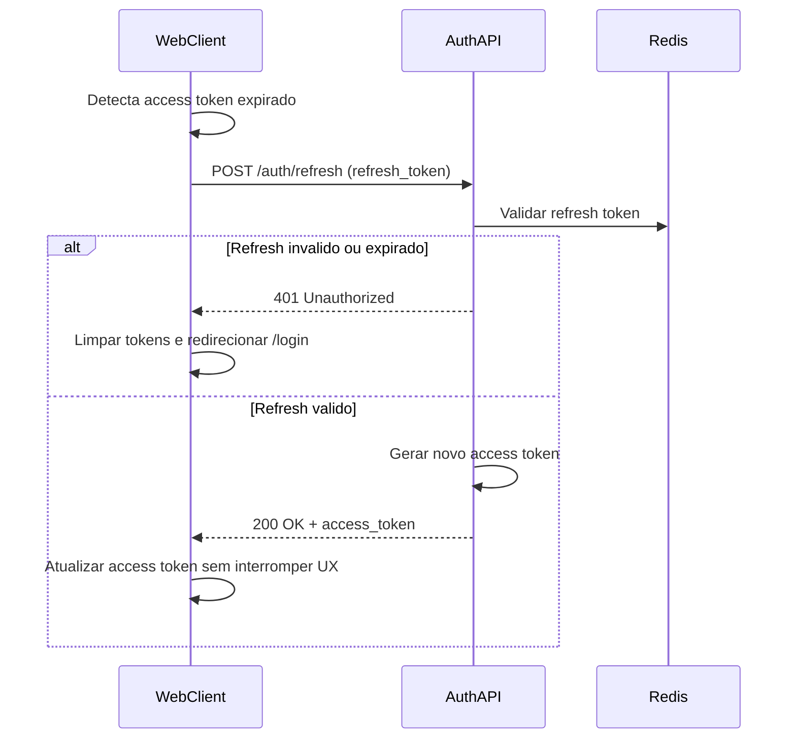
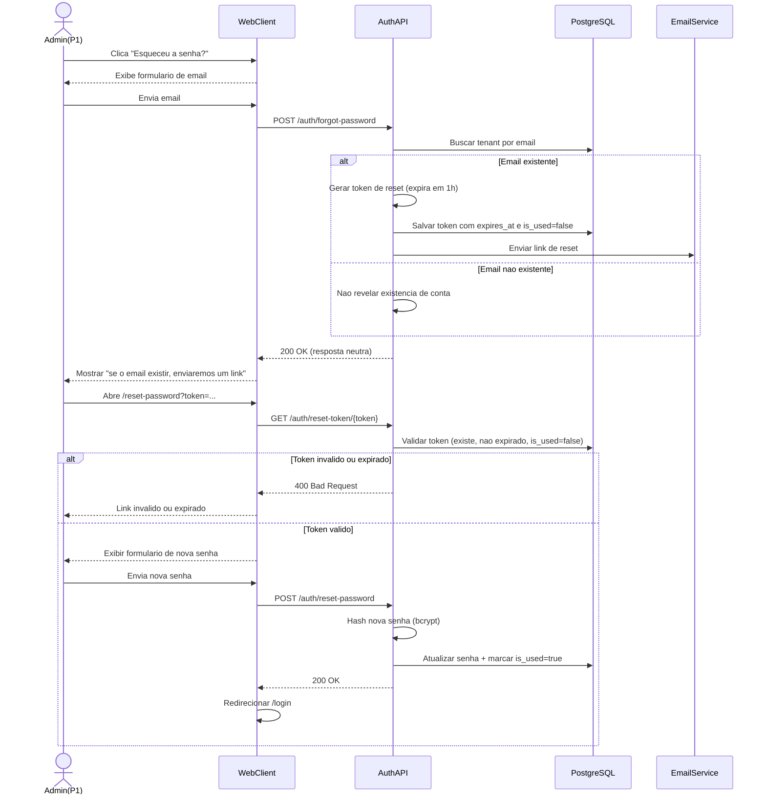

# 01-Auth — Diagrama de Sequência

## Fluxo de Signup + Verificação de Email + Primeiro Acesso

```mermaid
sequenceDiagram
    actor Admin as Admin(P1)
    participant Web as WebClient
    participant API as AuthAPI
    participant DB as PostgreSQL
    participant Cache as Redis
    participant Mail as EmailService

    Admin->>Web: Abre /signup
    Web-->>Admin: Exibe formulario de cadastro
    Admin->>Web: Envia email + senha
    Web->>API: POST /auth/signup
    API->>DB: Verificar email unico (case-insensitive)

    alt Email ja existe
        API-->>Web: 409 Conflict
        Web-->>Admin: Mostrar erro de email ja cadastrado
    else Novo email
        API->>API: Hash senha com bcrypt (12 rounds)
        API->>DB: Criar tenant (email_verificado=false)
        API->>API: Gerar access(15m) + refresh(7d)
        API->>Cache: Persistir refresh token (TTL 7d)
        API->>Mail: Enviar email de confirmacao
        API-->>Web: 201 Created + tokens
        Web->>Web: Salvar tokens no localStorage
        Web->>Web: Redirecionar /dashboard
        Web-->>Admin: Conta criada
    end

    Note over Admin,Mail: Usuario ainda nao confirmado nao pode seguir fluxo protegido

    Mail-->>Admin: Recebe link de confirmacao
    Admin->>Web: Abre /verify-email?token=...
    Web->>API: POST /auth/verify-email
    API->>DB: Validar token de confirmacao

    alt Token invalido ou expirado
        API-->>Web: 400 Bad Request
        Web-->>Admin: Mostrar erro e opcao reenviar email
    else Token valido
        API->>DB: Marcar email_verificado=true
        API-->>Web: 200 OK
        Web->>Web: Redirecionar /onboarding
    end

    Web-->>Admin: Exibir assistente (5 passos)
    Admin->>Web: Passo 1 negocio (ou pular)
    Web->>API: POST /onboarding/business
    API->>DB: Salvar progresso passo 1
    API-->>Web: 200 OK

    Admin->>Web: Passo 2 profissional (ou pular)
    Web->>API: POST /onboarding/professional
    API->>DB: Salvar progresso passo 2
    API-->>Web: 200 OK

    Admin->>Web: Passo 3 servico (ou pular)
    Web->>API: POST /onboarding/service
    API->>DB: Salvar progresso passo 3
    API-->>Web: 200 OK

    Admin->>Web: Passo 4 horarios (ou pular)
    Web->>API: POST /onboarding/hours
    API->>DB: Salvar progresso passo 4
    API-->>Web: 200 OK

    Admin->>Web: Passo 5 confirmar conclusao
    Web->>API: POST /onboarding/complete
    API->>DB: Marcar onboarding_completed=true
    API->>Mail: Enviar email resumo
    API-->>Web: 200 OK
    Web->>Web: Redirecionar /dashboard
```

## Fluxo de Login

```mermaid
sequenceDiagram
    actor Admin as Admin(P1)
    participant Web as WebClient
    participant API as AuthAPI
    participant DB as PostgreSQL
    participant Cache as Redis

    Admin->>Web: Abre /login
    Web-->>Admin: Exibe formulario
    Admin->>Web: Envia email + senha
    Web->>API: POST /auth/login
    API->>API: Aplicar rate limit por IP
    API->>DB: Buscar tenant por email

    alt Credenciais invalidas
        API->>API: Registrar tentativa falha
        API-->>Web: 401 Unauthorized (mensagem generica)
        Web-->>Admin: Mostrar "credenciais invalidas"
    else Conta suspensa ou inativa
        API-->>Web: 403 Forbidden (mensagem generica)
        Web-->>Admin: Mostrar "nao foi possivel autenticar"
    else Sucesso
        API->>API: Validar senha com bcrypt.compare
        API->>API: Gerar access(15m) + refresh(7d)
        API->>Cache: Persistir refresh token (TTL 7d)
        API-->>Web: 200 OK + tokens
        Web->>Web: Salvar tokens no localStorage
        Web->>Web: Redirecionar /dashboard
    end
```

## Fluxo de Refresh de Sessão

```mermaid
sequenceDiagram
    participant Web as WebClient
    participant API as AuthAPI
    participant Cache as Redis

    Web->>Web: Detecta access token expirado
    Web->>API: POST /auth/refresh (refresh_token)
    API->>Cache: Validar refresh token

    alt Refresh invalido ou expirado
        API-->>Web: 401 Unauthorized
        Web->>Web: Limpar tokens e redirecionar /login
    else Refresh valido
        API->>API: Gerar novo access token
        API-->>Web: 200 OK + access_token
        Web->>Web: Atualizar access token sem interromper UX
    end
```

## Fluxo de Recuperação e Reset de Senha

```mermaid
sequenceDiagram
    actor Admin as Admin(P1)
    participant Web as WebClient
    participant API as AuthAPI
    participant DB as PostgreSQL
    participant Mail as EmailService

    Admin->>Web: Clica "Esqueceu a senha?"
    Web-->>Admin: Exibe formulario de email
    Admin->>Web: Envia email
    Web->>API: POST /auth/forgot-password
    API->>DB: Buscar tenant por email

    alt Email existente
        API->>API: Gerar token de reset (expira em 1h)
        API->>DB: Salvar token com expires_at e is_used=false
        API->>Mail: Enviar link de reset
    else Email nao existente
        API->>API: Nao revelar existencia de conta
    end

    API-->>Web: 200 OK (resposta neutra)
    Web-->>Admin: Mostrar "se o email existir, enviaremos um link"

    Admin->>Web: Abre /reset-password?token=...
    Web->>API: GET /auth/reset-token/{token}
    API->>DB: Validar token (existe, nao expirado, is_used=false)

    alt Token invalido ou expirado
        API-->>Web: 400 Bad Request
        Web-->>Admin: Link invalido ou expirado
    else Token valido
        Web-->>Admin: Exibir formulario de nova senha
        Admin->>Web: Envia nova senha
        Web->>API: POST /auth/reset-password
        API->>API: Hash nova senha (bcrypt)
        API->>DB: Atualizar senha + marcar is_used=true
        API-->>Web: 200 OK
        Web->>Web: Redirecionar /login
    end
```
