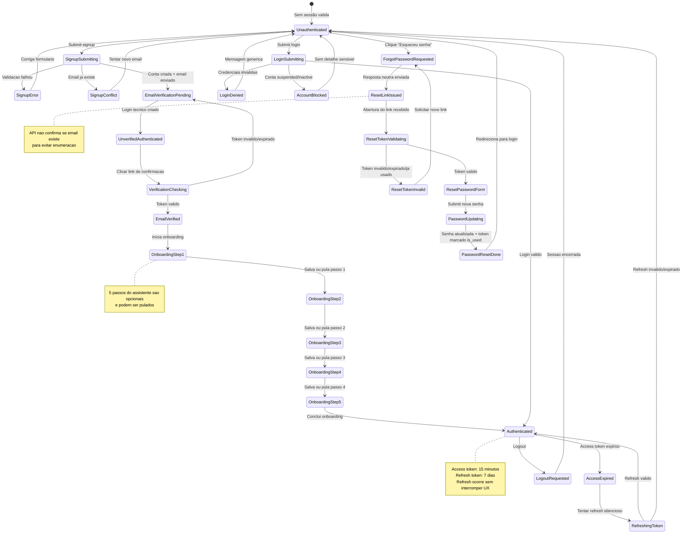
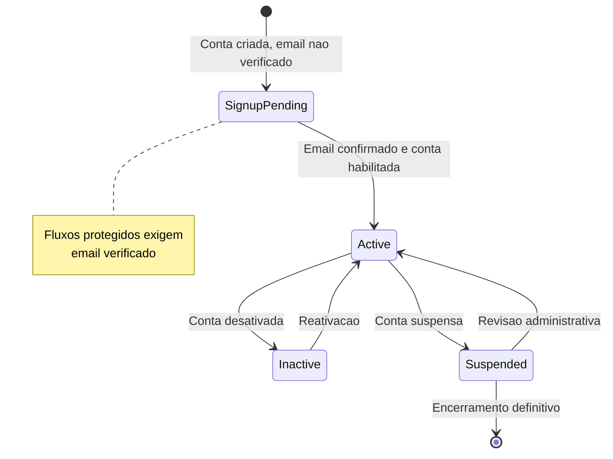

# 01-Auth — Diagrama de Estados

## Estados da Sessão de Autenticação

```mermaid
stateDiagram-v2
    [*] --> Unauthenticated: Sem sessão valida

    Unauthenticated --> SignupSubmitting: Submit signup
    SignupSubmitting --> SignupError: Validacao falhou
    SignupError --> Unauthenticated: Corrige formulario
    SignupSubmitting --> SignupConflict: Email ja existe
    SignupConflict --> Unauthenticated: Tentar novo email
    SignupSubmitting --> EmailVerificationPending: Conta criada + email enviado

    EmailVerificationPending --> UnverifiedAuthenticated: Login tecnico criado
    UnverifiedAuthenticated --> VerificationChecking: Clicar link de confirmacao
    VerificationChecking --> EmailVerificationPending: Token invalido/expirado
    VerificationChecking --> EmailVerified: Token valido

    EmailVerified --> OnboardingStep1: Inicia onboarding
    OnboardingStep1 --> OnboardingStep2: Salva ou pula passo 1
    OnboardingStep2 --> OnboardingStep3: Salva ou pula passo 2
    OnboardingStep3 --> OnboardingStep4: Salva ou pula passo 3
    OnboardingStep4 --> OnboardingStep5: Salva ou pula passo 4
    OnboardingStep5 --> Authenticated: Conclui onboarding

    Unauthenticated --> LoginSubmitting: Submit login
    LoginSubmitting --> LoginDenied: Credenciais invalidas
    LoginDenied --> Unauthenticated: Mensagem generica
    LoginSubmitting --> AccountBlocked: Conta suspended/inactive
    AccountBlocked --> Unauthenticated: Sem detalhe sensivel
    LoginSubmitting --> Authenticated: Login valido

    Authenticated --> AccessExpired: Access token expirou
    AccessExpired --> RefreshingToken: Tentar refresh silencioso
    RefreshingToken --> Authenticated: Refresh valido
    RefreshingToken --> Unauthenticated: Refresh invalido/expirado

    Authenticated --> LogoutRequested: Logout
    LogoutRequested --> Unauthenticated: Sessao encerrada

    Unauthenticated --> ForgotPasswordRequested: Clique "Esqueceu senha"
    ForgotPasswordRequested --> ResetLinkIssued: Resposta neutra enviada
    ResetLinkIssued --> ResetTokenValidating: Abertura do link recebido
    ResetTokenValidating --> ResetTokenInvalid: Token invalido/expirado/ja usado
    ResetTokenInvalid --> ForgotPasswordRequested: Solicitar novo link
    ResetTokenValidating --> ResetPasswordForm: Token valido
    ResetPasswordForm --> PasswordUpdating: Submit nova senha
    PasswordUpdating --> PasswordResetDone: Senha atualizada + token marcado is_used
    PasswordResetDone --> Unauthenticated: Redireciona para login

    note right of Authenticated
      Access token: 15 minutos
      Refresh token: 7 dias
      Refresh ocorre sem interromper UX
    end note

    note right of ResetLinkIssued
      API nao confirma se email existe
      para evitar enumeracao
    end note

    note right of OnboardingStep1
      5 passos do assistente sao opcionais
      e podem ser pulados
    end note
```

## Estados da Entidade Tenant (Usuário)

```mermaid
stateDiagram-v2
    [*] --> SignupPending: Conta criada, email nao verificado
    SignupPending --> Active: Email confirmado e conta habilitada

    Active --> Inactive: Conta desativada
    Active --> Suspended: Conta suspensa

    Inactive --> Active: Reativacao
    Suspended --> Active: Revisao administrativa

    Suspended --> [*]: Encerramento definitivo

    note right of SignupPending
      Fluxos protegidos exigem
      email verificado
    end note
```
