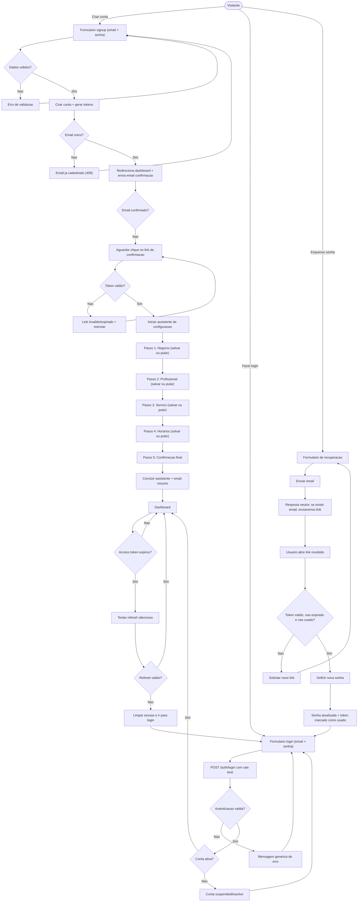

# 01-Auth — Fluxo de Usuário

**Principais Decisões:**
- Validação de email e senha forte no cadastro
- Mensagens genéricas para evitar enumeração de conta
- Confirmação de email antes do fluxo completo de primeiro acesso
- Token de reset com expiração e uso único (`is_used`)

**Pontos Críticos:**
- ✅ bcrypt com 12 rounds para hashing de senhas
- ✅ JWT tokens com expiração curta (15min access)
- ✅ Refresh token com expiração longa (7 dias)
- ✅ Rate limiting por IP para prevenir brute force
