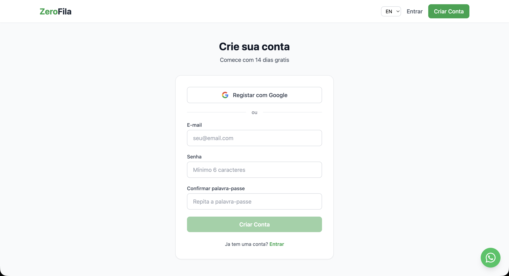
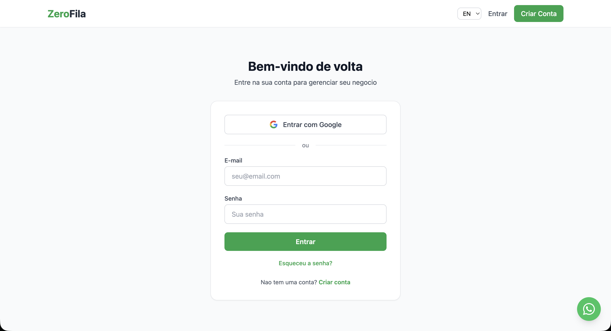
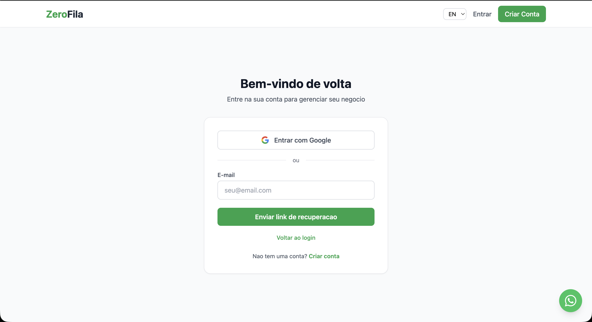
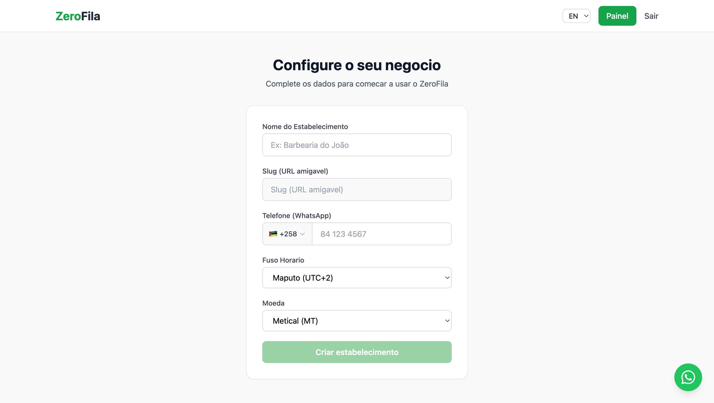
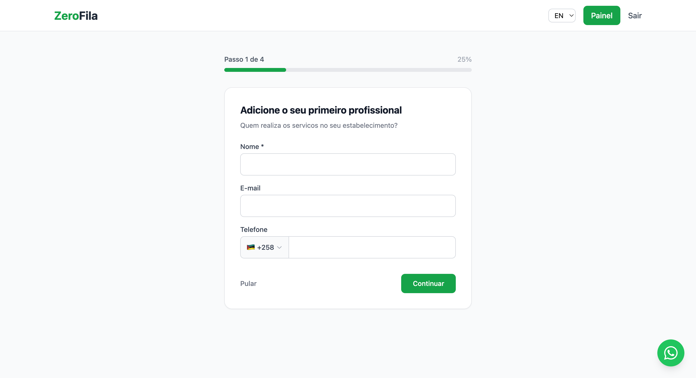
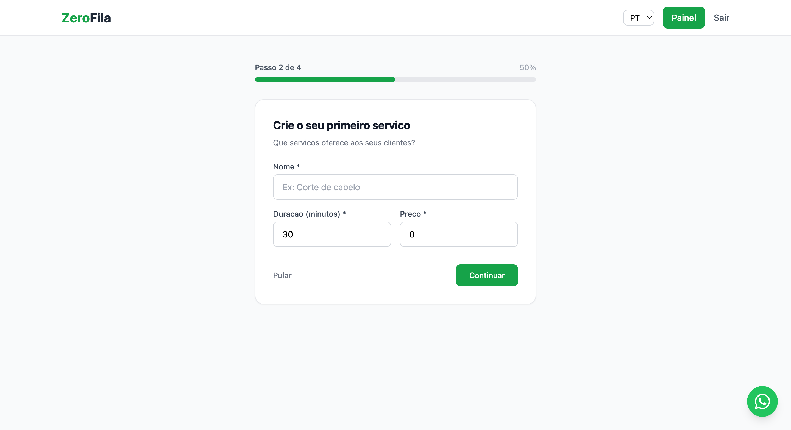
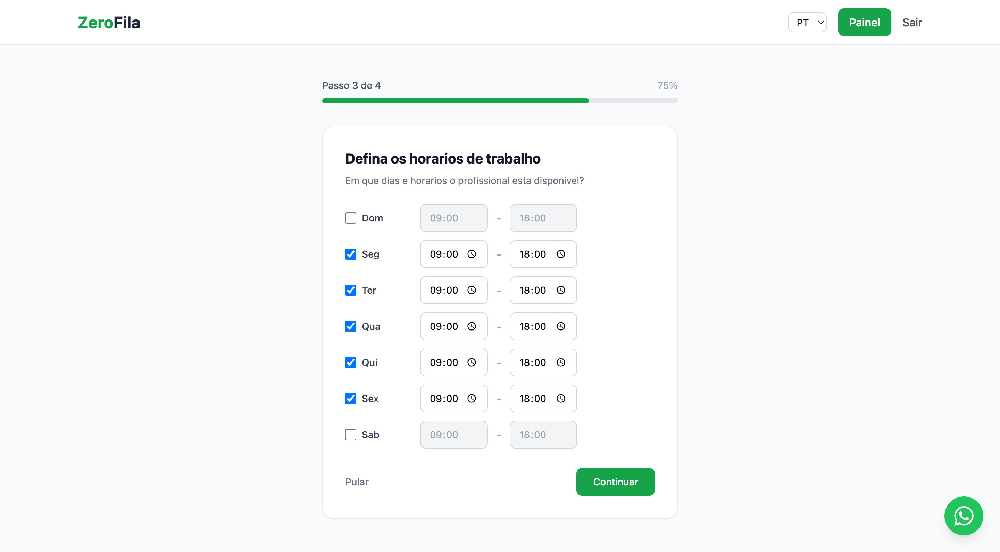
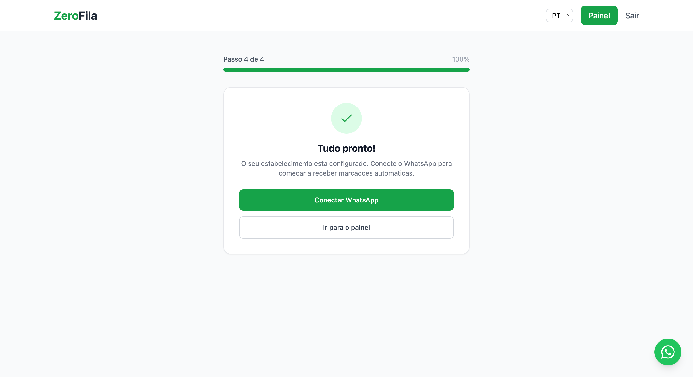

## Primeiros Passos — Criar a sua Conta

### Criar conta

1.  Na página inicial, clique em **"Criar Conta"** ou **"Registrar"**.
2.  Preencha o **e-mail** (será usado para login e recuperação) e uma **senha** segura.
3.  Clique em **"Registrar"**.
4.  Um **email de confirmação** será enviado automaticamente para o endereço cadastrado.
5.  Verifique seu e-mail e clique no **link de ativação** para confirmar a conta.
6.  Após confirmar, será redirecionado(a) automaticamente para o **assistente de configuração inicial**.

**Nota:** Se não receber o email em 5 minutos, verifique a pasta de spam ou clique em **"Reenviar Email de Confirmação"**.

### Fazer login

1.  Aceda à página de login.
2.  Insira o seu e-mail e senha.
3.  Clique em **"Entrar"**.

### Esqueceu a senha?

1.  Na página de login, clique em **"Esqueceu a senha?"**.
2.  Insira o seu e-mail.
3.  Receberá um link de recuperação no e-mail cadastrado.
4.  Siga as instruções para definir uma nova senha.

### Primeiro acesso? — Assistente de Configuração Inicial

Após confirmar seu e-mail, o novo usuário é apresentado com um **assistente de configuração interativo** que guia através dos passos essenciais para colocar o sistema em funcionamento.

#### 1️⃣ Configure seu negócio

1.  Insira o **nome do estabelecimento** (ex: "Barbearia Central")
2.  Selecione a **categoria** de serviço (ex: Barbearia, Salão, Clínica)
3.  Defina o **país e fuso horário** para sincronização de agendamentos
4.  Clique em **"Próximo"** para continuar

#### 2️⃣ Adicione o primeiro profissional

1.  Preencha o **nome completo** do profissional
2.  Insira o **email** e **telefone** (para notificações)
3.  Adicione uma **foto de perfil** (opcional)
4.  Clique em **"Adicionar Profissional"** e **"Próximo"**

#### 3️⃣ Defina o primeiro serviço

1.  Insira o **nome do serviço** (ex: "Corte de Cabelo")
2.  Selecione o **profissional** responsável
3.  Defina o **tempo de duração** (em minutos)
4.  Defina o **preço** (opcional, para futuras integrações de pagamento)
5.  Clique em **"Adicionar Serviço"** e **"Próximo"**

#### 4️⃣ Defina horários de trabalho

1.  Selecione os **dias da semana** em que trabalha
2.  Defina o **horário de abertura** e **fechamento**
3.  Configure **pausas para almoço** (se necessário)
4.  Clique em **"Próximo"**

#### 5️⃣ Tudo pronto!

1.  A configuração foi salva com sucesso
2.  Clique em **"Iniciar"** ou **"Ir para Dashboard"** para começar a usar o sistema
3.  O usuário agora pode:
     - Visualizar agendamentos
     - Receber solicitações via WhatsApp
     - Gerenciar profissionais e serviços
     - Consultar relatórios

---

**Notas Importantes:**
- ✅ Todos os passos são **opcionais** — o usuário pode pular e completar depois
- ✅ Os dados podem ser **editados** a qualquer momento no painel administrativo
- ✅ Após completar, o usuário é redirecionado para o **Dashboard**
- ✅ Um email de resumo é enviado com as configurações iniciais
- ✅ Se pular, o assistente pode ser acessado novamente em **Configurações > Assistente de Boas-vindas**
