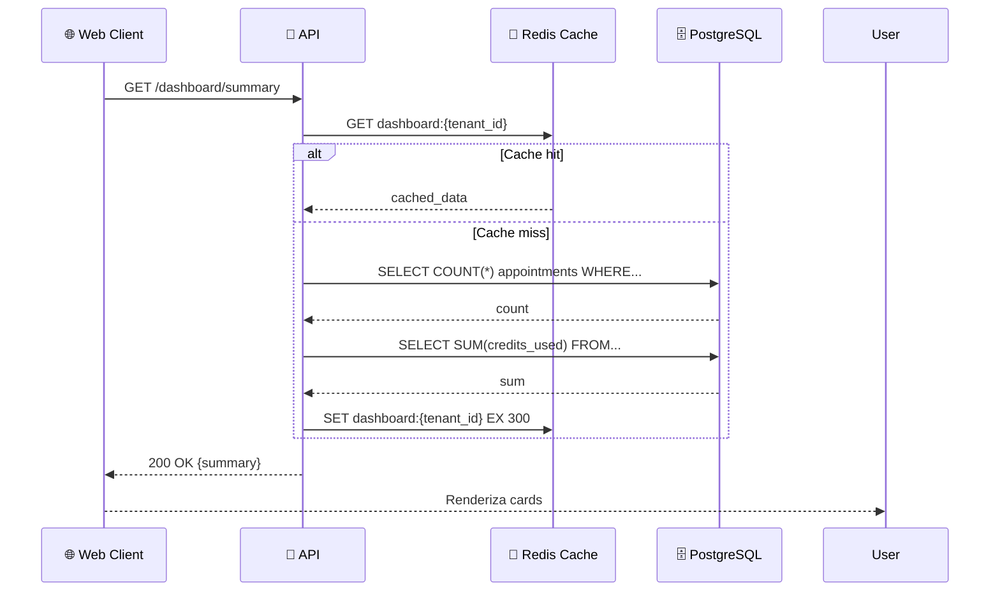

# 00-Dashboard — Sequência e Wireframes Completos

## Sequence Diagrams


```mermaid
sequenceDiagram
    participant Web as 🌐 Web Client
    participant API as 🚀 API
    participant Cache as 💾 Redis Cache
    participant DB as 🗄️ PostgreSQL
    
    Web->>API: GET /dashboard/summary
    API->>Cache: GET dashboard:{tenant_id}
    alt Cache hit
        Cache-->>API: cached_data
    else Cache miss
        API->>DB: SELECT COUNT(*) appointments WHERE...
        DB-->>API: count
        API->>DB: SELECT SUM(credits_used) FROM...
        DB-->>API: sum
        API->>Cache: SET dashboard:{tenant_id} EX 300
    end
    API-->>Web: 200 OK {summary}
    Web-->>User: Renderiza cards
```

## Wireframes (Detalhado)

```
Já exibido acima
```
