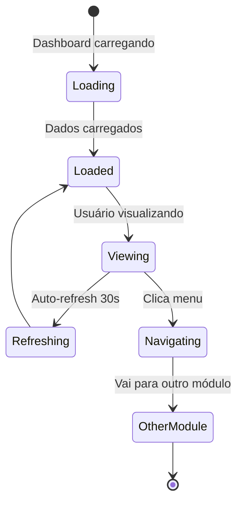
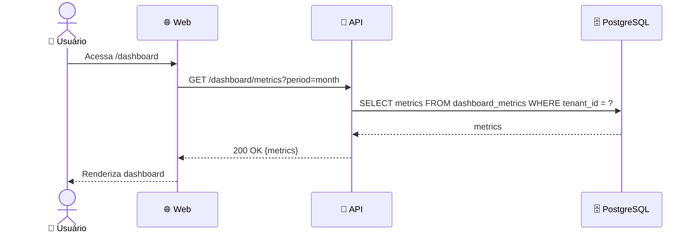

# 00-Dashboard — Complementos

## State Diagrams


```mermaid
stateDiagram-v2
    [*] --> Loading: Dashboard carregando
    Loading --> Loaded: Dados carregados
    Loaded --> Viewing: Usuário visualizando
    Viewing --> Refreshing: Auto-refresh 30s
    Refreshing --> Loaded
    
    Viewing --> Navigating: Clica menu
    Navigating --> OtherModule: Vai para outro módulo
    OtherModule --> [*]
```

## Sequence: Load Dashboard


```mermaid
sequenceDiagram
    actor User as 👤 Usuário
    participant Web as 🌐 Web
    participant API as 🚀 API
    participant DB as 🗄️ PostgreSQL
    
    User->>Web: Acessa /dashboard
    Web->>API: GET /dashboard/metrics?period=month
    API->>DB: SELECT metrics FROM dashboard_metrics WHERE tenant_id = ?
    DB-->>API: metrics
    API-->>Web: 200 OK {metrics}
    Web-->>User: Renderiza dashboard
```

## Wireframes

```
[Já exibido acima no section Wireframes]
```
