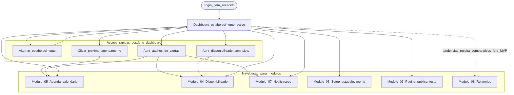

# 02 — Dashboard: fluxo do utilizador (painel)

Fluxo do **donno (Admin)** após autenticação. Detalhe de user stories: [USER_STORIES.md](../../USER_STORIES.md).

**Legenda**

- **Acções rápidas:** interacções que actualizam ou navegam com um clique a partir do próprio dashboard ([US-109](../../USER_STORIES.md)).
- **Navegação:** entradas de menu ou links equivalentes para trabalho prolongado (lista completa, configuração, relatórios).
- **Módulo 08:** não faz parte do MVP do dashboard; linha tracejada indica pedido explícito fora do escopo do ecrã inicial.
