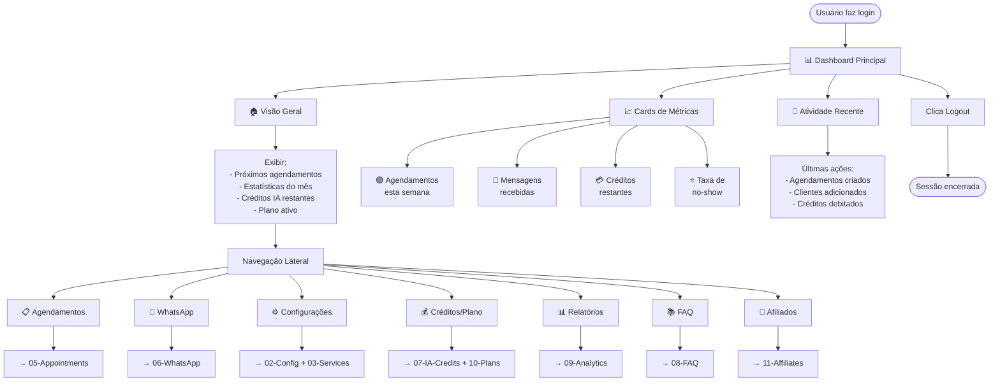
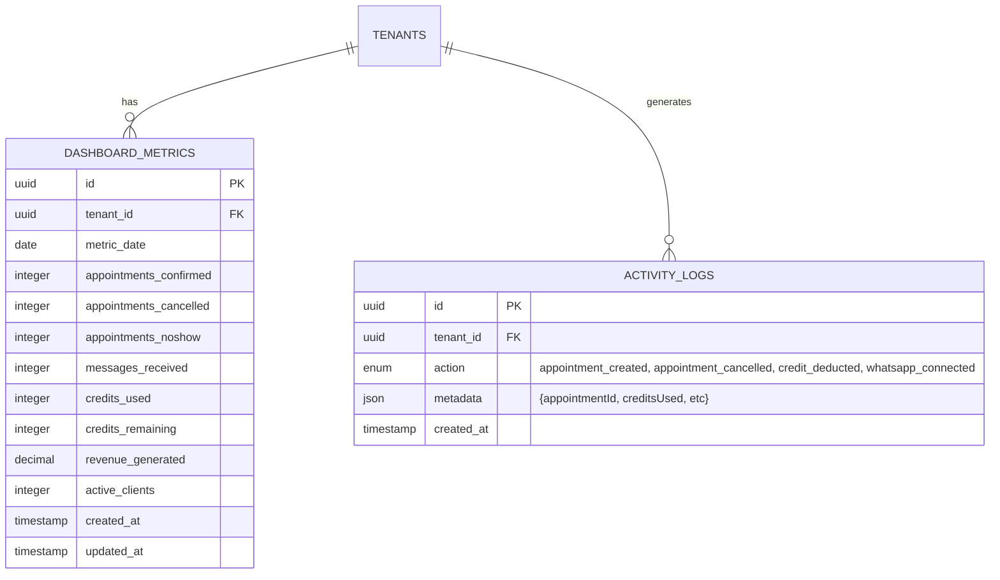

# 00-Dashboard — Fluxo / Wireframes / Estados / Sequência / ERD

## User Flow



## Wireframes

```
┌─────────────────────────────────────────────────────────────┐
│ 🏠 Dashboard                          [👤 João Silva] [⊙ ⋮]  │
├─┬───────────────────────────────────────────────────────────┤
│ │ 📋 Agendamentos                                            │
│ │ 📱 WhatsApp                                                │
│ │ ⚙️ Configurações                                           │
│ │ 💰 Planos & Créditos                                       │
│ │ 📊 Relatórios                                              │
│ │ 📚 FAQ                                                     │
│ │ 💼 Afiliados                                               │
│ │ ⚙️ Minha Conta                                             │
│ │ 🚪 Sair                                                    │
│ └───────────────────────────────────────────────────────────┤
│                                                              │
│  Boas-vindas, João Silva! 👋                               │
│                                                              │
│  ┌──────────────┐  ┌──────────────┐  ┌──────────────┐     │
│  │ 🟢 Próximos  │  │ 📱 Mensagens │  │ 💳 Créditos  │     │
│  │   Agendamen │  │   Recebidas  │  │   Restantes  │     │
│  │     15      │  │      234     │  │     450/500  │     │
│  │ esta semana │  │   este mês   │  │   (90%)      │     │
│  └──────────────┘  └──────────────┘  └──────────────┘     │
│                                                              │
│  ┌──────────────┐  ┌──────────────┐  ┌──────────────┐     │
│  │ ⭐ Taxa      │  │ 📈 Revenue   │  │ 👥 Clientes  │     │
│  │   No-show    │  │   (Mês)      │  │   Ativos     │     │
│  │     2%       │  │   R$ 1.250   │  │     142      │     │
│  │  excelente!  │  │              │  │              │     │
│  └──────────────┘  └──────────────┘  └──────────────┘     │
│                                                              │
│  ─────────────────────────────────────────────────────────  │
│                                                              │
│  📅 Próximos Agendamentos                                   │
│                                                              │
│  🟢 Amanhã 09:00 — João Silva — Corte Masculino            │
│  🟢 Amanhã 14:30 — Maria Silva — Barba                     │
│  🟢 Em 2 dias 10:00 — Carlos Santos — Combo                │
│  [ Ver Todos ]                                              │
│                                                              │
│  ─────────────────────────────────────────────────────────  │
│                                                              │
│  📝 Atividade Recente                                       │
│                                                              │
│  18/05 14:32 — Agendamento criado (cliente: Ana)           │
│  18/05 13:15 — Créditos debitados (120 tokens)             │
│  18/05 09:00 — Agendamento concluído (João)                │
│                                                              │
└─────────────────────────────────────────────────────────────┘
```

## ERD


