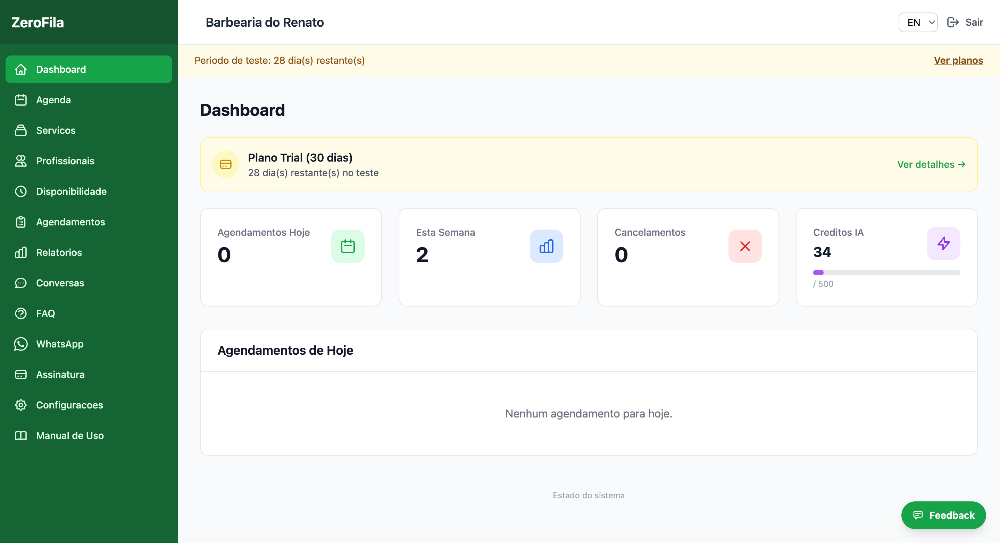

## Dashboard informativa

**Menu:**  Painel Admin →  **Dashboard**

O dashboard é a página inicial do painel e apresenta uma visão geral rápida:

-   **Agendamentos de hoje**  — Quantos atendimentos estão marcados para o dia atual.
-   **Agendamentos desta semana**  — Total na semana corrente.
-   **Cancelamentos**  — Número de cancelamentos recentes.
-   **Próximos agendamentos**  — Lista dos próximos atendimentos com detalhes.
 

**Dica:**  Consulte o dashboard diariamente ao abrir o estabelecimento para ter uma visão rápida da carga de trabalho do dia.