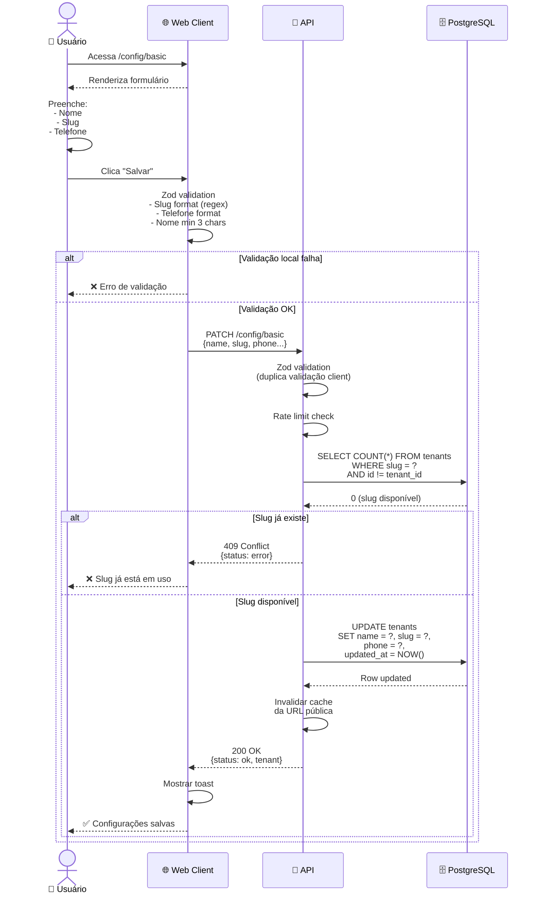
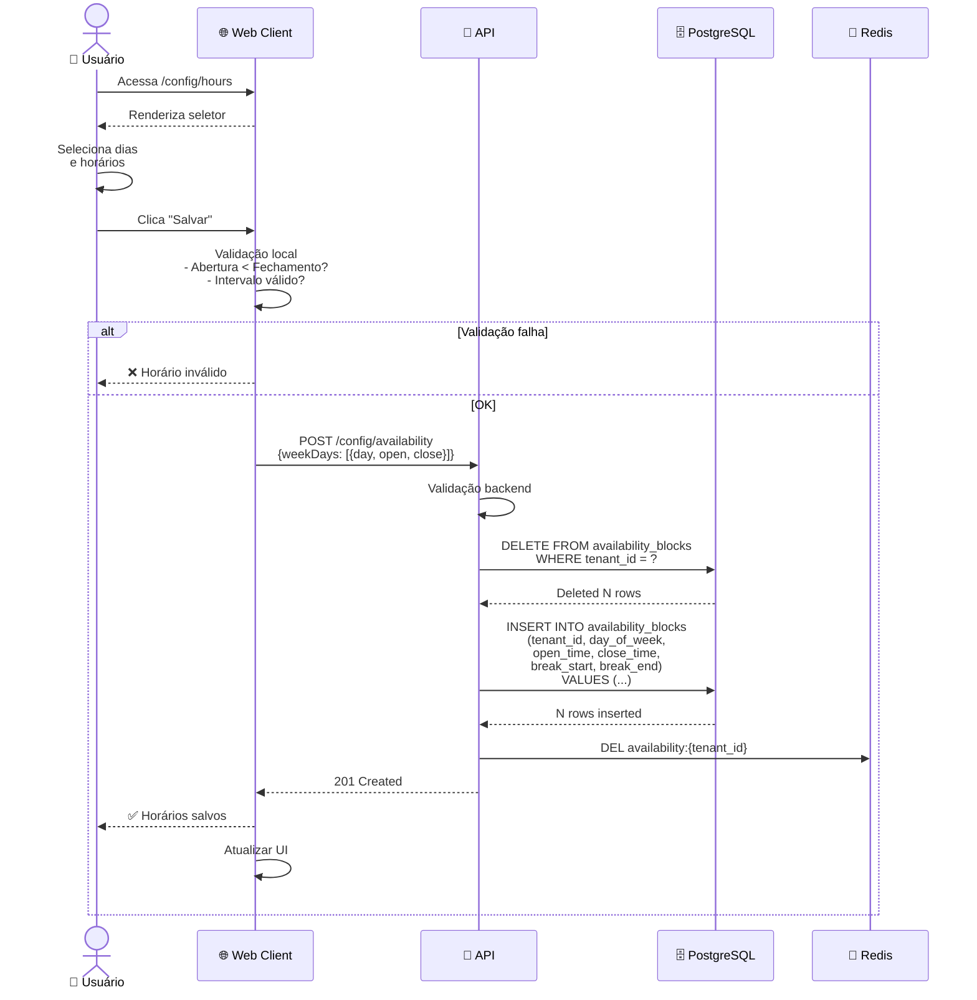
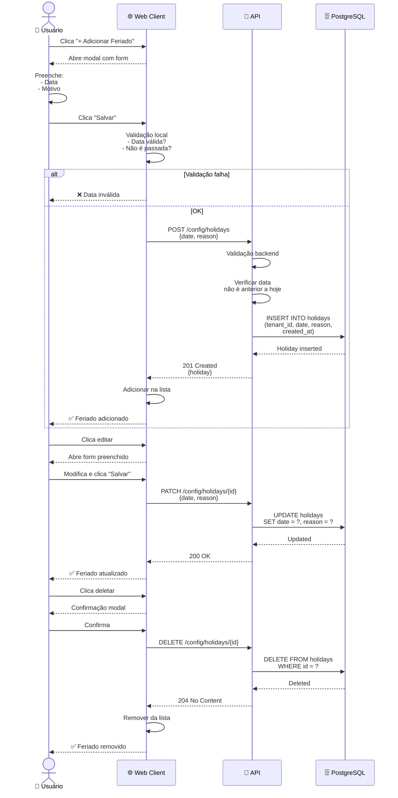
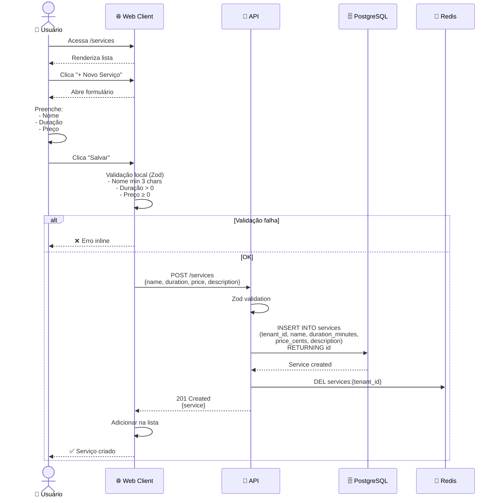
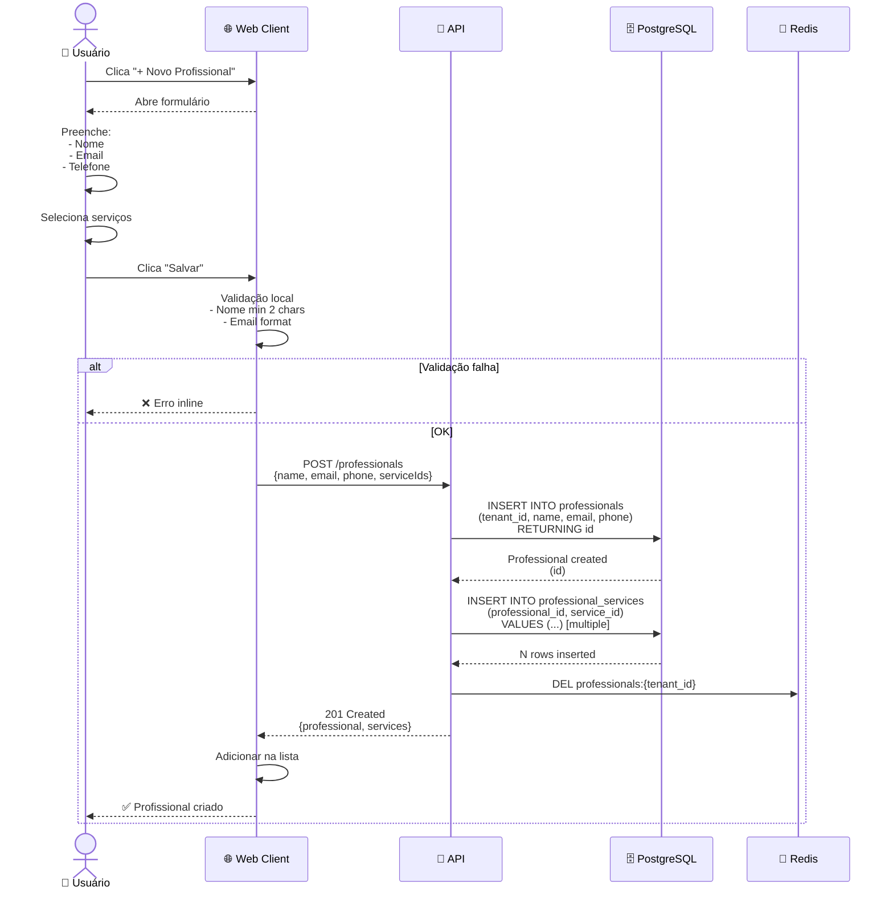
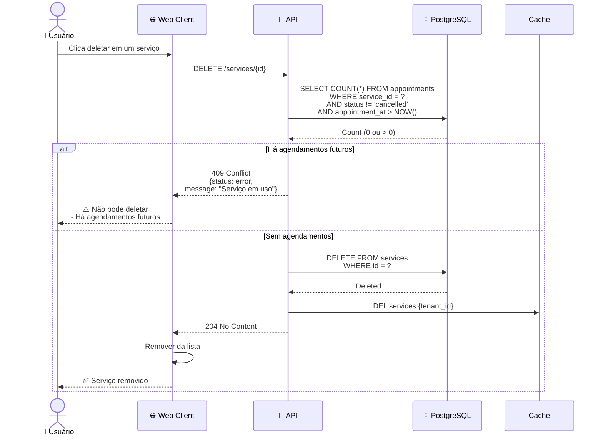
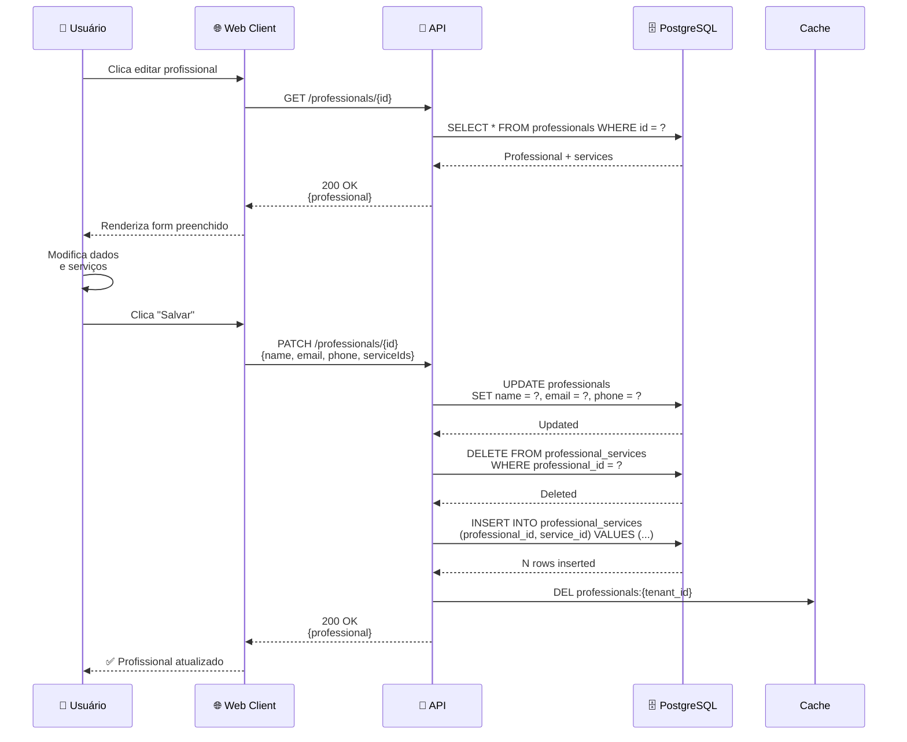
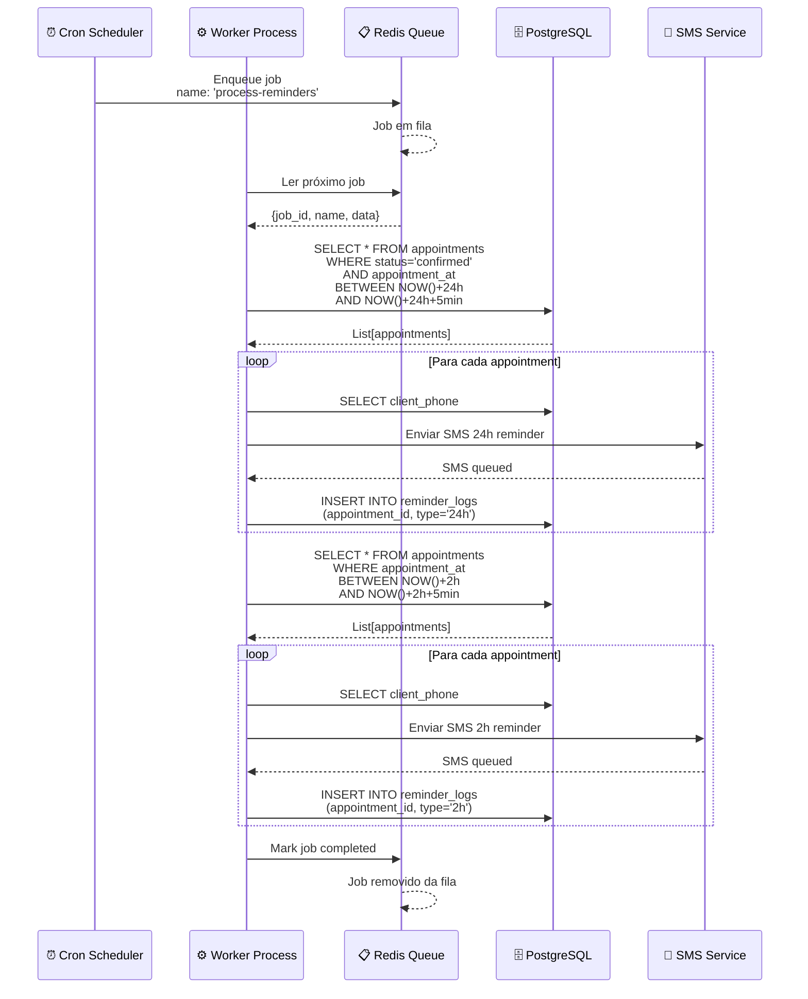
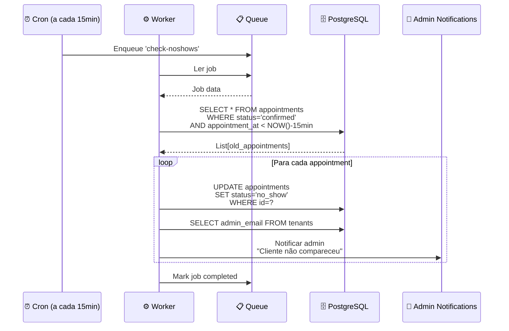
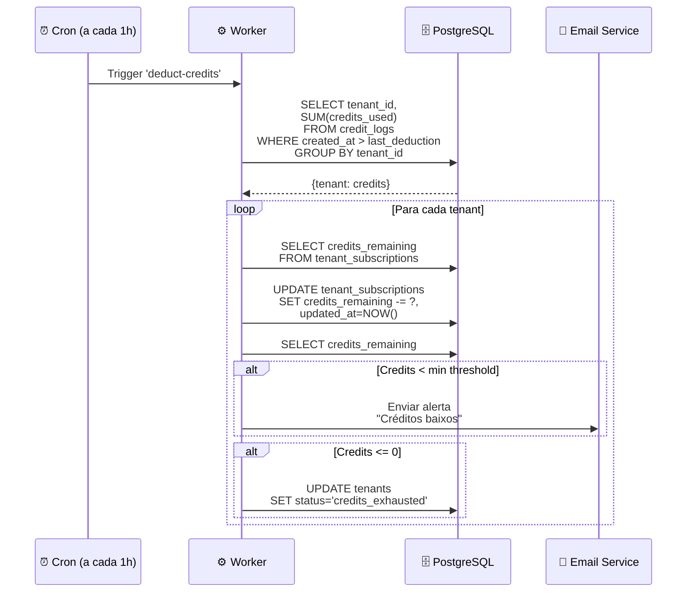

# Setup - Diagramas de Sequencia

## Fluxo A - Configuracoes

# 02-Config — Diagrama de Sequência

## Fluxo de Salvar Configuração Básica

## Fluxo de Salvar Horários de Funcionamento

## Fluxo de Adicionar Feriado

---

## Fluxo B - Servicos e profissionais

# 03-Services — Diagrama de Sequência

## Fluxo de Criar Serviço

## Fluxo de Criar Profissional e Atribuir Serviços

## Fluxo de Deletar Serviço (com validação)

## Fluxo de Editar Profissional

---

## Fluxo C - Workers assincronos

# 04-Workers — Diagrama de Sequência

## Fluxo: Worker de Lembretes (a cada 5 min)

## Fluxo: Worker de Auto-Update Status

## Fluxo: Worker de Debitagem de Créditos

