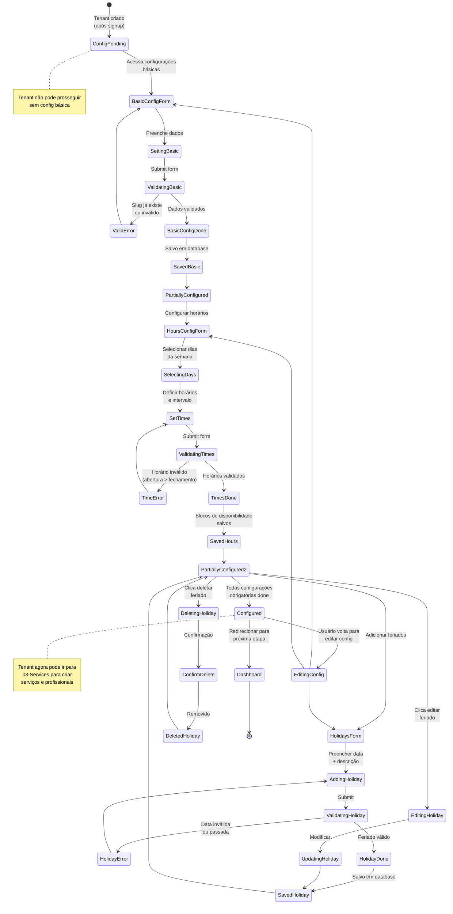
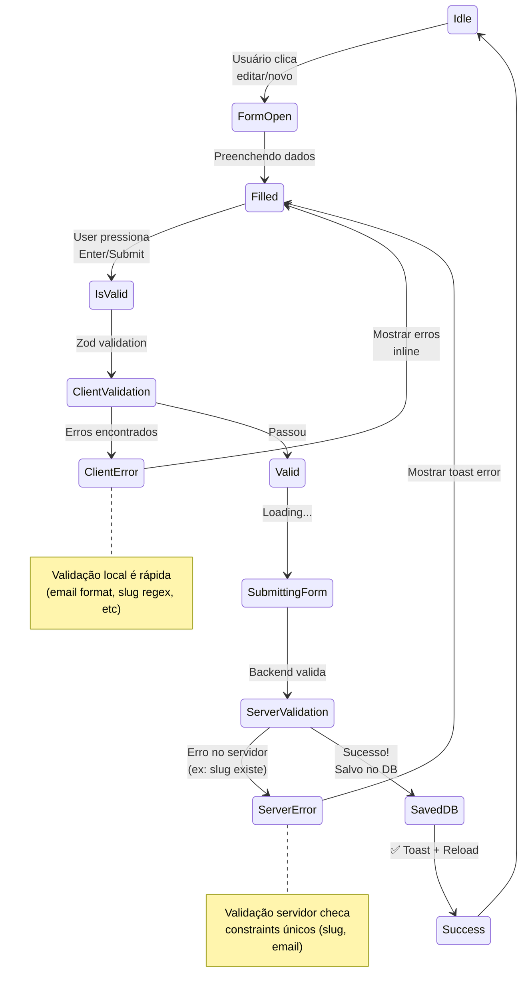
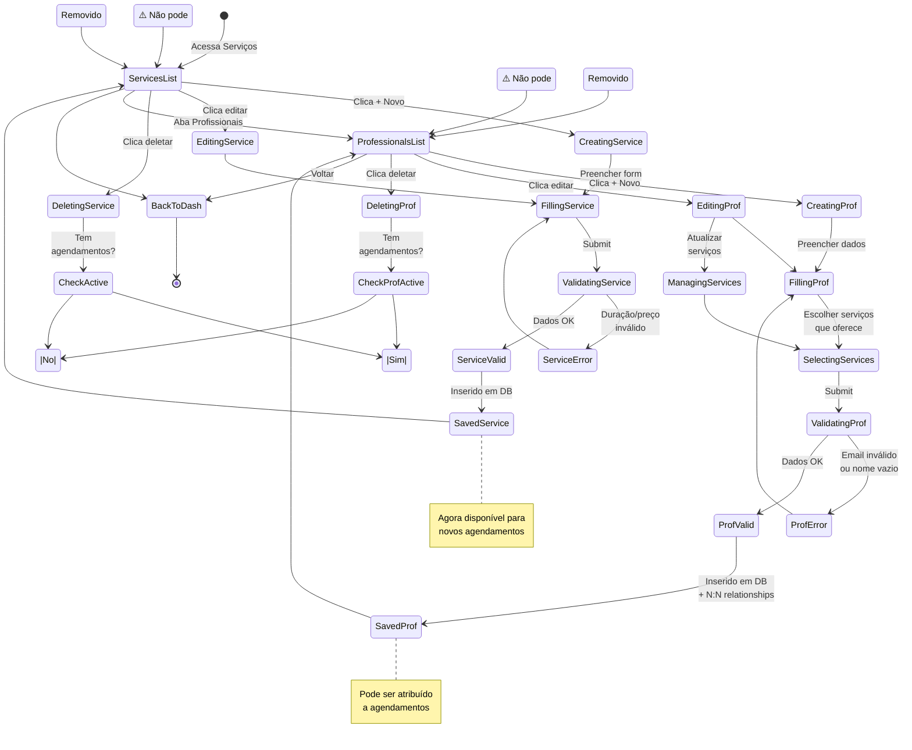
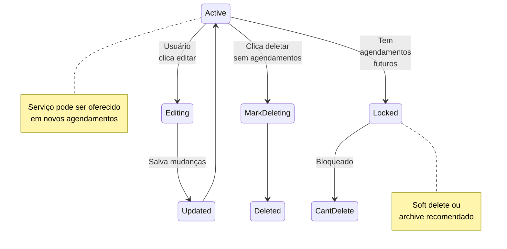
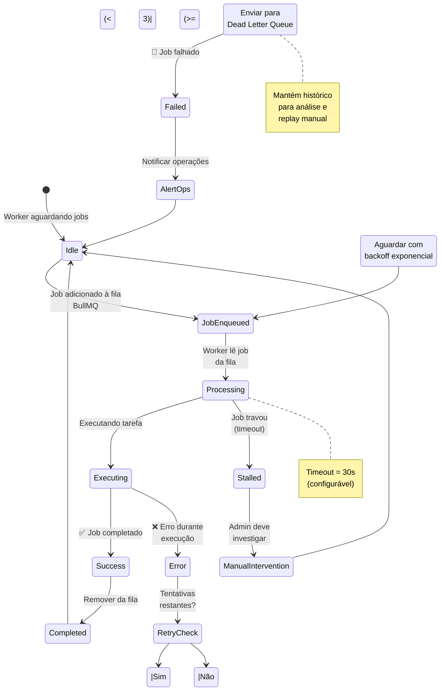
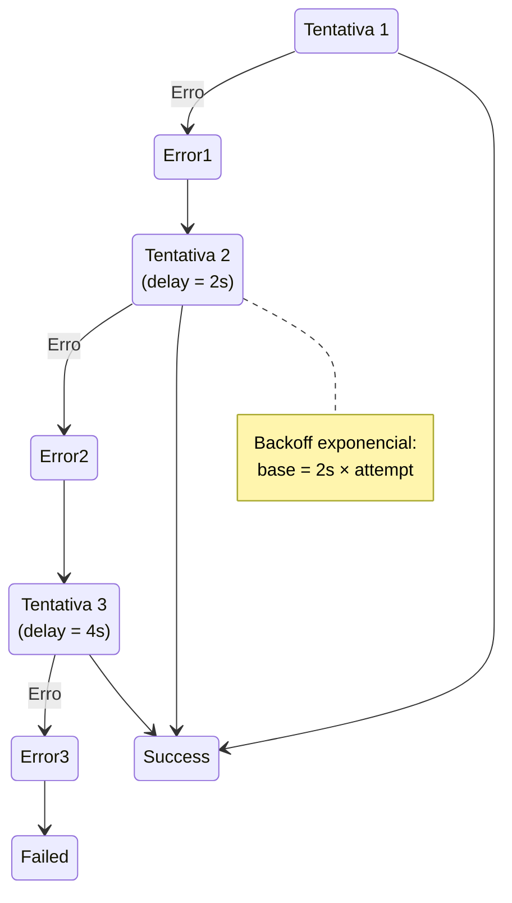

# Setup - Diagramas de Estado

## Estados A - Configuracoes

# 02-Config — Diagrama de Estados

## Estados de Validação de Formulários

---

## Estados B - Servicos e profissionais

# 03-Services — Diagrama de Estados

## Estados de Operação de Serviços

---

## Estados C - Workers assincronos

# 04-Workers — Diagrama de Estados

## Estados de Retry

