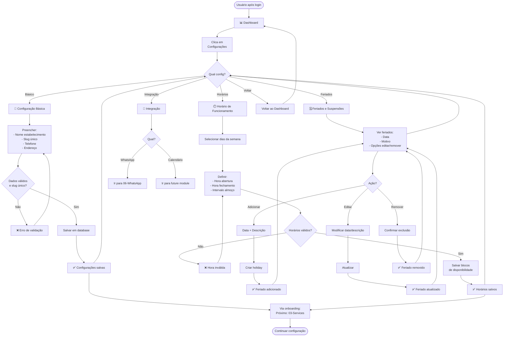
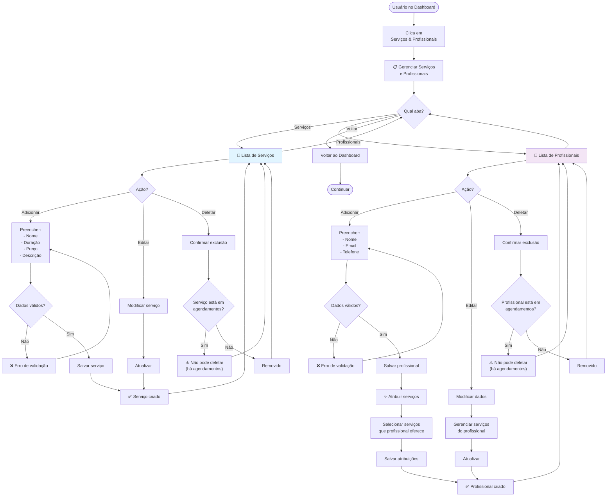
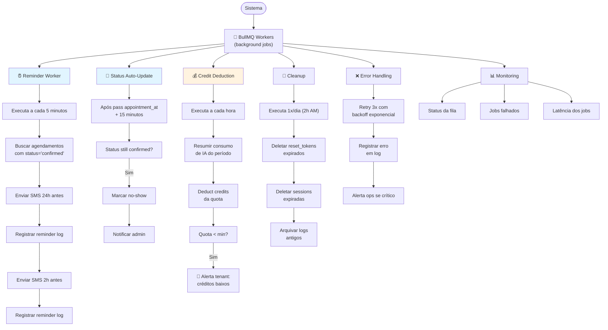

# Setup - User Flows

## Fluxo A - Configuracoes

# 02-Config — Fluxo de Usuário

**Decisões Principais:**
- Slug deve ser único e immutável (chave de URL pública)
- Horários são blocos repetiveis (segunda tem x, terça tem y, etc.)
- Feriados são exceções (remove horários normais daquele dia)
- Validações de horário: abertura < fechamento, intervalo válido

**Validações Críticas:**
- ✅ Slug: apenas letras, números, hífen (regex)
- ✅ Telefone: formato válido
- ✅ Horários: não podem ser negativos ou invertidos
- ✅ Feriados: data futura (ou atual para hoje)

---

## Fluxo B - Servicos e profissionais

# 03-Services — Fluxo de Usuário

**Decisões Principais:**
- Serviço = oferecimento genérico (não atrelado a pessoa)
- Profissional = pessoa que oferece serviços
- N:N = Um profissional pode oferecer múltiplos serviços
- Não deletar: soft delete ou constraint para preservar histórico
- Disponibilidade: pode ser por serviço + profissional ou só por profissional

**Validações Críticas:**
- ✅ Duração > 0 minutos
- ✅ Preço ≥ 0
- ✅ Email de profissional único (opcional)
- ✅ Nome não vazio

---

## Fluxo C - Workers assincronos

# 04-Workers — Fluxo de Usuário

**Responsabilidades Críticas:**
- Lembretes automáticos (24h + 2h)
- Auto-update de status para no-show
- Debitagem de créditos de IA
- Limpeza de dados expirados
- Logs e alertas

**Tecnologia:**
- BullMQ (Redis-backed queue)
- Retry com backoff exponencial
- Dead Letter Queue (DLQ) para falhas
