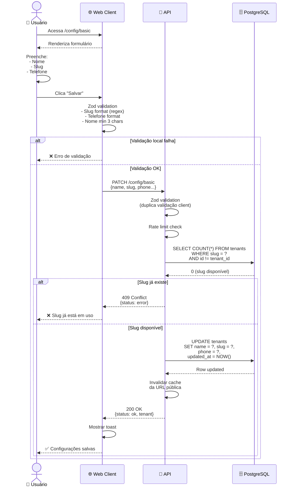
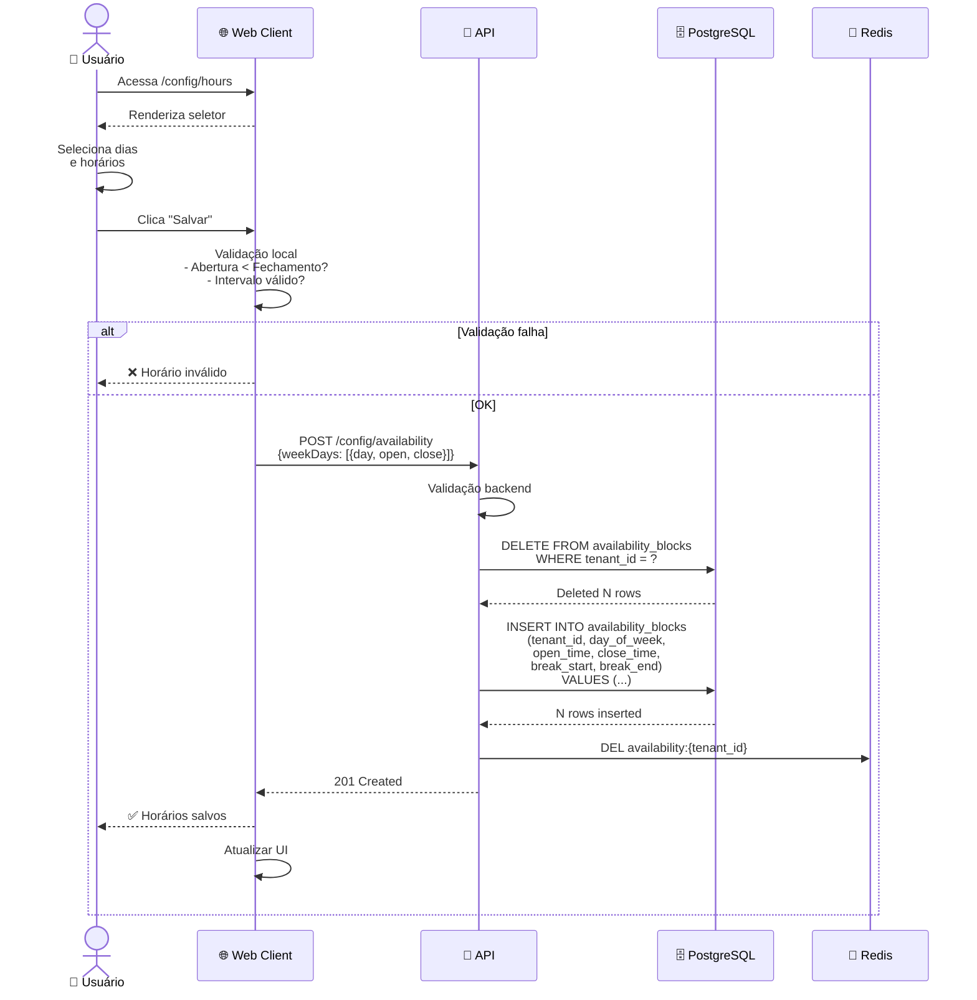
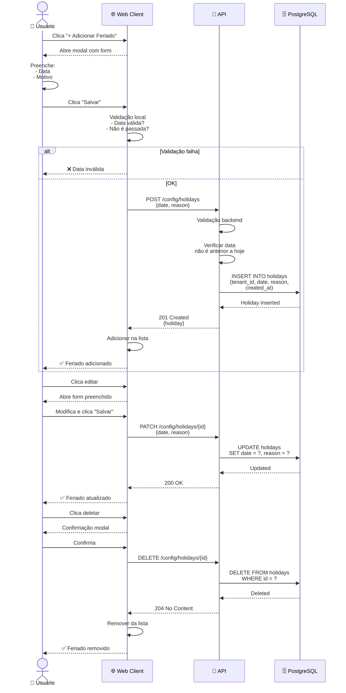

# 02-Config — Diagrama de Sequência

## Fluxo de Salvar Configuração Básica

```mermaid
sequenceDiagram
    actor User as 👤 Usuário
    participant Web as 🌐 Web Client
    participant API as 🚀 API
    participant DB as 🗄️ PostgreSQL
    
    User->>Web: Acessa /config/basic
    Web-->>User: Renderiza formulário
    
    User->>User: Preenche:<br/>- Nome<br/>- Slug<br/>- Telefone
    User->>Web: Clica "Salvar"
    
    Web->>Web: Zod validation<br/>- Slug format (regex)<br/>- Telefone format<br/>- Nome min 3 chars
    
    alt Validação local falha
        Web-->>User: ❌ Erro de validação
    else Validação OK
        Web->>API: PATCH /config/basic<br/>{name, slug, phone...}
        
        API->>API: Zod validation<br/>(duplica validação client)
        API->>API: Rate limit check
        
        API->>DB: SELECT COUNT(*) FROM tenants<br/>WHERE slug = ?<br/>AND id != tenant_id
        DB-->>API: 0 (slug disponível)
        
        alt Slug já existe
            API-->>Web: 409 Conflict<br/>{status: error}
            Web-->>User: ❌ Slug já está em uso
        else Slug disponível
            API->>DB: UPDATE tenants<br/>SET name = ?, slug = ?,<br/>phone = ?,<br/>updated_at = NOW()
            
            DB-->>API: Row updated
            API->>API: Invalidar cache<br/>da URL pública
            API-->>Web: 200 OK<br/>{status: ok, tenant}
            
            Web->>Web: Mostrar toast
            Web-->>User: ✅ Configurações salvas
        end
    end
```

## Fluxo de Salvar Horários de Funcionamento

```mermaid
sequenceDiagram
    actor User as 👤 Usuário
    participant Web as 🌐 Web Client
    participant API as 🚀 API
    participant DB as 🗄️ PostgreSQL
    participant Cache as 💾 Redis
    
    User->>Web: Acessa /config/hours
    Web-->>User: Renderiza seletor
    
    User->>User: Seleciona dias<br/>e horários
    User->>Web: Clica "Salvar"
    
    Web->>Web: Validação local<br/>- Abertura < Fechamento?<br/>- Intervalo válido?
    
    alt Validação falha
        Web-->>User: ❌ Horário inválido
    else OK
        Web->>API: POST /config/availability<br/>{weekDays: [{day, open, close}]}
        
        API->>API: Validação backend
        API->>DB: DELETE FROM availability_blocks<br/>WHERE tenant_id = ?
        
        DB-->>API: Deleted N rows
        
        API->>DB: INSERT INTO availability_blocks<br/>(tenant_id, day_of_week,<br/>open_time, close_time,<br/>break_start, break_end)<br/>VALUES (...)
        
        DB-->>API: N rows inserted
        API->>Cache: DEL availability:{tenant_id}
        API-->>Web: 201 Created
        
        Web-->>User: ✅ Horários salvos
        Web->>Web: Atualizar UI
    end
```

## Fluxo de Adicionar Feriado

```mermaid
sequenceDiagram
    actor User as 👤 Usuário
    participant Web as 🌐 Web Client
    participant API as 🚀 API
    participant DB as 🗄️ PostgreSQL
    
    User->>Web: Clica "+ Adicionar Feriado"
    Web-->>User: Abre modal com form
    
    User->>User: Preenche:<br/>- Data<br/>- Motivo
    User->>Web: Clica "Salvar"
    
    Web->>Web: Validação local<br/>- Data válida?<br/>- Não é passada?
    
    alt Validação falha
        Web-->>User: ❌ Data inválida
    else OK
        Web->>API: POST /config/holidays<br/>{date, reason}
        
        API->>API: Validação backend
        API->>API: Verificar data<br/>não é anterior a hoje
        
        API->>DB: INSERT INTO holidays<br/>(tenant_id, date, reason,<br/>created_at)
        
        DB-->>API: Holiday inserted
        API-->>Web: 201 Created<br/>{holiday}
        
        Web->>Web: Adicionar na lista
        Web-->>User: ✅ Feriado adicionado
    end
    
    User->>Web: Clica editar
    Web-->>User: Abre form preenchido
    
    User->>Web: Modifica e clica "Salvar"
    Web->>API: PATCH /config/holidays/{id}<br/>{date, reason}
    API->>DB: UPDATE holidays<br/>SET date = ?, reason = ?
    DB-->>API: Updated
    API-->>Web: 200 OK
    Web-->>User: ✅ Feriado atualizado
    
    User->>Web: Clica deletar
    Web-->>User: Confirmação modal
    User->>Web: Confirma
    Web->>API: DELETE /config/holidays/{id}
    API->>DB: DELETE FROM holidays<br/>WHERE id = ?
    DB-->>API: Deleted
    API-->>Web: 204 No Content
    Web->>Web: Remover da lista
    Web-->>User: ✅ Feriado removido
```
