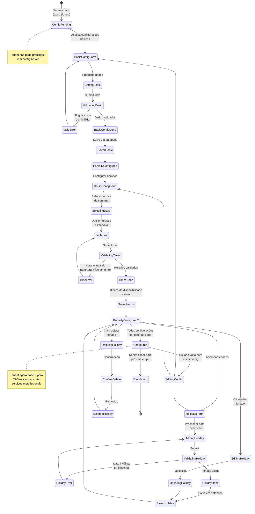
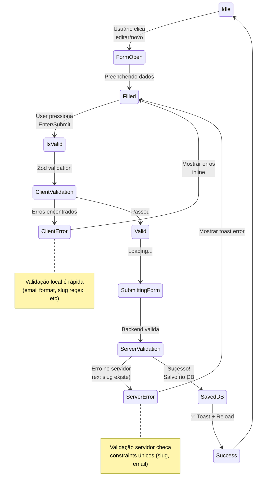

# 02-Config — Diagrama de Estados

```mermaid
stateDiagram-v2
    [*] --> ConfigPending: Tenant criado<br/>(após signup)
    
    ConfigPending --> BasicConfigForm: Acessa configurações<br/>básicas
    BasicConfigForm --> SettingBasic: Preenche dados
    SettingBasic --> ValidatingBasic: Submit form
    ValidatingBasic --> ValidError: Slug já existe<br/>ou inválido
    ValidError --> BasicConfigForm
    
    ValidatingBasic --> BasicConfigDone: Dados validados
    BasicConfigDone --> SavedBasic: Salvo em database
    SavedBasic --> PartiallyConfigured
    
    PartiallyConfigured --> HoursConfigForm: Configurar horários
    HoursConfigForm --> SelectingDays: Selecionar dias<br/>da semana
    SelectingDays --> SetTimes: Definir horários<br/>e intervalo
    SetTimes --> ValidatingTimes: Submit form
    ValidatingTimes --> TimeError: Horário inválido<br/>(abertura > fechamento)
    TimeError --> SetTimes
    
    ValidatingTimes --> TimesDone: Horários validados
    TimesDone --> SavedHours: Blocos de disponibilidade<br/>salvos
    SavedHours --> PartiallyConfigured2
    
    PartiallyConfigured2 --> HolidaysForm: Adicionar feriados
    HolidaysForm --> AddingHoliday: Preencher data<br/>+ descrição
    AddingHoliday --> ValidatingHoliday: Submit
    ValidatingHoliday --> HolidayError: Data inválida<br/>ou passada
    HolidayError --> AddingHoliday
    
    ValidatingHoliday --> HolidayDone: Feriado válido
    HolidayDone --> SavedHoliday: Salvo em database
    SavedHoliday --> PartiallyConfigured2
    
    PartiallyConfigured2 --> EditingHoliday: Clica editar<br/>feriado
    EditingHoliday --> UpdatingHoliday: Modificar
    UpdatingHoliday --> SavedHoliday
    
    PartiallyConfigured2 --> DeletingHoliday: Clica deletar<br/>feriado
    DeletingHoliday --> ConfirmDelete: Confirmação
    ConfirmDelete --> DeletedHoliday: Removido
    DeletedHoliday --> PartiallyConfigured2
    
    PartiallyConfigured2 --> Configured: Todas configurações<br/>obrigatórias done
    Configured --> Dashboard: Redirecionar para<br/>próxima etapa
    Dashboard --> [*]
    
    Configured --> EditingConfig: Usuário volta para<br/>editar config
    EditingConfig --> BasicConfigForm
    EditingConfig --> HoursConfigForm
    EditingConfig --> HolidaysForm
    
    note right of ConfigPending
      Tenant não pode prosseguir
      sem config básica
    end note
    
    note right of Configured
      Tenant agora pode ir para
      03-Services para criar
      serviços e profissionais
    end note
```

## Estados de Validação de Formulários

```mermaid
stateDiagram-v2
    Idle --> FormOpen: Usuário clica<br/>editar/novo
    FormOpen --> Filled: Preenchendo dados
    
    Filled --> IsValid: User pressiona<br/>Enter/Submit
    
    IsValid --> ClientValidation: Zod validation
    ClientValidation --> ClientError: Erros encontrados
    ClientError --> Filled: Mostrar erros<br/>inline
    
    ClientValidation --> Valid: Passou
    Valid --> SubmittingForm: Loading...
    
    SubmittingForm --> ServerValidation: Backend valida
    ServerValidation --> ServerError: Erro no servidor<br/>(ex: slug existe)
    ServerError --> Filled: Mostrar toast error
    
    ServerValidation --> SavedDB: Sucesso!<br/>Salvo no DB
    SavedDB --> Success: ✅ Toast + Reload
    Success --> Idle
    
    note right of ClientError
      Validação local é rápida
      (email format, slug regex, etc)
    end note
    
    note right of ServerError
      Validação servidor checa<br/>constraints únicos (slug, email)
    end note
```
