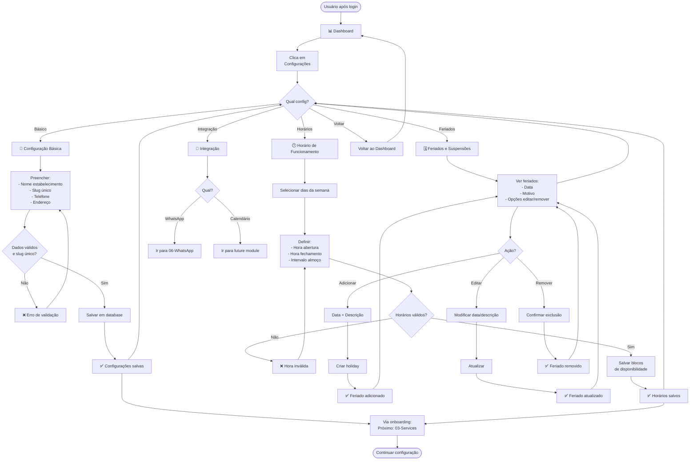

# 02-Config — Fluxo de Usuário

**Decisões Principais:**
- Slug deve ser único e immutável (chave de URL pública)
- Horários são blocos repetiveis (segunda tem x, terça tem y, etc.)
- Feriados são exceções (remove horários normais daquele dia)
- Validações de horário: abertura < fechamento, intervalo válido

**Validações Críticas:**
- ✅ Slug: apenas letras, números, hífen (regex)
- ✅ Telefone: formato válido
- ✅ Horários: não podem ser negativos ou invertidos
- ✅ Feriados: data futura (ou atual para hoje)
