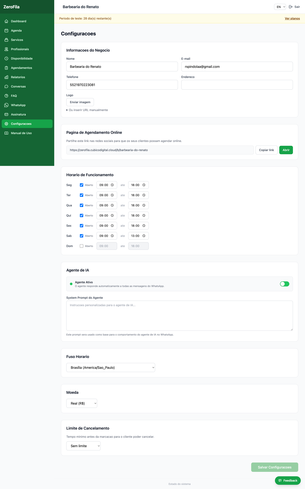

##  Configurar o Estabelecimento

  

**Menu:** Painel Admin → **Configurações**

  

Esta é a primeira etapa obrigatória após criar a conta. As informações aqui definidas serão usadas pelo assistente IA nas conversas com os seus clientes.
| Campo                   | Descrição                                   | Exemplo                          |
|------------------------|---------------------------------------------|----------------------------------|
| Nome                   | Nome do estabelecimento                     | Barbearia do João               |
| E-mail                 | E-mail de contacto                          | contato@barbeariaj.com          |
| Telefone               | Número de contacto                          | +55 11 99999-0000               |
| Endereço               | Morada completa                             | Rua das Flores, 123             |
| Fuso Horário           | Fuso da sua localização                     | America/Sao_Paulo               |
| Moeda                  | Moeda para exibir preços                    | BRL, MZN, EUR, USD              |
| Limite de Cancelamento | Tempo mínimo antes da marcação para cancelar| Sem limite, 2h, 4h, 6h, 12h, 24h|

###  Horário de Funcionamento

  

Configure os dias e horários em que o estabelecimento está aberto:

  

-  Ative ou desative cada dia da semana.

-  Defina o horário de abertura e encerramento.

  

**Exemplo:** Seg-Sex: 09:00–19:00 | Sáb: 08:00–16:00 | Dom: Fechado

  

###  Logotipo

  

Carregue o logotipo do seu estabelecimento. Formatos aceites: JPG, PNG. Tamanho recomendado: 200x200 pixels.

  

**Dica:** Preencha todas as informações com atenção. O assistente IA utiliza estes dados para informar os clientes sobre horário, endereço e contacto.

