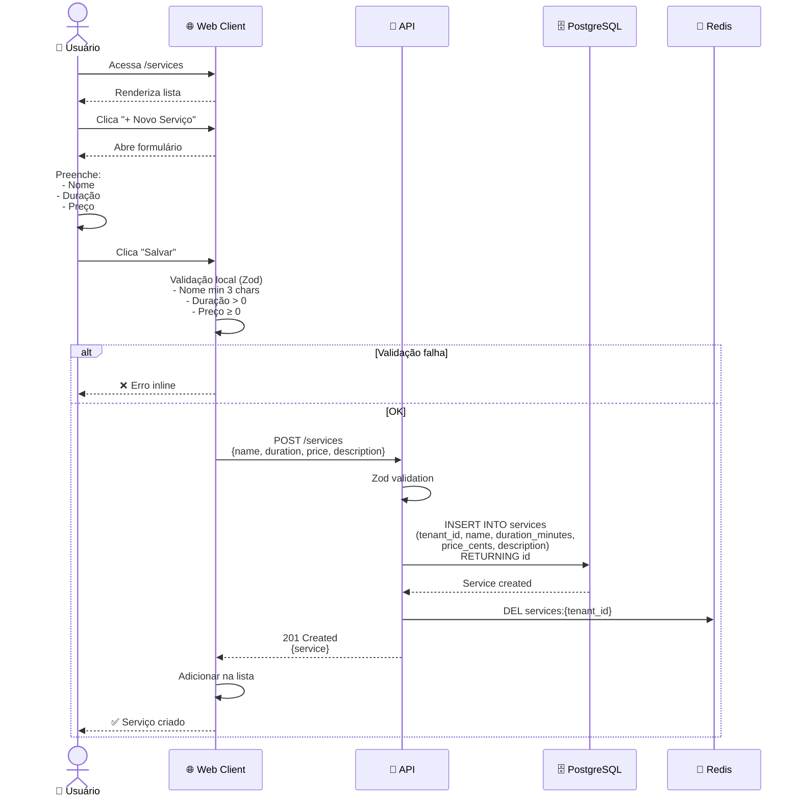
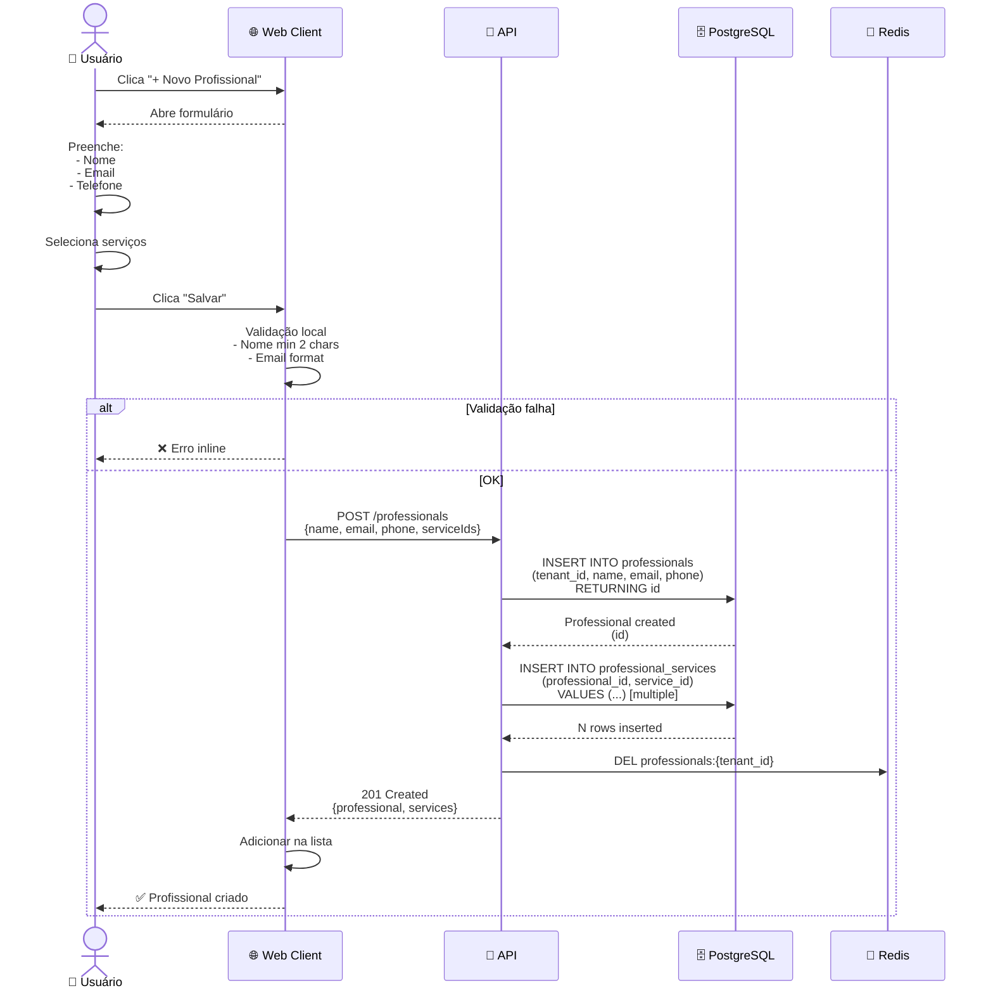
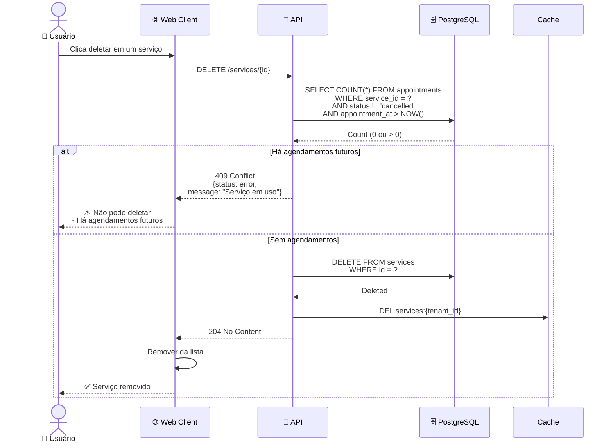
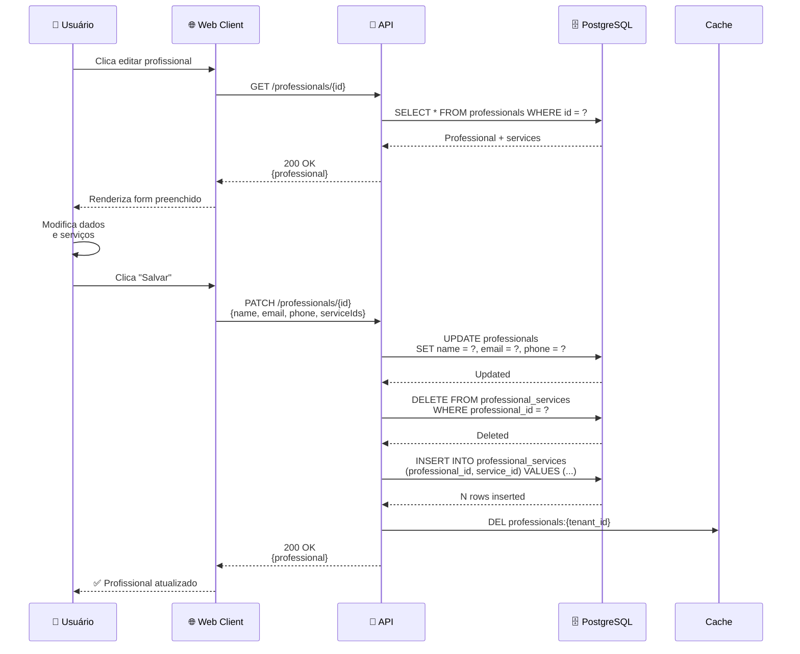

# 03-Services — Diagrama de Sequência

## Fluxo de Criar Serviço

## Fluxo de Criar Profissional e Atribuir Serviços

## Fluxo de Deletar Serviço (com validação)

## Fluxo de Editar Profissional

