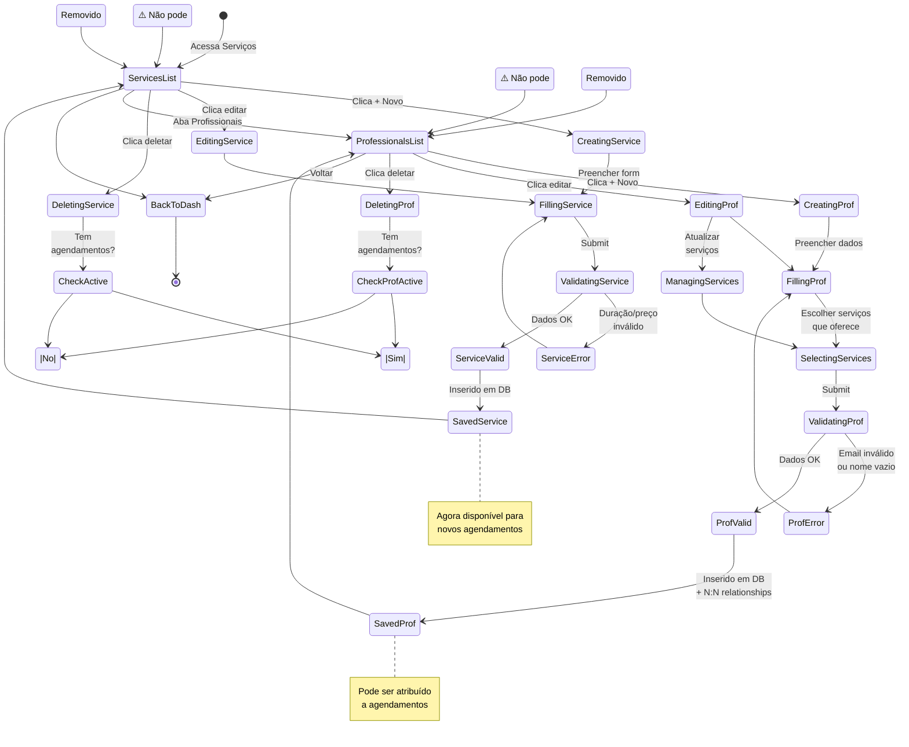
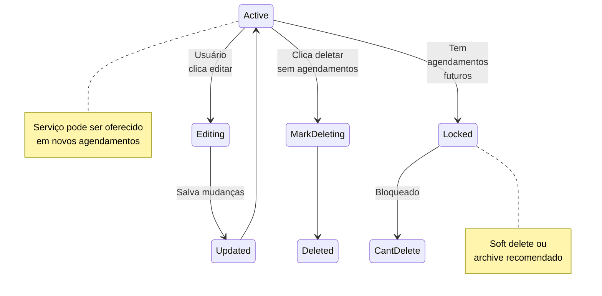

# 03-Services — Diagrama de Estados

```mermaid
stateDiagram-v2
    [*] --> ServicesList: Acessa Serviços
    
    ServicesList --> CreatingService: Clica + Novo
    CreatingService --> FillingService: Preencher form
    FillingService --> ValidatingService: Submit
    
    ValidatingService --> ServiceError: Duração/preço<br/>inválido
    ServiceError --> FillingService
    
    ValidatingService --> ServiceValid: Dados OK
    ServiceValid --> SavedService: Inserido em DB
    SavedService --> ServicesList
    
    ServicesList --> EditingService: Clica editar
    EditingService --> FillingService
    
    ServicesList --> DeletingService: Clica deletar
    DeletingService --> CheckActive: Tem<br/>agendamentos?
    CheckActive -->|Sim| CantDelete: ⚠️ Não pode
    CantDelete --> ServicesList
    CheckActive -->|No| DeletedService: Removido
    DeletedService --> ServicesList
    
    ServicesList --> ProfessionalsList: Aba Profissionais
    
    ProfessionalsList --> CreatingProf: Clica + Novo
    CreatingProf --> FillingProf: Preencher dados
    FillingProf --> SelectingServices: Escolher serviços<br/>que oferece
    SelectingServices --> ValidatingProf: Submit
    
    ValidatingProf --> ProfError: Email inválido<br/>ou nome vazio
    ProfError --> FillingProf
    
    ValidatingProf --> ProfValid: Dados OK
    ProfValid --> SavedProf: Inserido em DB<br/>+ N:N relationships
    SavedProf --> ProfessionalsList
    
    ProfessionalsList --> EditingProf: Clica editar
    EditingProf --> FillingProf
    EditingProf --> ManagingServices: Atualizar<br/>serviços
    ManagingServices --> SelectingServices
    
    ProfessionalsList --> DeletingProf: Clica deletar
    DeletingProf --> CheckProfActive: Tem<br/>agendamentos?
    CheckProfActive -->|Sim| CantDeleteProf: ⚠️ Não pode
    CantDeleteProf --> ProfessionalsList
    CheckProfActive -->|No| DeletedProf: Removido
    DeletedProf --> ProfessionalsList
    
    ProfessionalsList --> BackToDash: Voltar
    ServicesList --> BackToDash
    BackToDash --> [*]
    
    note right of SavedService
      Agora disponível para
      novos agendamentos
    end note
    
    note right of SavedProf
      Pode ser atribuído
      a agendamentos
    end note
```

## Estados de Operação de Serviços

```mermaid
stateDiagram-v2
    Active --> Editing: Usuário<br/>clica editar
    Editing --> Updated: Salva mudanças
    Updated --> Active
    
    Active --> MarkDeleting: Clica deletar<br/>sem agendamentos
    MarkDeleting --> Deleted
    
    Active --> Locked: Tem<br/>agendamentos<br/>futuros
    Locked --> CantDelete: Bloqueado
    
    note right of Active
      Serviço pode ser oferecido
      em novos agendamentos
    end note
    
    note right of Locked
      Soft delete ou
      archive recomendado
    end note
```
