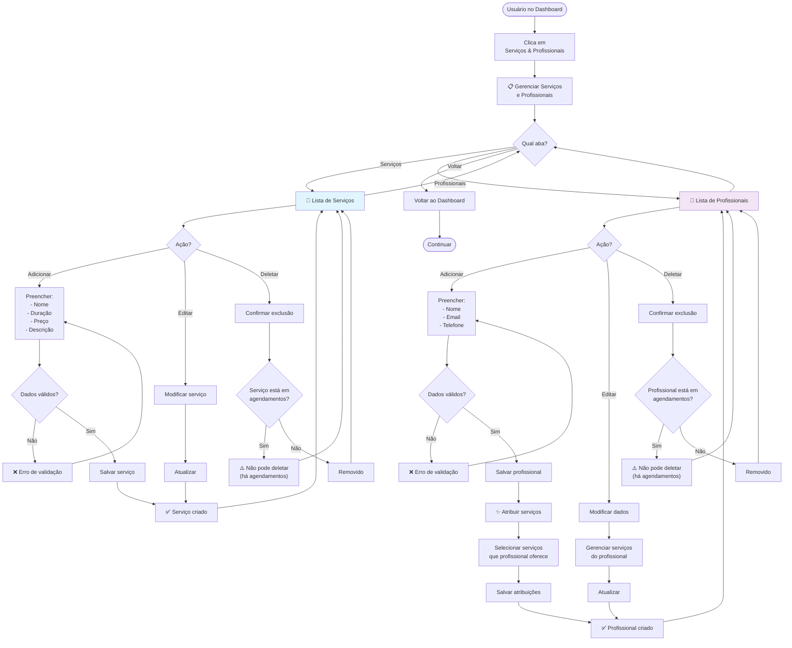

# 03-Services — Fluxo de Usuário

**Decisões Principais:**
- Serviço = oferecimento genérico (não atrelado a pessoa)
- Profissional = pessoa que oferece serviços
- N:N = Um profissional pode oferecer múltiplos serviços
- Não deletar: soft delete ou constraint para preservar histórico
- Disponibilidade: pode ser por serviço + profissional ou só por profissional

**Validações Críticas:**
- ✅ Duração > 0 minutos
- ✅ Preço ≥ 0
- ✅ Email de profissional único (opcional)
- ✅ Nome não vazio
