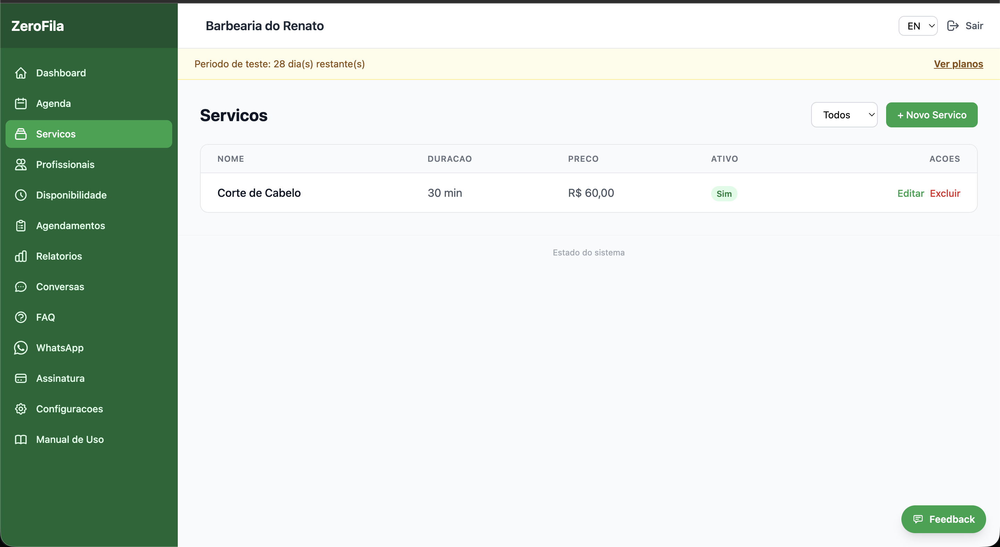
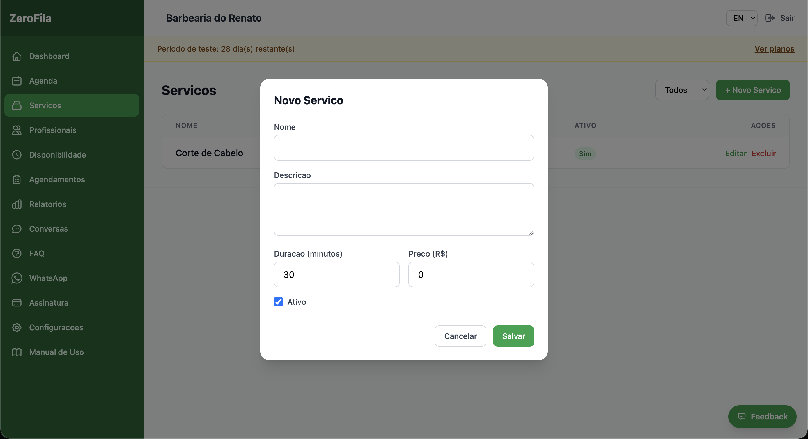
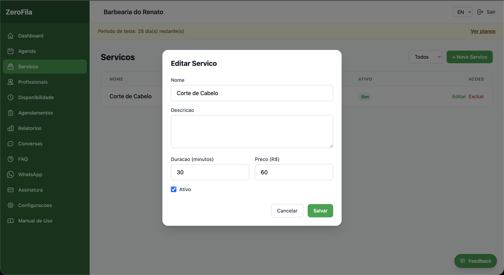
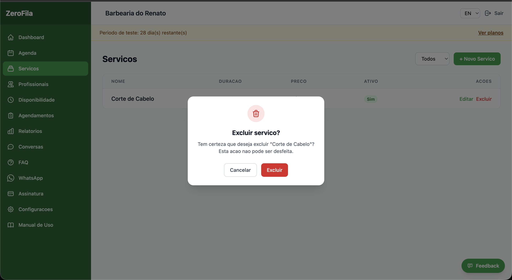

## Cadastrar Serviços

**Menu:** Painel Admin → **Serviços**

### Como adicionar um serviço:

1. Clique em **"Novo Serviço"**.
2. Preencha: **Nome, Descrição, Duração (minutos)** e **Preço**.
3. Clique em **"Salvar"**.

### Gerenciar serviços:

- **Editar** — Clique no ícone de edição para alterar qualquer informação.  
- **Ativar/Desativar** — Um serviço desativado não será oferecido pelo assistente IA.  
- **Filtrar** — Use os filtros para ver apenas serviços ativos ou inativos.  
- **Excluir** — Clique no ícone de exclusão para excluir qualquer serviço. 
 

### Exemplos por tipo de estabelecimento:

#### Barbearia
- Corte Masculino — 30 min — R$ 35  
- Barba — 20 min — R$ 25  
- Corte + Barba — 50 min — R$ 55  
- Pigmentação — 45 min — R$ 80  

#### Salão de Beleza
- Corte Feminino — 60 min — R$ 80  
- Escova — 40 min — R$ 50  
- Coloração — 120 min — R$ 150  
- Manicure — 45 min — R$ 40  

#### Spa
- Massagem Relaxante — 60 min — R$ 120  
- Limpeza de Pele — 90 min — R$ 100  
- Day Spa Completo — 240 min — R$ 350  