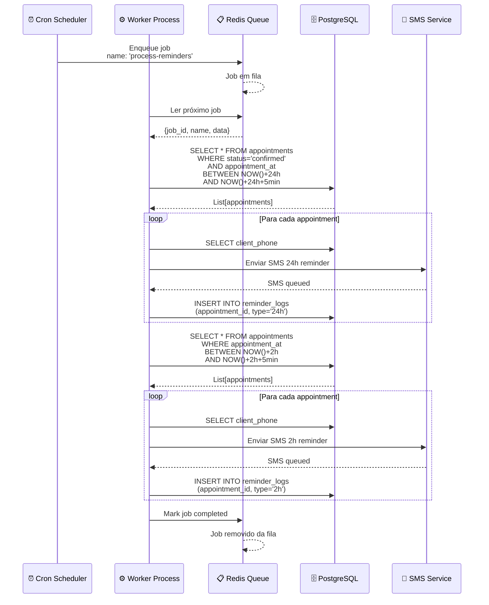
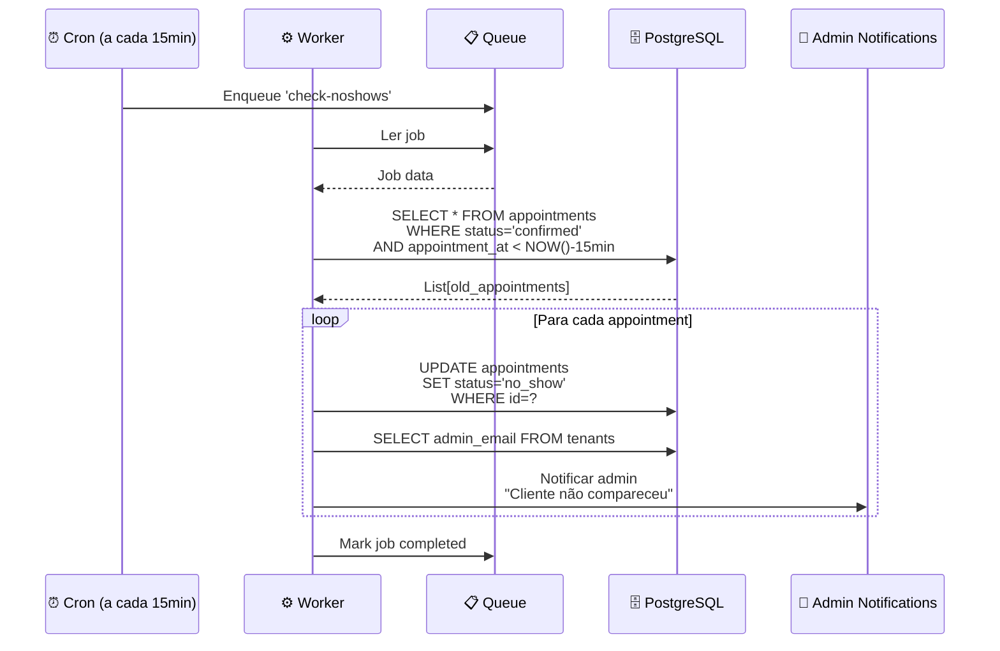
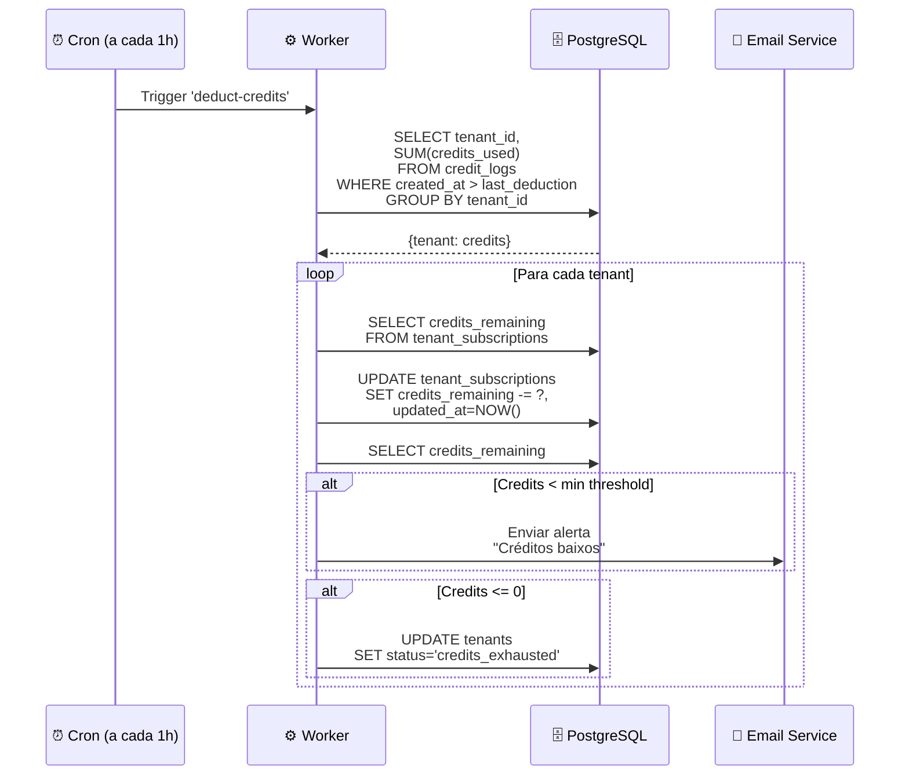

# 04-Workers — Diagrama de Sequência

## Fluxo: Worker de Lembretes (a cada 5 min)

```mermaid
sequenceDiagram
    participant Scheduler as ⏰ Cron Scheduler
    participant Worker as ⚙️ Worker Process
    participant Queue as 📋 Redis Queue
    participant DB as 🗄️ PostgreSQL
    participant SMS as 📱 SMS Service
    
    Scheduler->>Queue: Enqueue job<br/>name: 'process-reminders'
    Queue-->>Queue: Job em fila
    
    Worker->>Queue: Ler próximo job
    Queue-->>Worker: {job_id, name, data}
    
    Worker->>DB: SELECT * FROM appointments<br/>WHERE status='confirmed'<br/>AND appointment_at<br/>BETWEEN NOW()+24h<br/>AND NOW()+24h+5min
    DB-->>Worker: List[appointments]
    
    loop Para cada appointment
        Worker->>DB: SELECT client_phone
        Worker->>SMS: Enviar SMS 24h reminder
        SMS-->>Worker: SMS queued
        Worker->>DB: INSERT INTO reminder_logs<br/>(appointment_id, type='24h')
    end
    
    Worker->>DB: SELECT * FROM appointments<br/>WHERE appointment_at<br/>BETWEEN NOW()+2h<br/>AND NOW()+2h+5min
    DB-->>Worker: List[appointments]
    
    loop Para cada appointment
        Worker->>DB: SELECT client_phone
        Worker->>SMS: Enviar SMS 2h reminder
        SMS-->>Worker: SMS queued
        Worker->>DB: INSERT INTO reminder_logs<br/>(appointment_id, type='2h')
    end
    
    Worker->>Queue: Mark job completed
    Queue-->>Queue: Job removido da fila
```

## Fluxo: Worker de Auto-Update Status

```mermaid
sequenceDiagram
    participant Scheduler as ⏰ Cron (a cada 15min)
    participant Worker as ⚙️ Worker
    participant Queue as 📋 Queue
    participant DB as 🗄️ PostgreSQL
    participant Admin as 📧 Admin Notifications
    
    Scheduler->>Queue: Enqueue 'check-noshows'
    
    Worker->>Queue: Ler job
    Queue-->>Worker: Job data
    
    Worker->>DB: SELECT * FROM appointments<br/>WHERE status='confirmed'<br/>AND appointment_at < NOW()-15min
    DB-->>Worker: List[old_appointments]
    
    loop Para cada appointment
        Worker->>DB: UPDATE appointments<br/>SET status='no_show'<br/>WHERE id=?
        
        Worker->>DB: SELECT admin_email FROM tenants
        Worker->>Admin: Notificar admin<br/>"Cliente não compareceu"
    end
    
    Worker->>Queue: Mark job completed
```

## Fluxo: Worker de Debitagem de Créditos

```mermaid
sequenceDiagram
    participant Scheduler as ⏰ Cron (a cada 1h)
    participant Worker as ⚙️ Worker
    participant DB as 🗄️ PostgreSQL
    participant Email as 📧 Email Service
    
    Scheduler->>Worker: Trigger 'deduct-credits'
    
    Worker->>DB: SELECT tenant_id,<br/>SUM(credits_used)<br/>FROM credit_logs<br/>WHERE created_at > last_deduction<br/>GROUP BY tenant_id
    DB-->>Worker: {tenant: credits}
    
    loop Para cada tenant
        Worker->>DB: SELECT credits_remaining<br/>FROM tenant_subscriptions
        
        Worker->>DB: UPDATE tenant_subscriptions<br/>SET credits_remaining -= ?,<br/>updated_at=NOW()
        
        Worker->>DB: SELECT credits_remaining
        
        alt Credits < min threshold
            Worker->>Email: Enviar alerta<br/>"Créditos baixos"
        end
        
        alt Credits <= 0
            Worker->>DB: UPDATE tenants<br/>SET status='credits_exhausted'
        end
    end
```
