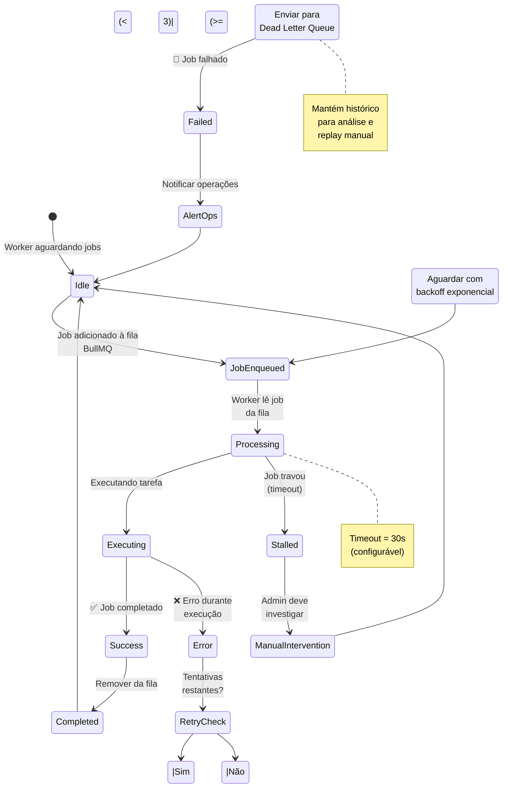
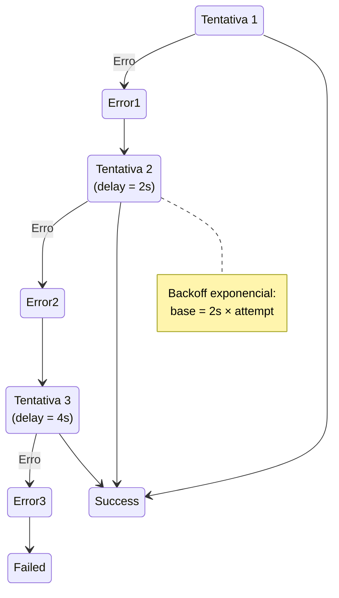

# 04-Workers — Diagrama de Estados

```mermaid
stateDiagram-v2
    [*] --> Idle: Worker aguardando jobs
    
    Idle --> JobEnqueued: Job adicionado à fila<br/>BullMQ
    
    JobEnqueued --> Processing: Worker lê job<br/>da fila
    Processing --> Executing: Executando tarefa
    
    Executing --> Success: ✅ Job completado
    Success --> Completed: Remover da fila
    Completed --> Idle
    
    Executing --> Error: ❌ Erro durante<br/>execução
    
    Error --> RetryCheck: Tentativas<br/>restantes?
    RetryCheck -->|Sim (< 3)| Backoff: Aguardar com<br/>backoff exponencial
    Backoff --> JobEnqueued
    
    RetryCheck -->|Não (>= 3)| DeadLetter: Enviar para<br/>Dead Letter Queue
    DeadLetter --> Failed: 🔴 Job falhado
    Failed --> AlertOps: Notificar operações
    AlertOps --> Idle
    
    Processing --> Stalled: Job travou<br/>(timeout)
    Stalled --> ManualIntervention: Admin deve<br/>investigar
    ManualIntervention --> Idle
    
    note right of Processing
      Timeout = 30s
      (configurável)
    end note
    
    note right of DeadLetter
      Mantém histórico
      para análise e
      replay manual
    end note
```

## Estados de Retry

```mermaid
stateDiagram-v2
    Initial: Tentativa 1
    Retry1: Tentativa 2<br/>(delay = 2s)
    Retry2: Tentativa 3<br/>(delay = 4s)
    Failed: Failed
    
    Initial --> Error1: Erro
    Error1 --> Retry1
    
    Retry1 --> Error2: Erro
    Error2 --> Retry2
    
    Retry2 --> Error3: Erro
    Error3 --> Failed
    
    Initial --> Success
    Retry1 --> Success
    Retry2 --> Success
    
    note right of Retry1
      Backoff exponencial:
      base = 2s × attempt
    end note
```
