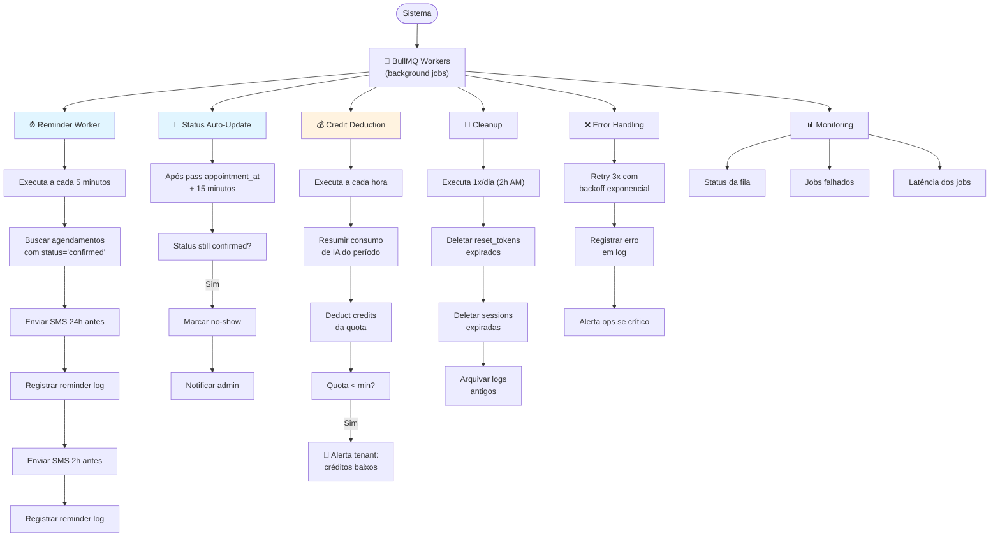

# 04-Workers — Fluxo de Usuário

**Responsabilidades Críticas:**
- Lembretes automáticos (24h + 2h)
- Auto-update de status para no-show
- Debitagem de créditos de IA
- Limpeza de dados expirados
- Logs e alertas

**Tecnologia:**
- BullMQ (Redis-backed queue)
- Retry com backoff exponencial
- Dead Letter Queue (DLQ) para falhas
