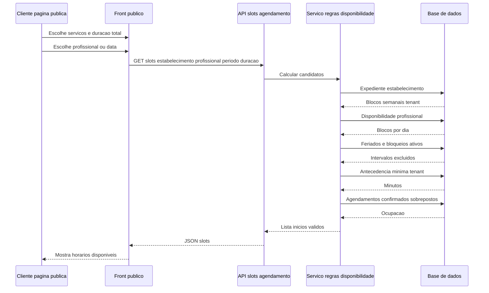
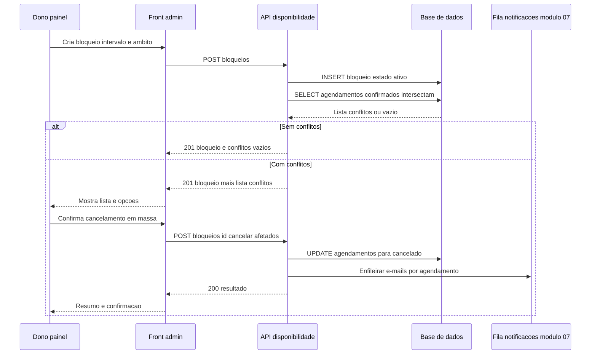

# 04 — Diagramas de sequência: disponibilidade

## 1. Consulta de slots na página pública (integração com módulo 06)

Fluxo em que o **cliente** (módulo 06) obtém horários válidos; o servidor aplica todas as camadas do módulo 04 + ocupação por agendamentos **confirmados**.

**Notas:**

- A mesma função de cálculo (ou equivalente) deve ser invocada na **criação** do agendamento com validação final e bloqueio transacional do intervalo.
- Lembretes e e-mails transacionais após reserva/cancelamento: [módulo 07](../../07-notifications/USER_STORIES.md).

---

## 2. Dono grava bloqueio com conflitos e cancelamento em massa (US-417 opção B)

*(Os códigos HTTP são exemplificativos; o essencial é: bloqueio persistido, deteção de conflitos, cancelamento explícito em massa e disparo de notificações.)*
