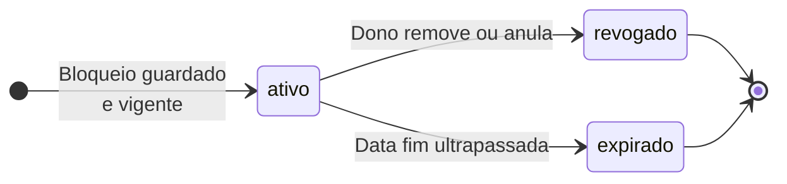
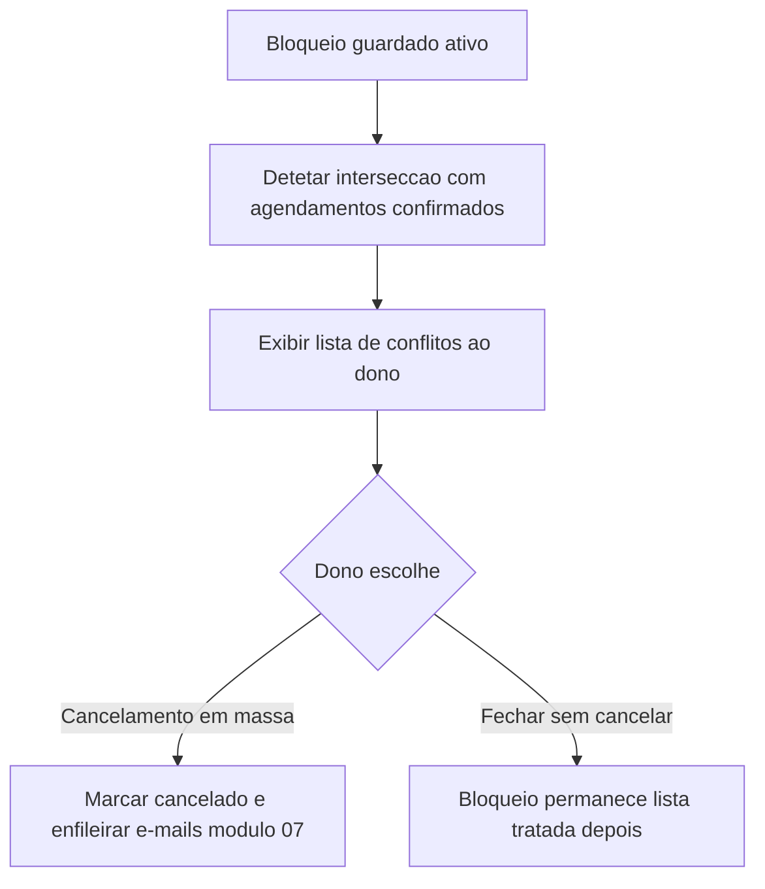

# 04 — Disponibilidade: diagrama de estados

Dois conjuntos de estados: **ciclo de vida de um bloqueio** (configuração no painel) e relação com **agendamentos confirmados** (módulos [05](../05-appointments/diagrams/state-diagram/states.md) / [06](../06-public-booking-page/diagrams/state-diagram/states.md)). Estados de **agendamento** (`confirmado`, `cancelado`, etc.) não são duplicados aqui.

---

## Bloqueio pontual (recurso de calendário)

| Estado | Significado |
|--------|-------------|
| `rascunho` | Opcional na UX: formulário em edição antes de submeter (omitido no diagrama se não existir). |
| `ativo` | Vigente; intersecta o cálculo de slots enquanto `agora` estiver dentro de `[início, fim]`. |
| `revogado` | Removido ou anulado pelo dono antes do fim; deixa de afetar novas consultas. |
| `expirado` | Fim do período passou; deixa de afetar slots (pode manter-se em histórico só leitura). |

---

## Conflito com agendamentos confirmados (US-417, opção B)

Após persistir bloqueio **ativo**, o sistema pode apresentar **conflitos** com agendamentos **confirmados**. A resolução em massa muda cada agendamento para **cancelado** (ver estados de agendamento no módulo 05); notificações no [módulo 07](../../07-notifications/USER_STORIES.md).

---

## Estados de slot (referência alinhada ao 05)

A ocupação de um intervalo por agendamento **confirmado** segue o diagrama de **slot** em [05-appointments — estados de slot](../05-appointments/diagrams/state-diagram/states.md) (`Booked` ↔ agendamento não cancelado). O módulo 04 define **por que** um instante não entra na lista de candidatos a slot livre (regras + bloqueios); o módulo 05/06 define o **ciclo do agendamento** em si.
