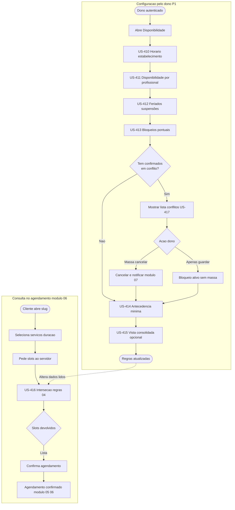

# 04 — Fluxo de utilizador: configuração (dono) e consumo (agendamento)

Dois eixos: **P1** no painel a definir regras; **cliente** na página pública a consumir slots calculados com essas regras ([módulo 06](../../06-public-booking-page/USER_STORIES.md)).

**Legenda:** a seta tracejada indica que alterações gravadas no painel passam a alimentar o motor na **próxima** consulta (ver [US-418](../../USER_STORIES.md)).
