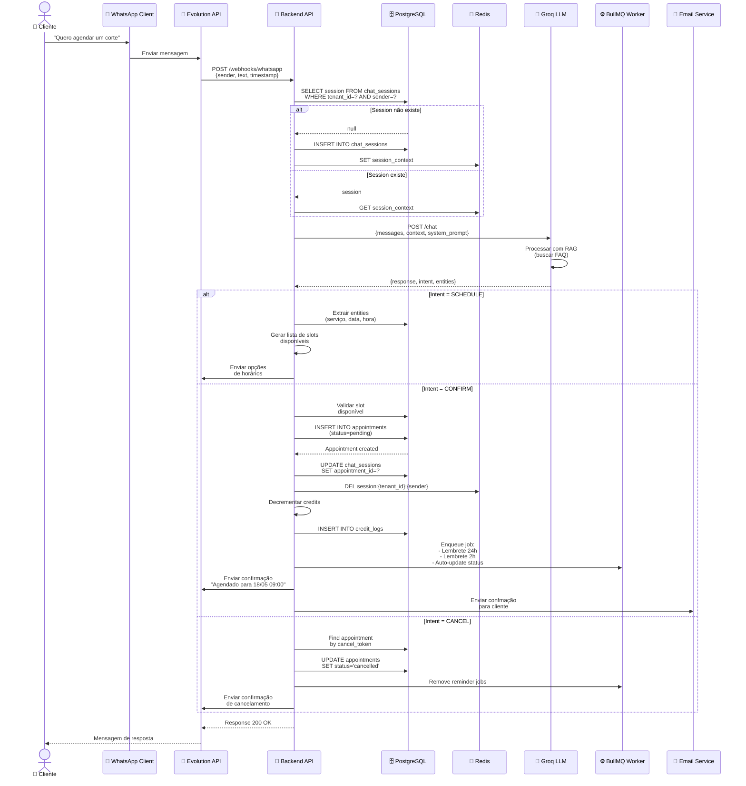
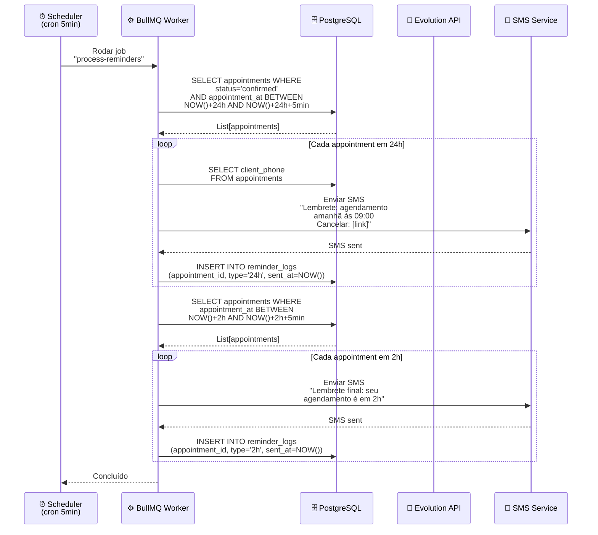
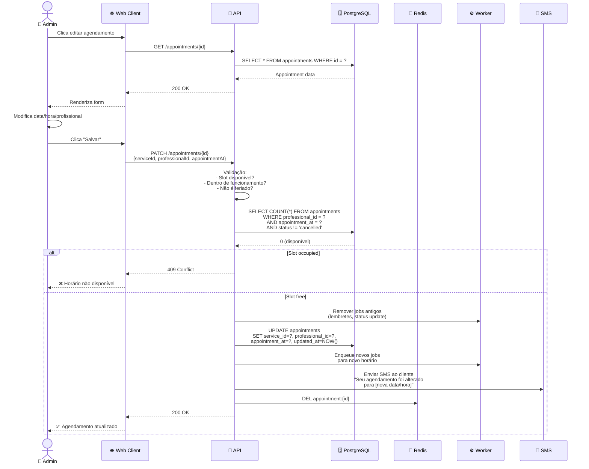

# 05-Appointments — Diagrama de Sequência

## Fluxo Crítico: Criar Agendamento via WhatsApp



## Fluxo: Processar Lembretes Automáticos



## Fluxo: Editar Agendamento (Admin)



## Fluxo: Cancelar Agendamento (Cliente)

```mermaid
sequenceDiagram
    actor Client as 👤 Cliente
    participant Link as 🔗 Cancel Link<br/>(Web)
    participant API as 🚀 API
    participant DB as 🗄️ PostgreSQL
    participant Worker as ⚙️ Worker
    participant SMS as 📱 SMS
    
    Client->>Link: Clica link de cancelamento
    Link->>API: GET /appointments/cancel/{token}?id=abc
    
    API->>DB: SELECT * FROM appointments<br/>WHERE id = ? AND cancel_token = ?
    DB-->>API: Appointment found
    
    API->>API: Validar:<br/>- Token ainda válido?<br/>- Agendamento não passou?
    
    alt Token inválido ou expirado
        API-->>Link: 400 Bad Request
        Link-->>Client: ❌ Link expirado
    else Token válido
        API->>DB: UPDATE appointments<br/>SET status='cancelled',<br/>cancel_token=NULL<br/>(invalidar token)
        
        API->>Worker: Remover jobs<br/>(lembretes, status)
        
        API->>SMS: Enviar SMS confirmação<br/>"Seu agendamento foi cancelado"
        
        API-->>Link: 200 OK<br/>{message: "Cancelado com sucesso"}
        Link-->>Client: ✅ Agendamento cancelado
    end
```
