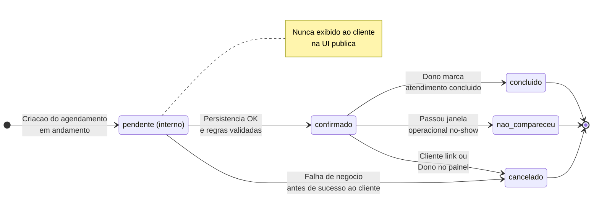
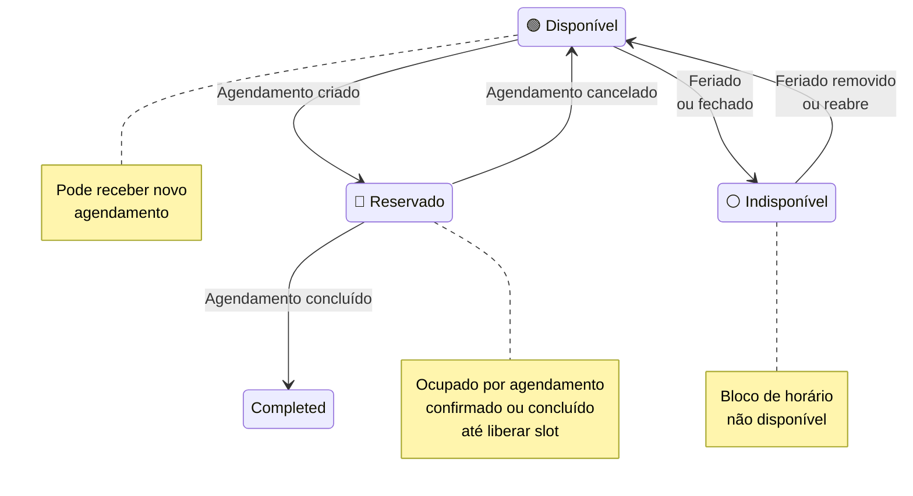

# 05 — Agendamentos: diagrama de estados

Alinhado ao modelo do [módulo 06 — página pública](../../06-public-booking-page/diagrams/state-diagram/states.md): **`pendente` é apenas transitório e interno** (criação atômica); **o cliente vê `confirmado` imediatamente** após agendamento bem-sucedido. Lembretes e envio de e-mail são tratados no [módulo 07](../../07-notifications/USER_STORIES.md), não como estados do agendamento.

---

## Ciclo de vida do agendamento

| Estado | Visível ao cliente (página pública) | Notas |
|--------|-------------------------------------|--------|
| `pendente` (interno) | Não | Existe só durante o processamento da criação; não rotular na UI. |
| `confirmado` | Sim | Estado estável após sucesso; cancelamento via link e lembretes partem daqui. |
| `concluído` | Opcional / painel | Marcado no painel após atendimento. |
| `nao_compareceu` | Não (painel / dono) | Equivale ao fluxo operacional de no-show. |
| `cancelado` | Sim (após cancelar) | Cliente ou dono; slot liberado. |

---

## Estados de slot de horário

