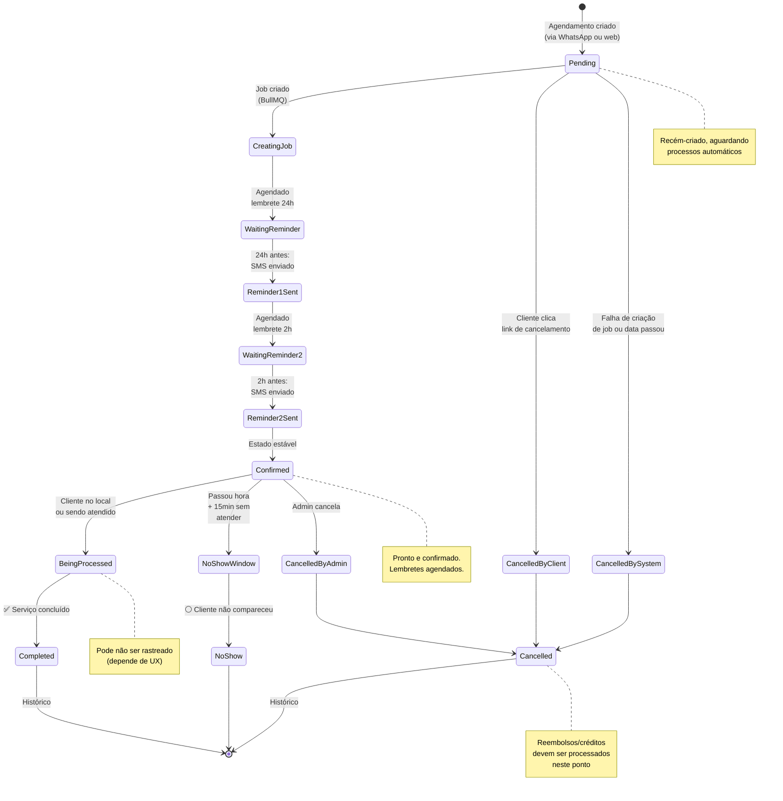
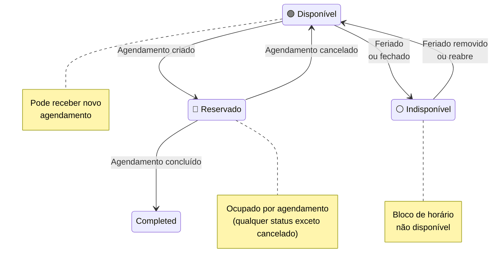

# 05-Appointments — Diagrama de Estados

```mermaid
stateDiagram-v2
    [*] --> Pending: Agendamento criado<br/>(via WhatsApp ou web)
    
    Pending --> CreatingJob: Job criado<br/>(BullMQ)
    CreatingJob --> WaitingReminder: Agendado<br/>lembrete 24h
    WaitingReminder --> Reminder1Sent: 24h antes:<br/>SMS enviado
    Reminder1Sent --> WaitingReminder2: Agendado<br/>lembrete 2h
    
    WaitingReminder2 --> Reminder2Sent: 2h antes:<br/>SMS enviado
    Reminder2Sent --> Confirmed: Estado estável
    
    Confirmed --> BeingProcessed: Cliente no local<br/>ou sendo atendido
    BeingProcessed --> Completed: ✅ Serviço concluído
    Completed --> [*]: Histórico
    
    Confirmed --> NoShowWindow: Passou hora<br/>+ 15min sem<br/>atender
    NoShowWindow --> NoShow: ⚪ Cliente não compareceu
    NoShow --> [*]
    
    Pending --> CancelledByClient: Cliente clica<br/>link de cancelamento
    CancelledByClient --> Cancelled
    
    Confirmed --> CancelledByAdmin: Admin cancela
    CancelledByAdmin --> Cancelled
    
    Pending --> CancelledBySystem: Falha de criação<br/>de job ou data passou
    CancelledBySystem --> Cancelled
    
    Cancelled --> [*]: Histórico
    
    note right of Pending
      Recém-criado, aguardando
      processos automáticos
    end note
    
    note right of Confirmed
      Pronto e confirmado.
      Lembretes agendados.
    end note
    
    note right of BeingProcessed
      Pode não ser rastreado
      (depende de UX)
    end note
    
    note right of Cancelled
      Reembolsos/créditos
      devem ser processados
      neste ponto
    end note
```

## Estados de Slot de Horário

```mermaid
stateDiagram-v2
    Available: 🟢 Disponível
    Booked: 🔴 Reservado
    Unavailable: ⚪ Indisponível
    
    Available --> Booked: Agendamento criado
    Booked --> Available: Agendamento cancelado
    Booked --> Completed: Agendamento concluído
    
    Available --> Unavailable: Feriado<br/>ou fechado
    Unavailable --> Available: Feriado removido<br/>ou reabre
    
    note right of Available
      Pode receber novo
      agendamento
    end note
    
    note right of Booked
      Ocupado por agendamento
      (qualquer status exceto cancelado)
    end note
    
    note right of Unavailable
      Bloco de horário
      não disponível
    end note
```
