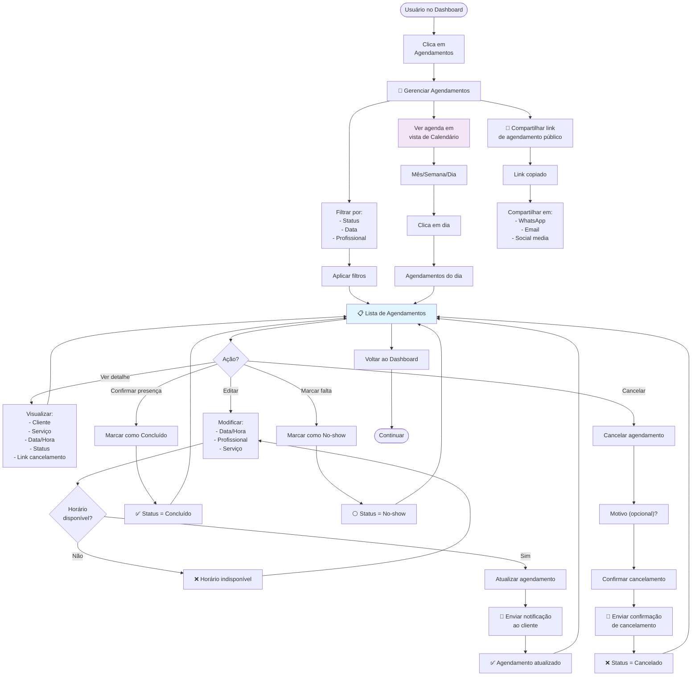

# 05-Appointments — Fluxo de Usuário

**Decisões Principais:**
- Status: Confirmado, Cancelado, Concluído, No-show
- Editar apenas se não está em progresso
- Cancelamento deve notificar cliente
- Link público permite cliente clicar para ver slot
- Lembretes automáticos via BullMQ (24h + 2h antes)

**Validações Críticas:**
- ✅ Horário disponível (não conflita)
- ✅ Horário dentro de funcionamento
- ✅ Horário não é feriado
- ✅ Não editar agendamentos "em progresso" (< 15min)
