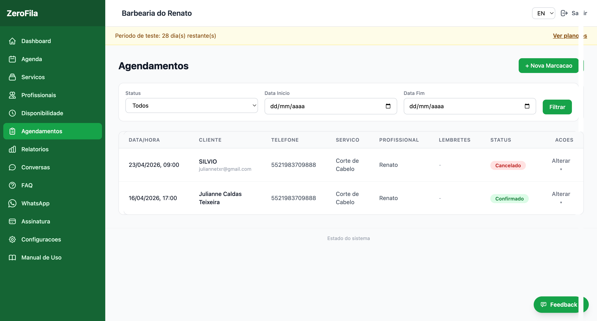
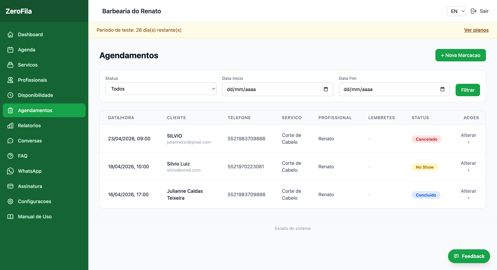
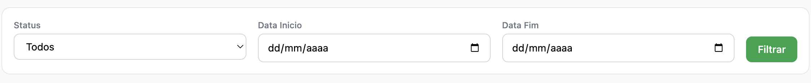
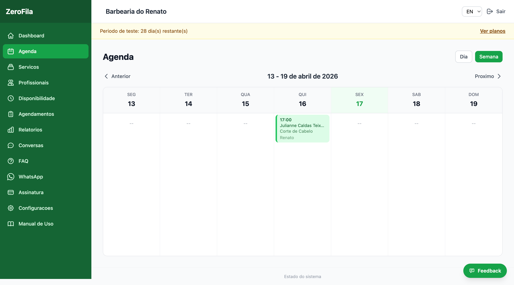
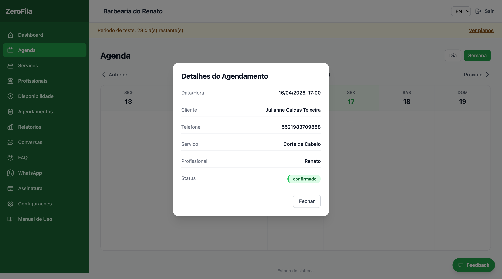
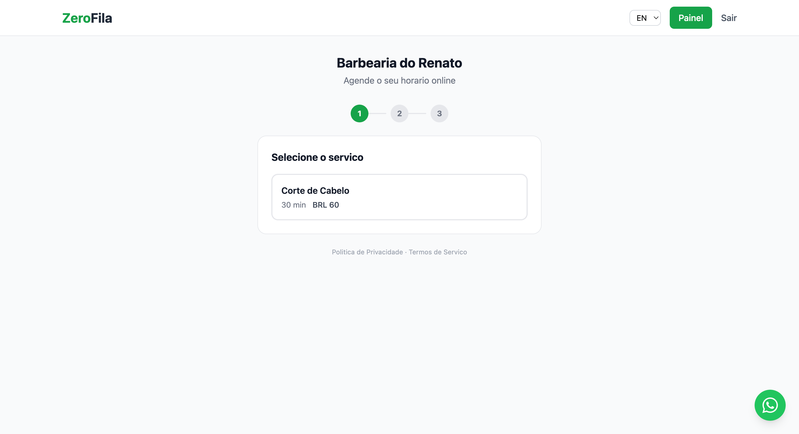
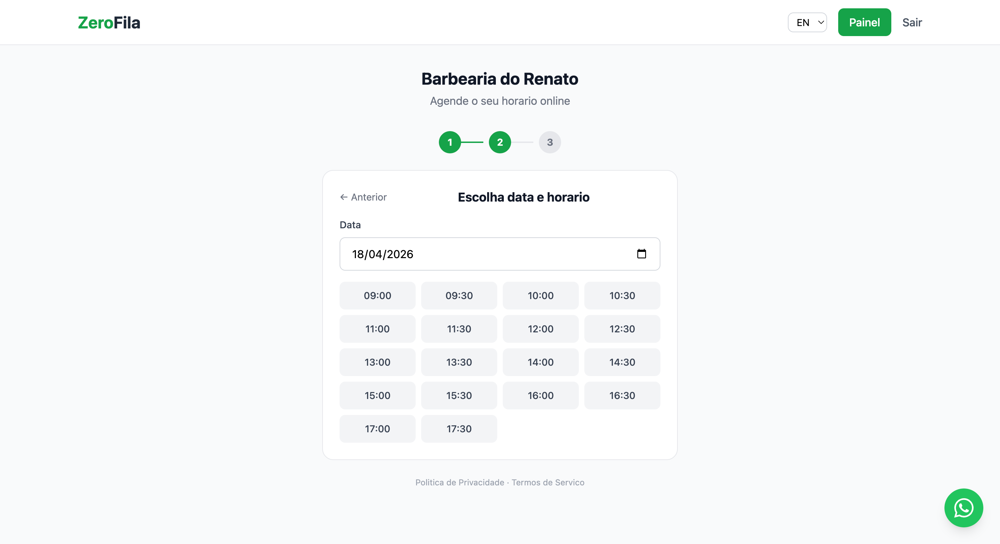
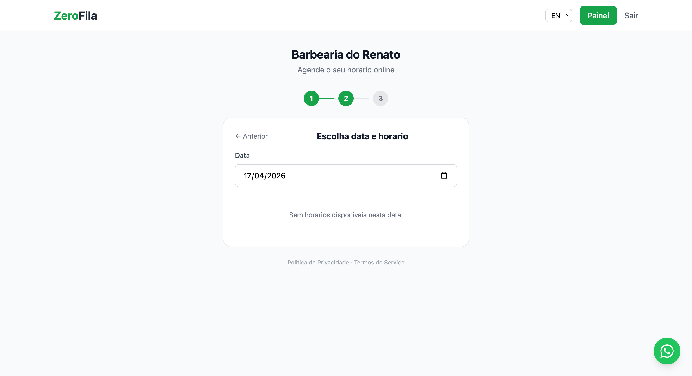
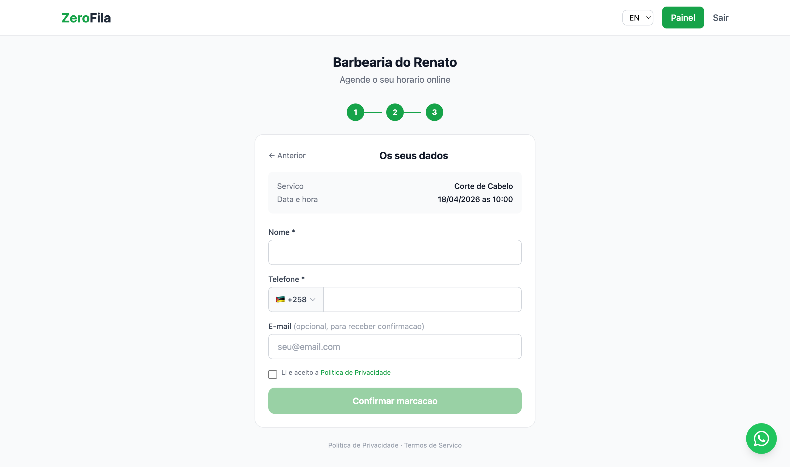
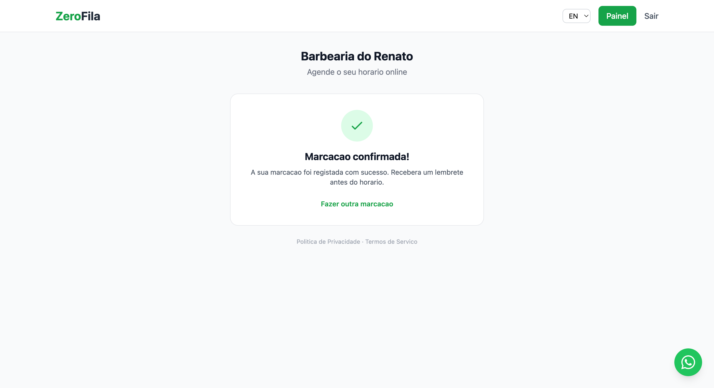

## Gerenciar Agendamentos

**Menu:** Painel Admin → **Agendamentos**

### Filtros disponíveis:

- **Por estado** — Confirmado, Cancelado, Concluído, Não compareceu (No-show).
- **Por data** — Defina um intervalo de datas para pesquisar.

### Estados dos agendamentos:

- 🟢 **Confirmado**  
  Agendamento ativo  

- 🔴 **Cancelado**  
  Foi cancelado  

- 🔵 **Concluído**  
  Atendimento realizado  

- ⚪ **No-show**  
  Cliente não compareceu  

---

## Visualizar a Agenda

**Menu:** Painel Admin → **Agenda**

A agenda oferece uma visão de calendário dos agendamentos:

- Visualização por dia, semana ou mês.  
- Código de cores por estado (confirmado, cancelado, etc.).  
- Clique num agendamento para ver detalhes completos.

---

## Página de Agendamento Online

Além do agendamento via WhatsApp, o seu estabelecimento tem uma página pública onde os clientes podem marcar diretamente pela web.

### O link da sua página

A URL da página é  `agenda-xpto.cubicodigital.cloud/b/_slug-do-seu-estabelecimento_`. O slug foi definido quando configurou o estabelecimento pela primeira vez.

### Como funciona para o cliente

1.  O cliente acede ao link e vê os dados do estabelecimento.
2.  Escolhe o  **serviço**  desejado.
3.  Escolhe o  **profissional**  (se aplicável).
4.  Seleciona a  **data e hora**  disponíveis.
5.  Preenche o  **nome**,  **telefone**  e  **email**.
6.  Confirma a marcação.

O agendamento criado pela página online aparece no painel de controle da mesma forma que os feitos via WhatsApp.

### Onde partilhar o link

-   **Redes sociais**  — Bio do Instagram, página do Facebook, etc.
-   **WhatsApp Business**  — Na descrição do perfil ou como resposta rápida.
-   **Google Meu Negócio**  — Como link de agendamento.
-   **Cartão de visita / material impresso**  — Inclua o link ou um QR code.

**Dica:**  Partilhe o link nas redes sociais para que os seus clientes saibam que podem agendar directamente pela web, sem precisar de ligar ou enviar mensagem.

---

## Como Funciona o Agendamento pelo WhatsApp

Veja o fluxo completo do ponto de vista do cliente:

1. **O cliente envia uma mensagem**  
   > "Olá, quero marcar um corte de cabelo"

2. **O assistente IA responde com os serviços**  
   > "Olá! Bem-vindo à Barbearia do João! Temos: Corte Masculino (30 min — R$ 35), Barba (20 min — R$ 25)... Qual deseja?"

3. **O cliente escolhe o serviço e indica a data**  
   > "Quero um corte masculino para amanhã de manhã"

4. **O assistente verifica a disponibilidade**  
   > "Para amanhã temos: 09:00, 09:30, 10:00, 10:30, 11:00. Qual prefere?"

5. **O cliente confirma e o agendamento é criado**  
   > "Agendamento confirmado! Corte Masculino amanhã às 10:00. Enviaremos um lembrete antes. Até lá!"

---

### Sugestão de divulgação para os seus clientes:

> "Agora você pode agendar pelo WhatsApp! Envie uma mensagem para o nosso número e o assistente virtual cuida de tudo, 24 horas por dia."

---

## Lembretes Automáticos

A Agenda XPTO envia automaticamente lembretes por WhatsApp. Não é necessária nenhuma configuração adicional — funciona de forma automática assim que o WhatsApp estiver configurado.

| Lembrete       | Quando               | Inclui                                        |
|----------------|----------------------|-----------------------------------------------|
| 24 horas antes | 24h antes do horário | Nome, serviço, horário + link de cancelamento |
| 2 horas antes  | 2h antes do horário  | Nome, serviço, horário + link de cancelamento |

**Nota:**  As mensagens de lembrete e confirmação são enviadas em dois idiomas (Português e Inglês) na mesma mensagem.

-   Cada lembrete é enviado  **apenas uma vez**  (sem duplicações).
-   O sistema verifica a cada  **5 minutos**.
-   Lembretes reduzem o não-comparecimento em até  **40%**.

--- 

## Cancelamentos

A Agenda XPTO oferece dois métodos de cancelamento simples e sem intervenção do estabelecimento:

### Pelo link do lembrete

1.  Cliente recebe o lembrete por WhatsApp e E-mail.
2.  Clica no link de cancelamento.
3.  Confirma o cancelamento com um clique.
4.  O agendamento é marcado como "Cancelado".

### Pela conversa no WhatsApp

1.  Cliente pede para cancelar na conversa.
2.  O assistente localiza os agendamentos futuros.
3.  Se houver mais de um, pergunta qual cancelar.
4.  Confirma o cancelamento.
 
### Pelo painel

1.  Funcionário navega até a tela de agendamento.
2.  Funcionário localiza os agendamentos futuros.
3.  Confirma o cancelamento com um clique.
4.  O agendamento é marcado como "Cancelado".

Após o cancelamento, o horário fica novamente disponível para outros clientes e o estado pode ser visto no painel com o filtro "Cancelado".

**Limite de cancelamento:**  Em  **Configurações → Limite de Cancelamento**, pode definir um tempo mínimo (2h, 4h, 6h, 12h ou 24h) antes da marcação para o cliente poder cancelar. Por defeito, não há limite.