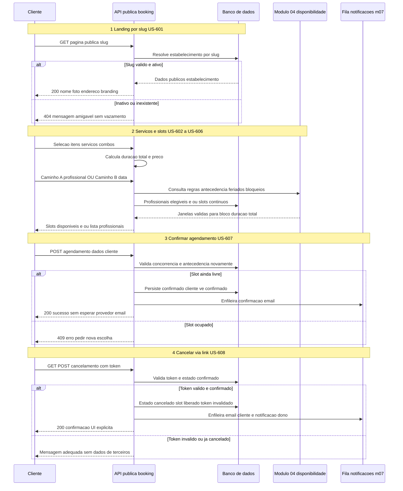

# 06 — Diagrama de sequência: página pública de agendamento

Fluxo ponta a ponta do cliente na página pública: resolução do estabelecimento, seleção de serviços e slots (com regras do módulo 04), confirmação com enfileiramento de notificações (módulo 07) e cancelamento via token. Estados do agendamento: ver [states.md](../state-diagram/states.md).

**Notas:**

- O módulo **04** pode ser invocado como serviço interno da API (mesmo processo) ou como limites claros no diagrama; o importante é que **antecedência mínima**, **feriados**, **bloqueios** e **cálculo de intervalo contínuo** seguem as regras documentadas em `docs/flow/04-availability/`.
- Estado `pendente` é apenas **transitório e interno**; a resposta de sucesso ao cliente reflete **confirmado**, alinhado às USER_STORIES e ao [states.md](../state-diagram/states.md).
