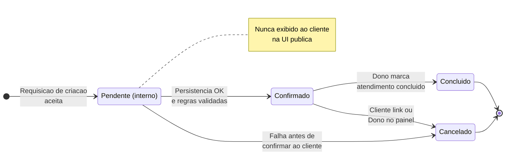

# 06 — Página pública: diagrama de estados do agendamento

## Estados e transições (visão de produto)

- **`pendente` (interno):** pode existir apenas de forma **transitória** durante a criação atômica do registro. **Nunca** é exibido ao cliente na UI pública.
- **`confirmado`:** estado após agendamento bem-sucedido; é o estado “normal” visível ao cliente e ao dono logo após a conclusão do fluxo.
- **`concluído`:** atendimento realizado (transição tipicamente pelo painel do dono).
- **`cancelado`:** cancelado pelo cliente (link) ou pelo dono no painel.

Transições permitidas:

- `pendente` → `confirmado` (conclusão imediata do processamento interno; cliente só vê `confirmado`)
- `confirmado` → `concluído`
- `pendente` → `cancelado` (falha de negócio antes de expor sucesso — cenário raro; cliente vê erro, não estado)
- `confirmado` → `cancelado`

---

## Diagrama (Mermaid)

---

## Alinhamento com notificações

Cancelamento e lembretes dependem do estado **confirmado** / **cancelado** conforme [docs/flow/07-notifications/USER_STORIES.md](../../07-notifications/USER_STORIES.md).
