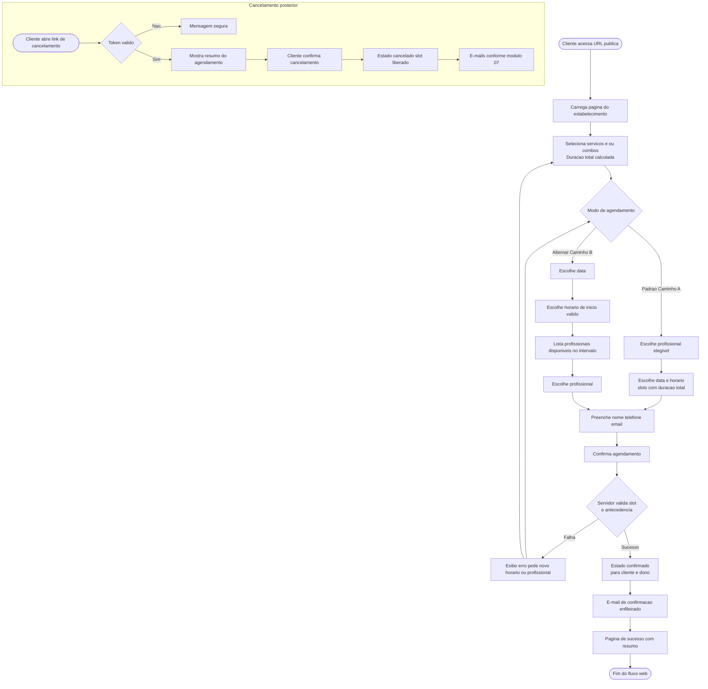

# 06 — Fluxo do cliente na página pública

Diagrama unificado com **Caminho A** (padrão), **Caminho B** (alternativa) e reconvergência até a confirmação.

**Legenda breve:**

- Antecedência mínima, feriados e bloqueios filtram slots em **SlotsA** e na escolha de horário em **PathB2**.
- O estado **`pendente` interno** não aparece neste fluxograma visível ao usuário; o nó **Confirmado** representa o que o cliente enxerga após sucesso.
